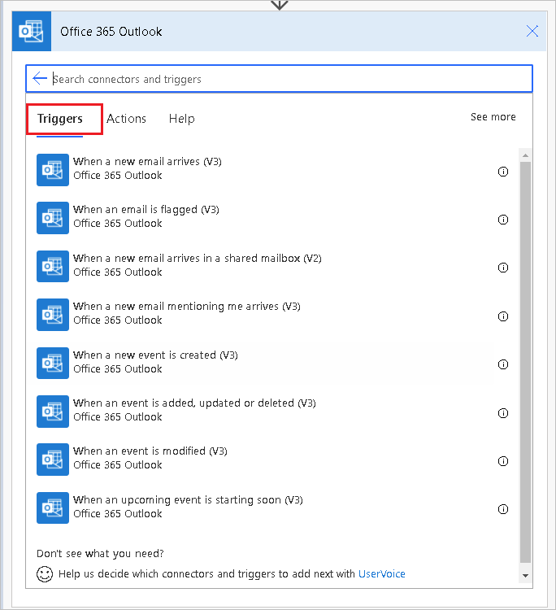
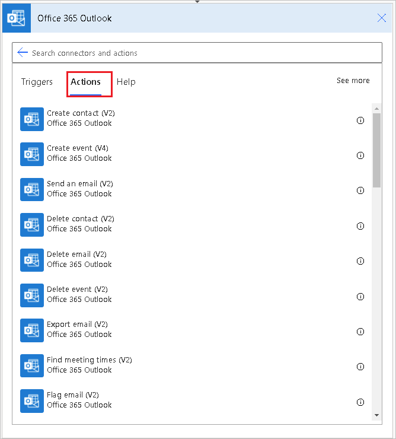

# Outlook email overview

Connectors represent the service to which you want to connect. For example, you can use the OneDrive, SharePoint, or Twitter connectors to use those services. One of the most popular connectors used in flows to send or receive email are the [Outlook connector](https://docs.microsoft.com/connectors/outlook/) and the [Office 365 outlook](https://docs.microsoft.com/connectors/office365/#known-issues-and-limitations) connector. Both connectors offer similar operations that allow you to manage your mail, calendars, and contacts. You can perform actions such as send mail, schedule meetings, add contacts, and so on.

## When to use what?

If you are using an work or school email account, use Office 365 Outlook connector. If you are using a personal (Microsoft Account) account, use the Outlook connector. In this article, we refer only to the Office 365 Outlook [triggers](https://docs.microsoft.com/connectors/office365/#triggers) and [actions](https://docs.microsoft.com/connectors/office365/#actions). You can use the same techniques for the Outlook connector as well.

A **trigger** is an event that starts a flow. For example, **When a new email arrives (V3)** is a trigger that starts a flow when an email arrives into an inbox. Here is the full list of the [Office 365 Outlook triggers](https://docs.microsoft.com/connectors/office365/#triggers) you can use to start flows. Use the [Trigger a flow based on email properties](https://docs.microsoft.com/power-automate/email-triggers) article to learn more on how to trigger a flow based on email properties.

Here's a list of Office 365 Outlook triggers:

   

**Actions** are the events you want the workflow to do once the trigger takes place. For example, when someone sends me an email, save it to OneDrive. Here is the full list of the [Office 365 outlook actions ](https://docs.microsoft.com/connectors/office365/#actions) you can use in your flows.

Here's a list of Office 365 Outlook actions:

   

## Create flows to manage email

There are three ways to create flows to manage your email:

1. Use a template &mdash; Most likely, there's already a [template](https://preview.flow.microsoft.com/templates) accomplishes your scenario. Search for your scenario among the templates and then follow the steps to create a flow from the template.

1. Tweak a template &mdash; If you find a template that is similar to your scenario, but it doesn’t do exactly what you are want, you can create a flow from that template and then tweak the flow to your liking. You can extend a flow that's created from template by adding, editing, or removing, triggers and actions. 

   <!--Todo use a link in the docs, not a blog-->
   >[!TIP]
   >You can [copy paste](https://flow.microsoft.com/blog/introducing-clipboard-in-flow-designer-and-three-new-user-experience-updates/) actions in the same flow or across flows to speed up the process.

1. Create a flow from scratch &mdash; If you can't find a template that's similar to your scenario, you can [create a flow from scratch](https://docs.microsoft.com/power-automate/get-started-logic-flow) and then connect the services you want.

## Next steps

