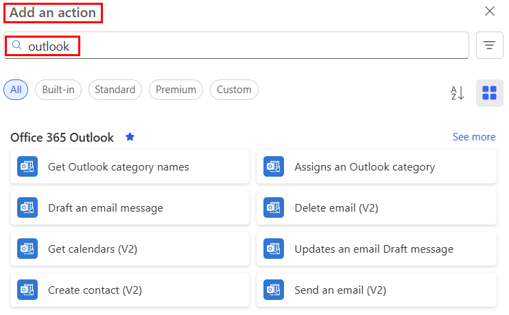

# Overview of Office 365 Outlook email use with Power Automate

Connectors represent the service to which you want to connect. For example, you can use the OneDrive, SharePoint, or Twitter connectors to use those services. One of the most popular connectors used in flows to send or receive email are the [Outlook.com connector](https://docs.microsoft.com/connectors/outlook/) and the [Office 365 Outlook](https://docs.microsoft.com/connectors/office365/#connector-in-depth) connector. Both connectors offer similar operations that allow you to manage your mail, calendars, and contacts. You can perform actions such as send mail, schedule meetings, add contacts, and so on with both of these connectors.

## Outlook.com or Office 365 Outlook: which connector should I use? 

If you are using an work or school email account, use Office 365 Outlook connector. If you are using a personal (Microsoft Account) account, use the Outlook.com connector. In this article, we refer only to the Office 365 Outlook [triggers](https://docs.microsoft.com/connectors/office365/#triggers) and [actions](https://docs.microsoft.com/connectors/office365/#actions). You can use the same techniques for the Outlook.com connector as well.

## Triggers

A **trigger** is an event that starts a cloud flow. For example, **When a new email arrives (V2)** is a trigger that starts a cloud flow when an email arrives into an inbox. Here is the full list of the [Office 365 Outlook triggers](https://docs.microsoft.com/connectors/office365/#triggers) you can use to start flows. Use the [Trigger a cloud flow based on email properties](https://docs.microsoft.com/power-automate/email-triggers) article to learn more on how to trigger flows based on email properties.

Here's a partial list of Office 365 Outlook triggers:

   

## Actions

**Actions** are the events you want the flow to do *after* the trigger event takes place. For example, when someone sends me an email, save it to OneDrive. Here is the full list of the [Office 365 Outlook actions ](https://docs.microsoft.com/connectors/office365/#actions) you can use in your flows.

Here's a partial list of Office 365 Outlook actions:

   

## More information

- Create [flows to manage email](create-email-flows.md).
- [Customize email in flows](email-customization.md).
- View the top [email scenarios](email-top-scenarios.md).

