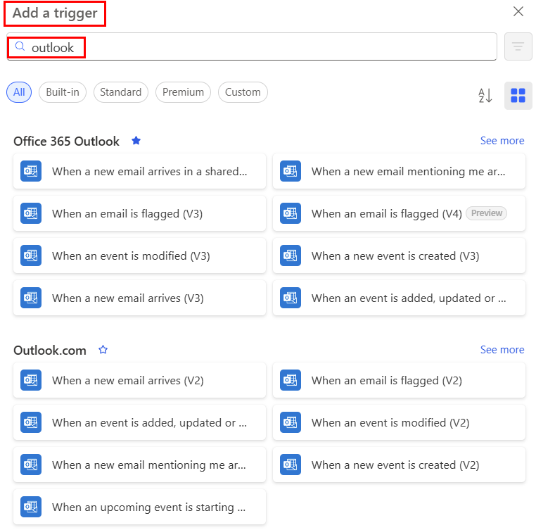

# Overview of using Outlook and Power Automate

Connectors represent the service to which you want to connect. For example, you can use the OneDrive, SharePoint, or Twitter connectors to use those services. Two of the most popular connectors used in flows to send or receive email are the [Outlook.com](/connectors/outlook/) connector and the [Office 365 Outlook](/connectors/office365/#connector-in-depth) connector. Both connectors offer similar operations that you can use to manage your mail, calendars, and contacts. You can perform actions such as send mail, schedule meetings, add contacts, and more with either of these connectors.

## Outlook.com or Office 365 Outlook: Which connector should I use?

If you're using a work or school email account, use the Office 365 Outlook connector. If you're using a personal account (Microsoft account), use the Outlook.com connector. In this article, we refer only to the Office 365 Outlook [triggers](/connectors/office365/#triggers) and [actions](/connectors/office365/#actions). You can also use the same techniques for the Outlook.com connector.

## Triggers

A *trigger* is an event that starts a cloud flow. For example, **When a new email arrives (V3)** is a trigger that starts a cloud flow when an email arrives into an inbox. You can also trigger flows based on the properties of an email. More information: [Trigger a cloud flow based on email properties](./email-triggers.md).
 
The following screenshot shows a partial list of the Office 365 Outlook triggers. For the full list of triggers you can use to start flows, go to [Office 365 Outlook triggers](/connectors/office365/#triggers).

> [!div class="mx-imgBorder"]
> 

## Actions

*Actions* are the events you want the flow to do after the trigger event takes place. An example of an action is, "when someone sends me an email, save it to OneDrive."

The following screenshot shows a partial list of Office 365 Outlook actions. For the full list of actions you can use in your flows, go to [Office 365 Outlook actions](/connectors/office365/#actions).

> [!div class="mx-imgBorder"]
> 

## Related information

- [Create flows for popular email scenarios](email-top-scenarios.md)
- [Create flows to manage email](create-email-flows.md)
- [Customize email in flows](email-customization.md)
- [Training: Enhance productivity with Power Automate and the Office 365 Outlook Connector (module)](/training/modules/enhance-productivity/)

[!INCLUDE[footer-include](includes/footer-banner.md)]
