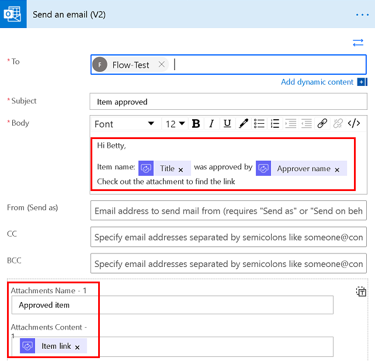
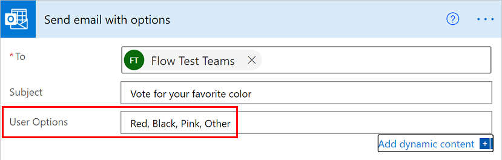
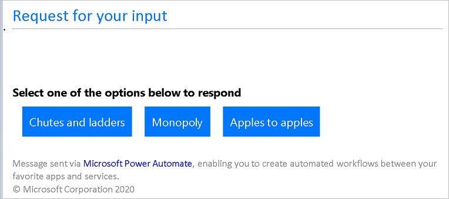
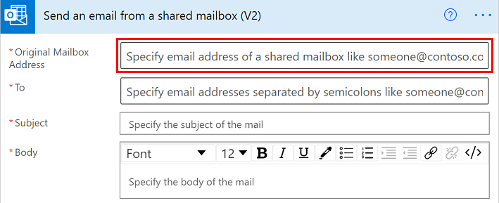

# Create flows for popular email scenarios

Here are some of the top scenarios in which you can use Power Automate to manage your email:

- Send an email from your account.

- Send an email from a distribution list (DL) or shared mailbox.

- Send an email with voting options.

- Build an approval process and notify colleagues via email.

- Send reminder email to approvers.

- Send a daily digest email with a summary table.

## Send email from your account

To send email from your account, use the [Send an email (V2)](https://docs.microsoft.com/connectors/office365/#send-an-email-(v2)) action.

You can send the email to one or more recipients. You can use the rich text editor to make text bold, add color, and format the email similar to the way you do in Outlook. You can add static text or values from previous actions by using dynamic content. You can use the **send as** option to send email as someone else, or on behalf of someone else. (To use this option, you'll need the permissions in Outlook to send on another person's behalf). You can find all email you send in your **Sent items** folder in Outlook.

For example, if you have a cloud flow that sends you an email as soon as your item is approved, you can add the link of the approved item as an attachment.

## Send email with voting options

<!--todo add a link to actionable email-->
Use the **Send email with options** action to send an email with voting options using actionable email. Provide voting options in the **User Options** field.

   

The recipients receive an email similar to the following image.

   

In your flow, you must capture that response and save it somewhere. You might email it to yourself, save it to Excel, or post it to Teams. Don't forget to save it, otherwise you won't know how people voted.<!--note from editor: Suggested.-->

## Send an email from a distribution list or shared mailbox

Use the [Send an email from a shared mailbox (V2) ](https://docs.microsoft.com/connectors/office365/#send-an-email-from-a-shared-mailbox-(v2)) action and specify the shared mailbox address to send email from a shared mailbox. 

The distribution list admin must first give you [permissions](https://docs.microsoft.com/microsoft-365/admin/manage/send-email-as-distribution-list?view=o365-worldwide) to the shared mailbox. When you use this action, email appears in the Sent folder of your shared mailbox because you're sending it from that account directly.

## Build an approval process and send notifications via email 

You can use Power Automate to [build an approval process that notifies users via email](https://o365hq.com/blog/build-an-approval-process-with-power-automate).

## Send reminder email to approvers

You can also send [reminder emails for approval requests](https://flow.microsoft.com/blog/approval-reminders-using-parallel-branches).

## Send a daily digest email with a table

Here are three ways you can send a daily digest email with a table:<!--note from editor: There is no order here.-->

- Use the [Data Operation – Select ](https://docs.microsoft.com/power-automate/data-operations#use-the-select-action) action to create a table with the column names and data you'd like to see in the email.
You can further format the data by using expressions. In following example, the flow gets calendar events within a certain timeframe, converts the time zones, and then creates a table with the events.<!--note from editor: If the reader is going to learn how to do this by looking at the image, there needs to be descriptive alt text here.-->

    

- Add the [Create HTML Table](https://docs.microsoft.com/power-automate/data-operations#use-the-create-html-table-action) action, and then add the output from the select action to the HTML action.

- Add the [Send an email (V2)](https://docs.microsoft.com/connectors/office365/#send-an-email-(v2)) action, add the output from an HTML table into the body of the email.

   

   >[!TIP]
   >Remember to select **Is Html** in the email action.

## More information

- Overview of [email with flows](email-overview.md)
- Create [flows to manage email](create-email-flows.md)
- [Customize email in flows](email-customization.md)

[!INCLUDE[footer-include](includes/footer-banner.md)]