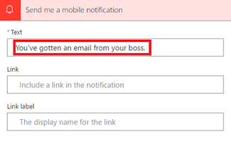

<properties
    pageTitle="Start a flow based on properties such as the subject, from address, or the recipient of an email. | Microsoft Flow"
    description="Start a flow based on properties such as the subject, from address, or the recipient of an email."
    services=""
    suite="flow"
    documentationCenter="na"
    authors="msftman"
    manager="anneta"
    editor=""
    tags=""/>

<tags
   ms.service="flow"
   ms.devlang="na"
   ms.topic="article"
   ms.tgt_pltfrm="na"
   ms.workload="na"
   ms.date="03/16/2016"
   ms.author="deonhe"/>

# Trigger a flow based on email properties

Use the **When a new email arrives** trigger to create a flow that runs when one or more of these email properties match criteria that you provide:

Property|When to use
----|----
Folder|Trigger a flow whenever emails arrive into a specific folder. This property can be useful if you have rules that route emails to different folders.
To|Trigger a flow based on the address to which an email was sent. This property can be useful if you receive email that was sent to different email addresses in the same inbox.
From|Trigger a flow based on the sender's email address.
Importance|Trigger a flow based on the importance with which emails were sent. Email can be sent with high, normal or low importance.
Has Attachment|Trigger a flow based on the presence of attachments on incoming emails.
Subject Filter|Search for the presence of specific words in the subject of an email. Your flow can then take *actions* based on the results of your search.

>[AZURE.IMPORTANT]Each [Microsoft Flow plan](https://flow.microsoft.com/pricing/) includes a run quota. Always check properties in the flow's trigger when possible; this strategy avoids using your run quota unnecessarily. If you check a property in a condition, each run will be counted against your plan's run quota, even if the filter condition you defined isn't met. For example, if you check an email's *from* address in a condition, each run will count against your plan's run quota, even if the *from* address of an email doesn't match the address in which you're interested.

In the walk-throughs below, we'll check all properties in the **When a new email arrives** trigger. You can learn more by visiting the [frequently asked billing questions](billing-questions.md/#what-counts-as-a-run) and the [pricing](https://ms.flow.microsoft.com/pricing/) page.

## Prerequisites

- An account with access to [Microsoft Flow](https://flow.microsoft.com).
- An Office 365 Outlook account.
- An Android or iOS mobile device with the Microsoft Flow app installed.
- Connections to Office 365 Outlook and the push notification service.

## Trigger a flow based on the subject of an email

In this walk-through, we'll create a flow that sends a push notification to your mobile phone if the subject of any new email has the word "lottery" in it. Your flow will then mark any such email as *read*.

Note: While this walk-through sends a push notification, you are free to use any other action to suit your workflow needs. For example, you could store the contents of the emails in another repository such as a Google Sheet or a Microsoft Excel file stored on Dropbox.

Ok, let's get started:

1. Sign into [Microsoft Flow](https://flow.microsoft.com), and then select the **My flows** tab.

1. Select **Create from blank**.

     

1. Search for "email", and then select **Office 365 Outlook - When a new email arrives** from the list of triggers. This trigger runs each time an email arrives.

     

1. Select the folder that you'd like the flow to monitor for incoming emails, and then select **Show advanced options**.

     Note: To display all your email folders, you may have to first select the **Show Picker** icon, which is located on the right side of the **Folder** box on the **When a new email arrives** card.

     

1. In the **Subject Filter** box, enter the text that your flow will use to filter incoming emails.

     In this example I'm interested in any email that has the word "lottery" in the subject.

      

1. Select **New step** > **Add an action**.

1. Search for "notification", and then select **Notifications - Send me a mobile notification** from the list of actions.

     

1. Enter the details for the mobile notification you'd like to receive when an email that matches the **Subject Filter** you specified earlier arrives.

     

1. Select **New step** > **Add an action**.

1. Search for "read", and then select **Office 365 Outlook - Mark as read** from the list of actions.

     

1. Add the **MessageId** token into the **Message Id** box on the **Mark as read** card.

   If the **Message Id** token isn't visible, search for it by entering **Message Id** in the search box.

     

1. Give your flow a name, and then save it by selecting **Create flow** at the top of the page.

     

Congratulations, you'll now receive a push notification each time you receive an email that contains the word "lottery" in the subject.

## Trigger a flow based on an email's sender

In this walk-through, we'll create a flow that sends a push notification to your mobile phone if any new email arrives from a specific sender (email address). The flow will also mark any such email as *read*.

1. Sign into [Microsoft Flow](https://flow.microsoft.com), and then select the **My flows** tab.

1. Select **Create from blank**.

     

1. Search for "email", and then select **Office 365 Outlook - When a new email arrives** from the list of triggers.

   This trigger runs each time an email arrives.

     

1. Select the folder that you'd like the flow to monitor for incoming emails, and then select **Show advanced options**.

   To display all your email folders, you may have to first select the **Show Picker** icon, which is located on the right side of the **Folder** box on the **When a new email arrives** card.

     

1. Enter the email address of the sender into **From**.

   This flow will take action on any emails sent from this address.

      

1. Select **New step** > **Add an action**.

1. Search for "notification", and then select **Notifications - Send me a mobile notification** from the list of actions.

     

1. Enter the details for the mobile notification you'd like to receive whenever a message arrives from the email address you entered earlier.

     

1. Select **New step** > **Add an action**.

1. Search for "read", and then select **Office 365 Outlook - Mark as read** from the list of actions.

     

1. Add the **MessageId** token into the **Message Id** box on the **Mark as read** card.

   If the **Message Id** token isn't visible, search for it by entering **Message Id** in the search box.

     

1. Give your flow a name, and then save it by selecting **Create flow** at the top of the page.

     

## Trigger a flow when emails arrive in a specific folder

You may want to create this type of flow if you've set up rules that route email to different folders based on certain properties (such as the address to which the email was sent) of the email.

Let's get started:

>[AZURE.NOTE]If you don't already have a rule that routes email to a folder other than your inbox, create such a rule and confirm it works by sending a test email.

1. Sign into [Microsoft Flow](https://flow.microsoft.com), and then select the **My flows** tab.

1. Select **Create from blank**.

     

1. Search for "email", and then select **Office 365 Outlook - When a new email arrives** from the list of triggers. This trigger runs each time an email arrives.

     

1. Select the folder to which you've created the rule to route specific emails. To display all your email folders, you may have to first select the **Show Picker** icon, which is located on the right side of the **Folder** box on the **When a new email arrives** card.

     

1. Select **New step** > **Add an action**.

1. Search for "notifications", and then select **Notifications - Send me a mobile notification** from the actions list.

     

1. Enter the details for the mobile notification you'd like to receive when an email arrives into the folder you've selected above. You'll have to enter the credentials for the notifications service if you haven't done so previously.

     

1. Select **New step** > **Add an action**.

1. Search for "read", and then select **Office 365 Outlook - Mark as read** from the actions list.

     

1. Add the **MessageId** token into the **Message Id** box on the **Mark as read** card.

   If the **Message Id** token isn't visible, search for it by entering **Message Id** in the search box.

     

1. Give your flow a name, and then save it by selecting **Create flow** at the top of the page.

     

Test the flow by sending an email that will be routed to the folder you selected earlier in this walk-through.
