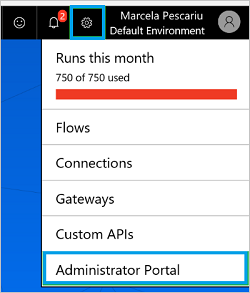
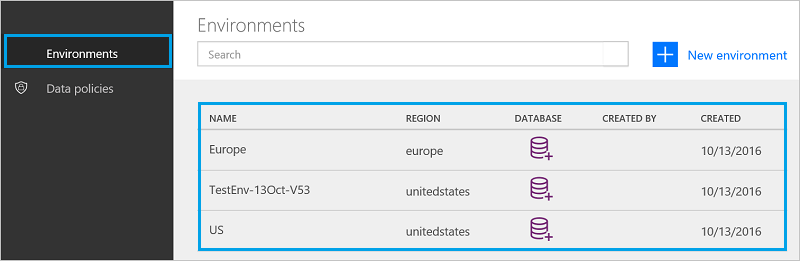
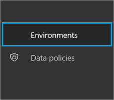
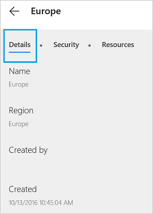
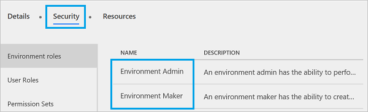
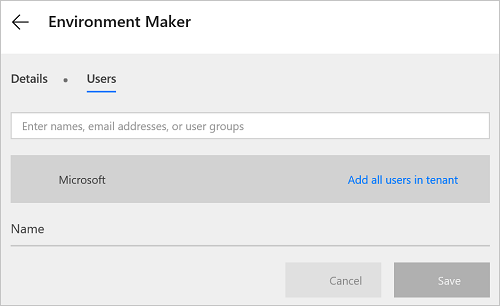
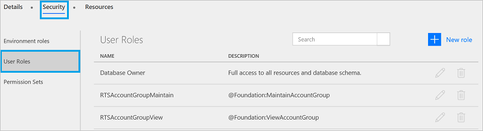
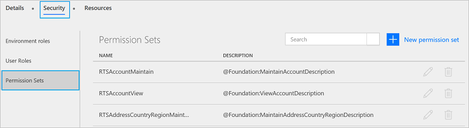

<properties
    pageTitle="Environment overview for Administrators | Microsoft Flow"
    description="Using, creating, and managing environments in Microsoft Flow"
    services=""
    suite="flow"
    documentationCenter="na"
    authors="sunaysv"
    manager="anneta"
    editor=""
    tags=""/>

<tags
   ms.service="flow"
   ms.devlang="na"
   ms.topic="article"
   ms.tgt_pltfrm="na"
   ms.workload="na"
   ms.date="10/20/2016"
   ms.author="sunayv"/>

# Using environments within Microsoft Flow

## Benefits
Environments are new feature in Microsoft Flow, and include the following benefits: 

- **Data locality**: Environments can be created in different regions, and are bound to that geographic location. When you create a flow in an environment, that flow is routed to all datacenters in that geographic location. This also provides a performance benefit. 

	If your users are in Europe, then create and use the environment in the Europe region. If your users are in the United States, then create and use the environment in the U.S. 

	If you delete the environment, then all flows within that environment are also deleted. This applies to any items you create in that environment, including connections, gateways, PowerApps, and more.

- **Data loss prevention**: As an Administrator, your don't want flows that get data from an internal location (such as *OneDrive for Business*), and then post that data publicly (such as to *Twitter*). Using data loss prevention, you control which services can be used in a business data-only policy. 

	For example, you can add the *SharePoint* and *OneDrive for Business* services to a business data-only policy. Any flows created in this environment can use these *SharePoint* and *OneDrive for Business* services. Only services you add are available. 

	> [!NOTE] Data loss prevention is available with some license skus, including the P2 license. 

- **Isolation boundary for all resources**: Any flows, gateways, connections, custom APIs, and so on reside in that specific environment. They do not exist in any other environments. 

- **Common Data Service**: You want to create a flow that inserts data somewhere. Your options are:

	- Insert data into an Excel file, and store the Excel file in a cloud storage account, such as OneDrive.
	- Create your own SQL Database, and store your data in it.
	- Use the Common Data Service to store your data.

	Every environment can have zero or one database storage for your flows in the Common Data Service. Access to the Common Data Service depends on the license you purchase; it is not included with the Free license.

## Limitations

Although, environments provide many benefits, they also introduce new limitations. The fact that environments are an isolation boundary means that you can never have resources that reference other resources *across* environments. For example, it's impossible to create a Custom API in one environment and create a flow that uses both that Custom API and a gateway in a different environment.

Thus, it is important that environments are only created when necessary. Creating too many environments will make it very difficult for users across your organization to share resources.

## Use the default environment

The **Default** environment is available for every user, and is shared by all users. Every user can create flows in this environment.

> [!TIP] If you're a Preview user, all existing flows reside in the default environment. A *Preview user* is someone who was using Microsoft Flow before its release to General Availability (GA). 

## Use the administrator center
Administrators use the administrator center to create environments, add users to these environments, and other similar tasks. There are two ways to open the administrator center:

#### Option 1: Select Settings

1. Sign in to [flow.microsoft.com](https://flow.microsoft.com).
2. Select the Settings gear, and choose **Administrator Portal** from the list:  

3. The administrator center opens.

#### Option 2: Open admin.flow.microsoft.com

Go to [admin.flow.microsoft.com](https://admin.flow.microsoft.com), and sign-in with your work account. The administrator center opens.

## Create an environment

1. In the [Microsoft Flow admin center](https://admin.flow.microsoft.com), select **Environments**. Any existing environments are displayed:  

2. Select **New environment**. Enter the following info:

	| Property | Description |
|--- | --- |
| Environment Name | Enter the name of your environment, such as `Human Resources`, or `Europe flows`. |
| Region | Choose the location to host your environment. For the best performance, use a region closest to your users. For example, if your flow users are in London, then choose the Europe region. If your flow users are in New York, then choose the United States region. |
| Provision database for this environment | Create a database in this environment. This database can be used by all users within the environment. The database is part of the Common Data Service, which is available with some licenses. So if you don't see this property, then it's not included with your license. |
| I do not want to provide full access to all users | Use this settings to prevent users in the environment from using the database. |

3. Select **Create**. Your new environment is listed. 

Next, add users to the environment.

## Manage your existing environments

1. In the [Microsoft Flow admin center](https://admin.flow.microsoft.com), select **Environments**:  
  
2. Select an environment to open its properties. 
3. **Details** show additional information about the environment, including who created the environment, its geographic location, and other properties:  

4. Select **Security**. In **Environment roles**, there are two options: **Admin** and **Maker**:  

	

	A **Maker** can create new resources in an environment, such as flows, data connections, and gateways. 

	> [!NOTE] A user does not need to be a **Maker** to *edit* resources in an environment, only to create *net-new* resources. Each resource creator can determine who can edit that resource, and can grant edit permissions to users who are not environment Makers.

	An **Admin** can create data loss prevention policies, and also complete administrative tasks, such as create environments, add users to an environment, and assign admin/maker privileges.  

	1. Select the **Environment Maker** role, and then select **Users**:  
	

	2. Enter a name, email address, or user group that you'd like to give the Maker role. As you start typing, intellisense starts listing the user/groups that match your text. 
	3. Select **Save** to complete adding users. 
5. Within **Security**, select **User Roles**:  
	

	Any existing roles are listed, including the options to edit or delete the role. 

	Select **New role** to create a new role. 

6. Within **Security**, select **Permission Sets**:  
	

	Any existing permission sets are listed, including the options to edit or delete the role. 

	Select **New permission set** to create a new one. 

7. In **Resources**, all the items within the environment are listed, including flows, connections, custom APIs, gateways, and PowerApps. 

## Commonly asked questions

##### Can I migrate a Microsoft Flow in my U.S. environment, to a Europe environment?
No, flows cannot be moved between environments. Recreate the flow in the different environment.

##### Which license includes the Common Data Service?
Only Microsoft PowerApps Plan 2 includes rights to create databases with the Common Data Service. However, all paid plans (Microsoft Flow plans 1 and 2, and Microsoft PowerApps plans 1 and 2) have the rights to use the Common Data Service.

##### Can the Common Data Service be used outside of an environment?
No. The Common Data Service requires an environment.

##### What regions include Microsoft Flow?
Microsoft Flow supports most of the regions that Office 365 supports, see [the regions overview](regions-overview.md) for more details.

##### What is needed to create my own custom environment?
All users with the Microsoft Flow Plan 2 license can create their own environments, in addition to the default environment. All Microsoft Flow users, including Office 365 and Free, can use the environments created by Plan 2 administrators, but they cannot create their own environments. 
