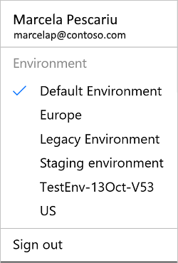
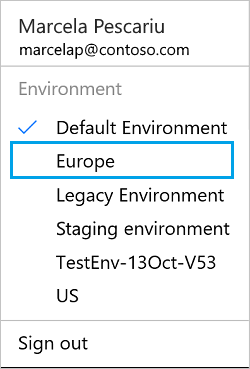

<properties
    pageTitle="Switching environments when creating a Microsoft Flow | Microsoft Flow"
    description="How a maker uses different environments when creating a Microsoft Flow"
    services=""
    suite="flow"
    documentationCenter="na"
    authors="sunaysv"
    manager="anneta"
    editor=""
    tags=""/>

<tags
   ms.service="flow"
   ms.devlang="na"
   ms.topic="article"
   ms.tgt_pltfrm="na"
   ms.workload="na"
   ms.date="10/27/2016"
   ms.author="sunayv"/>

# Choosing an environment

With Microsoft Flow, you can work in different environments, and easily switch among them. The scope of this article covers the following topics on environment:

- Background of what environments provide
- Switching environments
- How to create a flow in the right environment

## Environments overview

Environments provide an isolation boundary for your flows, connections, gateways, and other resources. When you create a flow, you choose which environment to host the flow, and the resources used by that flow. You can use different environments for different scenarios.

Some examples:

- You are creating a flow that uses a connection to the Microsoft Common Data Service. In this scenario, the flow and the Common Data Service reside in the same environment. This ensures all the data is isolated within that environment (isolation boundary).
- You are creating a flow for your Human Resources department. You want to ensure that only users in your Human Resources department have access to the flow. For example, you don't want your Sales group to use the flow. In this scenario, you can use a separate environment, which only the HR users have permissions, to host the flow, and any resources the flow uses, including gateways or connections.
- There are users in Europe that use a flow to show SharePoint data. In this scenario, create an environment in Europe that hosts the flow, and the SharePoint connection. This Europe environment gives the European users the best performance, as all resources are local to Europe (data locality).

Environments are created by Microsoft Flow administrators. These administrators also control who has access to the different environments.

This topic shows you how to navigate between different environments. For details on how you can create and manage them, see [administer environments](environments-overview-admin.md).

## Switching environments

Microsoft Flow makes it pretty easy to switch between environments. When you do switch, you are seeing all the items in that specific environment; you are not seeing items in any other environment.

Here's an example.

You create a flow named *NewEmployee* in the *Human Resources* environment. In [flow.microsoft.com](http://flow.microsoft.com), you open the *Sales* environment. The *NewEmployee* flow is not listed. To see the *NewEmployee* flow, open the *Human Resources* environment. Remember, this applies to any items you create in the environment, including connections, gateways, PowerApps, and more.

1. Open [flow.microsoft.com](http://flow.microsoft.com).
2. In the top right corner, you see your name, and the environment you're in:  

	In the image, notice the notifications. These notifications are specific to the flow in this default environment.

3. Select your name. In the drop-down list, all the environments available to you are listed. Your current environment is checked:  

4. To switch to another environment, select that environment in the list:  

5. Microsoft Flow automatically switches to the new environment:  

	In the image, notice there are no notifications. The new Europe environment has no notifications.

## Create flows in the right environment

Before you create a flow, always make sure you select the environment you want to flow to be in. Otherwise, you will have delete and recreate the flow in the correct environment.

Consider the following factors when choosing which environment to create your flows in:

- Gateways are created in the Default environment. Gateways cannot be created in other environments, so if you want to connect to On-premises data you'll need to use the Default environment.
- Flows can only use connections, and other resources within the same environment. They cannot use resources in other environment. For example, you are creating a flow that uses a custom connector. This custom connector must be in the same environment as the flow.
- The Microsoft Common Data Service database is always tied to exactly one environment. That means if you ever want to work with the Common Data Service data you must select the same environment that the database is in.
- You will see all environments that you can edit resources in. This does not mean you can create new resources in all environments, however. Thus, in some environments you may be unable to create new flows. You need to ask the administrator to add you as a **Maker** to that environment, or, pick a different environment to create the flow in (you will always be able to create flows in the default environment).

## What you did
Using these steps, you switch between environments that you have permissions to use. Now, go start creating your flows.

## Next steps

[Create a flow from a template](get-started-logic-template.md)  
[Create a flow](get-started-logic-flow.md)  
[Environment overview for Administrators](environments-overview-admin.md)
