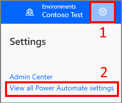
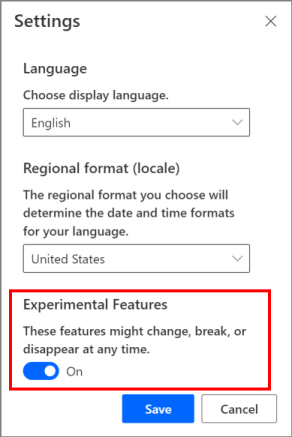

# Enable experimental features in Power Automate

Experimental features provide you early access to functionalities and updates in Power Automate before they're available worldwide.

> [!CAUTION]
>
> - Experimental features might change, break, or disappear at any time, and shouldn't be enabled in production environments.
> - Microsoft doesn't provide support for experimental features. Microsoft Power Platform technical support team won’t be able to help you with issues or questions. Use the [Power Automate community forums](https://aka.ms/fl_comm_forums) for feedback and help with experimental features.

Follow these steps to enable experimental features in Power Automate.

1. Sign in to [Power Automate](https://make.powerautomate.com).

1. Select your environment from the top-right corner.

1. Select **Settings** (gear icon) > **View all Power Automate settings**.

    

1. Set **Experimental Features** to **On**, and then select **Save**.

   

You will now be able to access all experimental features in Power Automate.

>[!NOTE]
>Experimental features are available only for the account that turns on experimental features.

## Related information

[New expression editor for actions (experimental feature)](multi-step-logic-flow.md#new-expression-editor-for-actions-experimental-feature)
