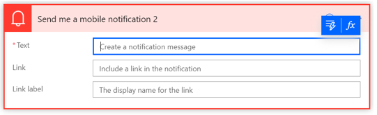
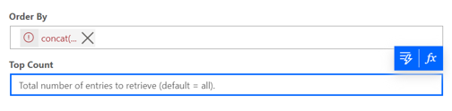

## Turning on Experimental features

Please follow below steps to turn on experimental features in your environment:  
**•Go to flow.microsoft.com and login if you are not logged in already.**  
**•Click on Settings (gear icon) from top-right corner of the page and click 'View all Power Automate settings'** 

**•	Turn On Experimental Features** 
**•	Click Save

Now, when you will create a new flow or edit any existing flow, you will be able to access all experimental features in Power Automate. 
**Note:**
Experimental features might change, break, or disappear at any time. So, please be careful while using it in production environment.

## New Expression Editor in experimental features

Do you struggle with writing expressions in your flow actions? Now, you can make use of the bigger and improved expression editor in experimental mode. Simply Turn on Experimental Mode and click on the ‘fx’ skittle on an action. 

**1.	The expression editor view is bigger to help you manage richer and complex expressions.**  
**2.	Ability to choose dynamic content in the expressions without having to switch tabs.**  
**3.	Ability to preserve errored expressions and unblock the view to parallelly work on other parts of flow.**

 
**Note:**
Some actions may not support the new expression editor.

