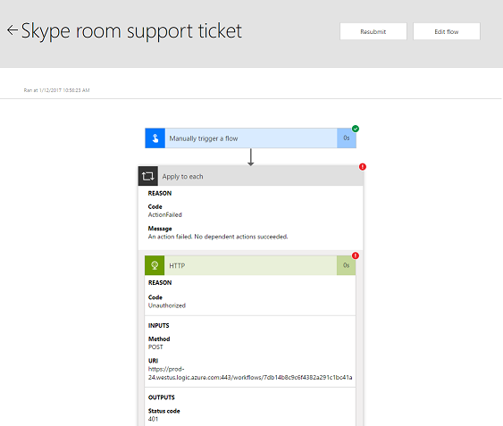

<properties
	pageTitle="Fix flow failures | Microsoft Flow"
	description="How to fix some of the most common flow failures"
	services=""
	suite="flow"
	documentationCenter="na"
	authors="stepsic-microsoft-com"
	manager="erikre"
	editor=""
	tags=""/>

<tags
   ms.service="flow"
   ms.devlang="na"
   ms.topic="article"
   ms.tgt_pltfrm="na"
   ms.workload="na"
   ms.date="01/17/2017"
   ms.author="stepsic"/>

# Fix flow failures #

## Identify the error ##

Before you can fix your flow, you first need to identify the reason that it failed. Start by going to the notifications icon at the top of the web portal, or selecting the **Activity** tab in the mobile app. You should see your flow there, and you can select it.

You are now looking at the flow details. Find the step with the red exclamation icon and you should see the error message for your flow there.

## Authentication failures ##

One of the most common reasons that a flow can fail is an *authentication* failure. You have an authentication failure if you see **Unauthorized** in the error message, or, if you see an error code of **401** or **403**. You can usually fix an authentication failure by updating the **Connection**. To update your connection:

1. Select the **Settings** menu in the top of the web portal. It looks like a gear. Choose **Connections**.
2. Scroll to the connection that you saw the **Unauthorized** error message for.
3. Next to the conncetion you should see a message saying: *This connection is not authenticated. Verify password.* Select the **Verify password** link.
4. Follow the instructions in the pop-up window to verify your credentials.

Finally, you can return to your flow run failure and select the **Resubmit** button. It should now run as expected. 

## Action configuration ##

Another common failure is when you have settings in the actions of the flow that do not function as expected.
