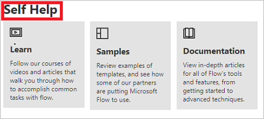

# Troubleshooting a cloud flow

## Repair tips in email

Repair tips are sent to flow owners via email whenever a cloud flow fails. These repair tips emails contain specific, actionable feedback about certain errors. For example, one common error is setting up a cloud flow that attempts to get a person’s manager in Office 365—but there is no manager configured in Azure Active Directory (Azure AD). If this or several other conditions cause your flow to fail, you get a repair tips email like this:

The repair tips email contains the following sections:

Name|Description
---|---
Time|Displays the time the flow first failed.
What happened|Provides a description of the problem that caused the failure in the flow.
How do I fix|Provides tips for resolving the issue that cause the failure in the flow.
Troubleshooting Tips|Provides details including the number of times the flow failed, and a link to retry the flow with the same input data.

To fix the reported errors, select **Fix my flow** and follow the steps in the repair tips email.

Repair tips emails are optional. If you don't want to receive them, just turn them off from the properties menu for the specific flow.

If your flow fails, you can also troubleshoot it directly in Power Automate.  Here are a few common failure scenarios and tips on how to fix them.

## Identify the error

1. Select **My flows**.
1. Select the flow that failed.
1. In the **28-day run history** section, select the **date** of the failed run.
   
   Details about the flow appear, and at least one step shows a red exclamation icon.
1. Open that failed step, and then review the error message.

   On the right pane, you can see the **details** of the error and **How to fix** the error 

   

## Authentication failures
In many cases, flows fail because of an authentication error. If you have this type of error, the error message contains **Unauthorized** or an error code of **401** or **403** appears. You can usually fix an authentication error by updating the connection:

1. In the right pane, click on **View Connections** below **How to fix**.
1. Scroll to the connection for which you saw the **Unauthorized** error message.
1. Next to the connection, click or tap the **Fix connection** link in the message about the connection not being authenticated.
1. Verify your credentials by following the instructions that appear, return to your flow-run failure, and then click or tap **Resubmit**.

   
   
 The flow should now run as expected.

## Action configuration
Flows also fail if a setting in an action of the flow doesn't function as expected. In this case, the error message contains **Bad request** or **Not found**, or an error code of **400** or **404** appears.

The error details should specify how to correct the failure. You'll need to click or tap the **Edit** button and then correct the problem inside the flow definition. Save the updated flow, and then click or tap **Resubmit** to try the run again with the updated configuration.

## Other failures
If the error code **500** or **502** appears, the failure is temporary or transient. Click or tap **Resubmit** to try the flow again.

## Getting help from support or the community

When you need help, you can use our **Self Help** options, or you can **Ask for help** from others.

### Self help 

1. Go to the [support site](https://flow.microsoft.com/support/).
1. Go to the **Self Help** category and select one of the self-help options.

    

### Ask for help from others

1. Go to the [support site](https://flow.microsoft.com/support/).
1. Select **Contact Support** in the **Ask for help** section.
    
    

1. Complete the **Problem type**, **Category**, and the **Tell us what you need help with** fields, and then select **See solutions**. 

1. Notice that the **Solutions** section displays after you select **See solutions**. It contains a list of results that you can use to help address the issue you're facing. 

    

If you need help with an issue, help is available from our [community](https://go.microsoft.com/fwlink/?LinkID=787467) and Microsoft. 

[!INCLUDE[footer-include](includes/footer-banner.md)]