# Run your flows with Flics smart buttons (Preview)

Trigger your flows by pressing a physical button, known as a Flic, from Shortcut Labs. For example, press a Flic to track your working hours, block your calendar, count visitors at an event, or save geographical locations.

> [!IMPORTANT]
> Configure all Flic properties by using Flic's mobile app for [Android](https://play.google.com/store/apps/details?id=io.flic.app) or [iOS](https://itunes.apple.com/us/app/flic-app/id977593793?ls=1&mt=8) before you create your flow.
> 
> 

## Prerequisites
To use Flics with Power Automate, you must have:

* Access to [Power Automate](https://flow.microsoft.com).
* Downloaded Flic's [Android](https://play.google.com/store/apps/details?id=io.flic.app) or [iOS](https://itunes.apple.com/us/app/flic-app/id977593793?ls=1&mt=8) mobile app, and used it to pair one or more Flics.

## Configure Flic properties
Use Flic's mobile app to program the Flic's events. The events are:

* click (one quick press)
* double-click (two quick presses)
* hold (one long press)

This screenshot shows a sample of what your Flic configuration process might be like:

After you've linked a Flic event to Power Automate, you can then select that Flic as a trigger for your flows. You select triggers later in this walkthrough.

## Create a cloud flow that's triggered by a Flic
In this walkthrough, we use a Flic to run a cloud flow that records the time a consultant spends at each client. The consultant presses the Flic once upon arrival, and then presses it again, just before departure from the client. Each press of the Flic starts a run of the flow to which it's connected. The flow saves the current time in Google Sheets, and then sends an email notification. The email contains details about the flow run.

Note: Be sure you've used the Flic mobile app to pair, and configure at least one **click** action to trigger Power Automate. In this screenshot, I've configured the **click** action to trigger Power Automate. Later in this walkthrough we configure our flow to trigger when the Flic is pressed once (clicked).

   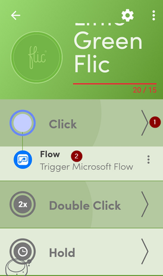

Let's get started creating our flow.

### Start with a template
1. Sign into [Power Automate](https://flow.microsoft.com).
   
    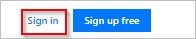
2. Enter **flic** into the search box, and then select the search icon.
   
    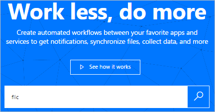
3. Select the **Track your working hours with Flic smart button** template.
   
    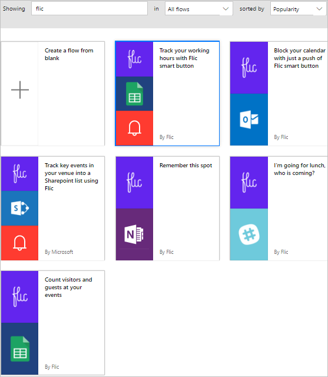

### Create a spreadsheet in Google Sheets
1. Review the template's details and note that this template requires a spreadsheet in Google Sheets.
   
   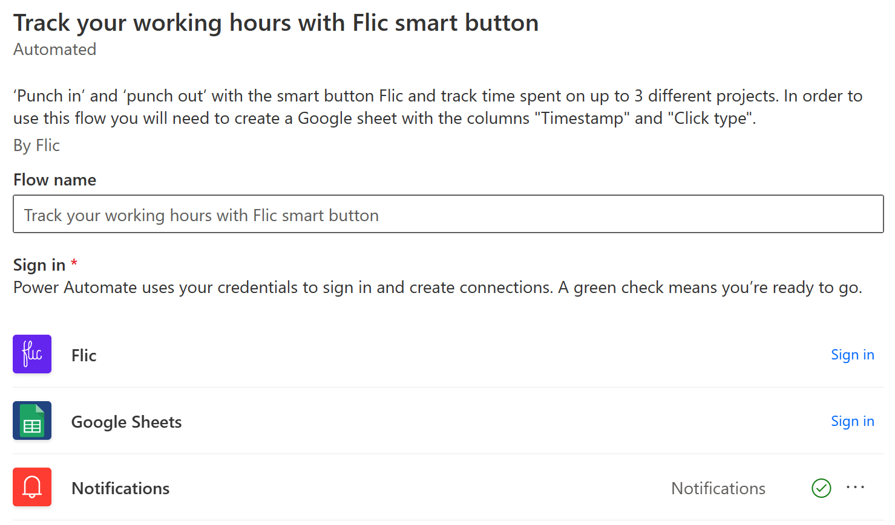
2. In Google Sheets, create a spreadsheet that contains a sheet with columns named **ClickType** and **TimeStamp**.
   
      Tip: You name columns in Google Sheets by entering the column name at the top of the column. So, your sheet should appear like this screenshot:
   
   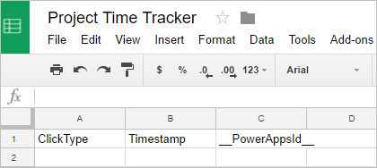
   
   Note: You use this sheet later in this walkthrough.

### Add the Flic trigger to your flow
1. Sign in to the template's services, and then select **Continue**.
   
     **Continue** is enabled after you sign into all required services for the template.
   
    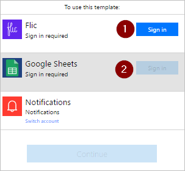
2. Enter **flic** into the search box, and then select the **Flic - When a Flic is pressed** trigger.
   
    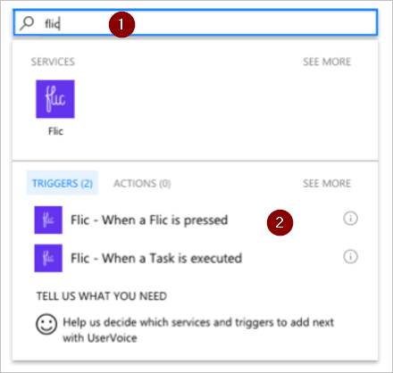
3. Select the Flic you want to use from the **Flic button** list on the **Flic - When a Flic is pressed** card.
4. Select **click** from the **Events** list to indicate that you want to trigger the flow when the Flic is pressed once.
   
    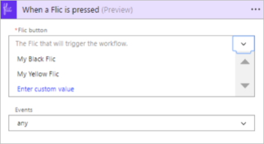
   
   Optionally, you can select **any** to indicate that each Flic event (click, double-click, or hold) triggers the flow.
   
   **Double-click** indicates that the flow triggers when the Flic is quickly pressed two times. **Hold** indicates that a long press on the Flic triggers the flow.
   
   You're free to create other flows and trigger them using the other events in the **Events** list. For example, you can use the **double-click** event to record the time you leave a client.

### Configure the sheet
   On the **Insert row** card:

1. Select the spreadsheet you created earlier from the **File** list.
2. Select the sheet from the **Worksheet** list.
   
   Note: Two additional boxes appear on the **Insert row** card after you select the sheet. These boxes represent the two columns in the sheet you created earlier.
3. Select the **ClickType** box, and then select the **Click type** token.
4. Select the **Timestamp** box, and then select the **Click time** token.
   
    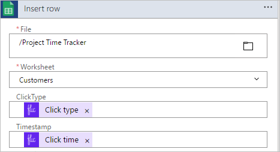

### Confirm the email settings are correct
1. Confirm the **Send me an email notification** card looks like this screenshot.
   
    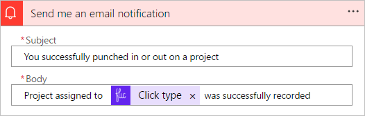

### Save your flow and test it
1. Give your flow a name, and then save it.
   
    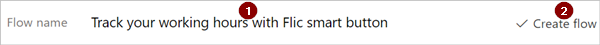

If you've followed along, pressing the Flic once triggers the flow. The flow then records the click type and the current time in the sheet and then sends an email to you.

1. Press your Flic once.
2. Open your worksheet in Google Sheets. You should see the **ClickType** and the **Timestamp** columns populated with the "click" and the time, respectively.
   
    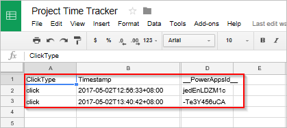
3. You can also see the results of the run from the Power Automate website or from the Power Automate mobile app. Here's a screenshot of my test run.
   
    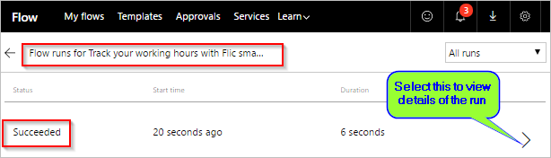
4. Here's what the body of the notification email that I received from the run of the flow looks like.
   
    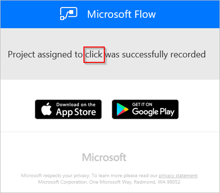

For extra credit, consider extending the flow to automatically record your location (latitude and longitude) when the Flic is pressed.

## More information
* [Share button flows](share-buttons.md).
* Learn to use [button trigger tokens](introduction-to-button-trigger-tokens.md) to send current data when your button flows are executed.
* Install the Power Automate mobile app for [Android](https://aka.ms/flowmobiledocsandroid), [iOS](https://aka.ms/flowmobiledocsios), or [Windows Phone](https://aka.ms/flowmobilewindows).

[!INCLUDE[footer-include](includes/footer-banner.md)]