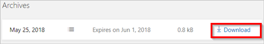

# Respond to GDPR Data Subject Export Requests for Power Automate

As part of our commitment to partner with you on your journey to the General Data Protection Regulation (GDPR), we’ve developed documentation to help you prepare. The documentation not only describes what we’re doing to prepare for the GDPR but also shares examples of steps you can take today with Microsoft to support GDPR compliance when using Power Automate.

## Manage export requests

The *right of data portability* allows data subjects to request a copy of their personal data in an electronic format (that’s a “structured, commonly used, machine readable, and interoperable format”) that may be transmitted to another data controller.

Use the [Microsoft privacy dashboard](https://account.microsoft.com/privacy/), or [Power Automate](https://flow.microsoft.com/) to find or export personal data for a specific user.

|Personal data|Location|
|-----------------|-------------------|
|Product and service activity|Microsoft privacy dashboard|
|Flows|Power Automate maker portal|
|Run history|Power Automate maker portal|
|Activity Feed|Power Automate maker portal|
|Connections|Power Automate maker portal|

## Export product and service activity

1. Sign into the [Microsoft privacy dashboard](https://account.microsoft.com/privacy/) using your Microsoft Account (MSA).
1. Select **Activity history**.

    
    You can browse your activity history for the different Microsoft applications and services that you use.
1. To export **Product and Service Activity** data select **Download your data**, and then select **CREATE NEW ARCHIVE**.

    

1. Select **App & service usage**, and then select **Create archive**.

    
1. A new archive is created. Select **Download** to obtain your exported product and service activity data.

    

## Export a cloud flow

An end user who has access to a cloud flow, can export the flow by following these steps:

1. Sign into [Power Automate](https://flow.microsoft.com/).

1. Select the **My flows**, and then select the flow to export.

1. Select **… More**, and then select **Export**.

    

1. Select **Package (.zip)**.

Your flow will now be available as a zipped package. For more information, see the blog post about [how to export and import a cloud flow](https://flow.microsoft.com/blog/import-export-bap-packages/).

## Export run history

Run history includes a list of all runs for a cloud flow. This data includes the flow’s status, start time, duration, and input/output data for triggers and actions.

An end user who has access to the flow can follow these steps to export this data:

1. Sign into [Power Automate](https://flow.microsoft.com/).
1. Select the **My flows** link, and then select the flow for which you want to export the run history.
1. In the **RUN HISTORY** pane, select **See all**.

    

1. Select **Download CSV**.

    

The run history is downloaded as a .csv file so that you can open it in Microsoft Excel or a text editor to analyze the results.

## Export a user's activity feed

In [Power Automate](https://flow.microsoft.com/), the activity feed shows a user’s history of activities, failures and notifications. Users can view their activity feed by following these steps:

1. Sign into [Power Automate](https://flow.microsoft.com/), select the bell icon near the upper-right corner, and then select **Show all activity**.

    

1. In the **Activity** screen, copy the results, and then paste them into a text editor such as Microsoft Word.

    

## Export a user’s connections

Connections allow flows to connect to APIs, SaaS applications, and other third-party systems. Follow these steps to view your connections:

1. Sign into [Power Automate](https://flow.microsoft.com/), select the gear icon near the upper-right corner, and then select **Connections**.

    
1. Copy the results, and then paste them into a text editor such as Microsoft Word.

[!INCLUDE[footer-include](includes/footer-banner.md)]