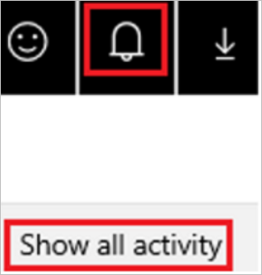
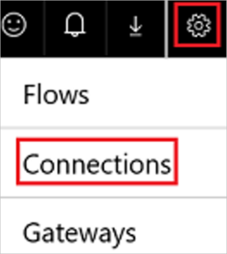
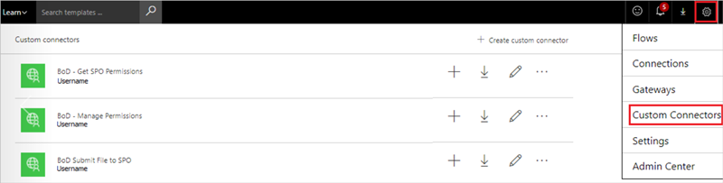

# Responding to GDPR Data Subject Export Requests for Power Automate


As part of our commitment to partner with you on your journey to the General Data Protection Regulation (GDPR), we’ve developed documentation to help you prepare. The documentation not only describes what we’re doing to prepare for the GDPR but also shares examples of steps you can take today with Microsoft to support GDPR compliance when using Power Automate.

## Manage Export requests

The *right of data portability* allows a data subject to request a copy of their personal data in an electronic format (that’s a “structured, commonly used, machine readable, and interoperable format”) that may be transmitted to another data controller.

Power Automate offers the following experiences to find or export personal data for a specific user:

* **Website access:** sign into the [Power Apps admin center](https://admin.powerapps.com/), or the [Power Platform admin center](https://admin.powerplatform.microsoft.com/).

* **PowerShell access:**  [Power Apps Admin PowerShell cmdlets](/power-platform/admin/powerapps-powershell).

|**Customer data**|**Website access**|**PowerShell access**|
|-----------------|------------------|-------------------|
|System-generated logs|[Office 365 Service Trust Portal](https://servicetrust.microsoft.com/)|
|Run history|Power Automate Maker Portal||
|Flows|Power Automate Maker Portal||
|Flow permissions| Power Automate Maker Portal and Power Automate admin center||
|User details||Power Apps cmdlets|
|Connections|Power Automate Maker Portal|Power Apps cmdlets |
|Connection permissions|Power Automate Maker Portal|Power Apps cmdlets |
|Custom connectors|Power Automate Maker Portal|Power Apps cmdlets |
|Custom connector permissions|Power Automate Maker Portal|Power Apps cmdlets |
|Gateway|Power Automate Maker Portal|On-premises Data Gateway PowerShell cmdlets|
|Gateway permissions|Power Automate Maker Portal|On-premises Data Gateway PowerShell cmdlets|

## Export a cloud flow

Either an end user or an administrator, who has granted themselves access to the flow, can export the flow by following these steps:

1. Sign into [Power Automate](https://flow.microsoft.com/).

1. Select the **My flows** link, and then select the flow to export.

1. Select **… More**, and then select **Export**.

    

1. Select **Package (.zip)**.

Your flow will now be available as a zipped package. For more information, see the blog post about [how to export and import a cloud flow](https://flow.microsoft.com/blog/import-export-bap-packages/).

## Export run history

Run history includes a list of all executions that have occurred for a cloud flow. This data includes the flow’s status, start time, duration, and input/output data for triggers and actions.

Either an end user or an administrator, who has been granted access to the flow through the Power Automate admin center, can follow these steps to export this data:

1. Sign into [Power Automate](https://flow.microsoft.com/).
1. Select the **My flows** link, and then select the flow for which you want to export the run history.
1. In the **RUN HISTORY** pane, select **See all**.

    

1. Select **Download CSV**.

    

The run history is downloaded as a .csv file so that you can open it in Microsoft Excel or a text editor and further analyze the results.

## Export a user's activity feed

In [Power Automate](https://flow.microsoft.com/), the activity feed shows a user’s history of activities, failures and notifications. Any user can view their activity feed by following these steps:

1. Sign into [Power Automate](https://flow.microsoft.com/), select the bell icon near the upper-right corner, and then select **Show all activity**.

    

1. In the **Activity** screen, copy the results, and then paste them into a document editor such as Microsoft Word.

    

## Export a user’s connections

Connections allow flows to connect to APIs, SaaS applications, and other third-party systems. Follow these steps to view your connections:

1. Sign into [Power Automate](https://flow.microsoft.com/), select the gear icon near the upper-right corner, and then select **Connections**.

    
1. Copy the results, and then paste them into a document editor such as Microsoft Word.

Power Apps Admin PowerShell cmdlets

```PowerShell
Add-PowerAppsAccount

#Retrieves all connections for the user 
Add-PowerAppsAccount
$userId = "7822bb68-7c24-49ce-90ce-1ec8deab99a7"
Get-AdminConnection -CreateBy $userId | ConvertTo-Json |Out-File -FilePath "UserConnections.txt"
```

## Export a list of a user’s connection permissions

A user can export the connection role assignments for all connection that they have access to via the Get-ConnectionRoleAssignment function in the [Power Apps PowerShell cmdlets](/power-platform/admin/powerapps-powershell).

```PowerShell
Add-PowerAppsAccount
Get-ConnectionRoleAssignment | ConvertTo-Json | Out-File -FilePath "ConnectionPermissions.txt"
```
Power Apps Admin PowerShell cmdlets

```PowerShell
Add-PowerAppsAccount

#Retrieves all connection permissions for the specified user 
Add-PowerAppsAccount
$userId = "7822bb68-7c24-49ce-90ce-1ec8deab99a7"
Get-AdminConnectionRoleAssignment -PrincipalObjectId $userId | ConvertTo-Json | Out-File -FilePath "ConnectionPermissions.txt" 
```

## Export a user’s custom connectors

Custom connectors supplement the out of box connectors and allow for connectivity to other APIs, SaaS, and custom-developed systems. You can transfer ownership of a custom connector or delete it.

Follow these steps to export a list of customer connectors:<!-- Edit note: Is it custom or customer connectors. -->

1. Navigate to [Power Automate](https://flow.microsoft.com).
1. Select the settings **gear** icon.
1. Select **Custom Connectors**.
1. Copy and paste the list of custom connectors into a text editor such as Microsoft Word.

    

In addition to the experience provided in Power Automate, you can use the Get-Connector function from the [Power Apps PowerShell cmdlets](/power-platform/admin/powerapps-powershell) to export all custom connectors.

~~~~
Add-PowerAppsAccount
Get-Connector -FilterNonCustomConnectors | ConvertTo-Json | Out-File -FilePath "CustomConnectors.txt"
~~~~

Power Apps Admin PowerShell cmdlets

```PowerShell
Add-PowerAppsAccount

#Retrieves all custom connectors for user 
Add-PowerAppsAccount
$userId = "7822bb68-7c24-49ce-90ce-1ec8deab99a7"
Get-AdminConnector -CreatedBy $userId | ConvertTo-Json | Out-File -FilePath "UserCustomConnectors.txt"  
```

## Export a user’s custom connector permissions

A user can export all custom connector permissions they have created via the Get-ConnectorRoleAssignment function in the [Power Apps PowerShell cmdlets](/power-platform/admin/powerapps-powershell).

```PowerShell
Add-PowerAppsAccount
Get-ConnectorRoleAssignment | ConvertTo-Json | Out-File -FilePath "CustomConnectorPermissions.txt"
```

Power Apps Admin PowerShell cmdlets

```PowerShell
Add-PowerAppsAccount

#Retrieves all connection permissions for the specified user 
Add-PowerAppsAccount
$userId = "7822bb68-7c24-49ce-90ce-1ec8deab99a7"
Get-AdminConnectorRoleAssignment -PrincipalObjectId $userId | ConvertTo-Json | Out-File -FilePath "CustomConnectorPermissions.txt"   
```

## Export approval history

Power Automate Approvals History captures history of approvals that have been received or sent for a user. Any user can view their approval history by:

1. Signing into [Power Automate](https://flow.microsoft.com/), selecting **Approvals**, and then selecting **History**.

    

1. A list shows approvals that the user received. The users can show approvals that they sent by selecting the down arrow next to **Received** and then selecting **Sent**.

    

## Export User Details
User details provide a linkage between a user and a specific tenant. An administrator can export this information by calling the **Get-AdminFlowUserDetails** cmdlet and passing in the Object ID for the user.

Power Apps Admin PowerShell cmdlets

```PowerShell
Add-PowerAppsAccount

Get-AdminFlowUserDetails -UserId 1b6759b9-bbea-43b6-9f3e-1af6206e0e80
```

## Export Gateway Settings
Responding to Data Subject Export Requests for On-Premise Data Gateways can be found [here](/power-bi/service-gateway-onprem#tenant-level-administration).


[!INCLUDE[footer-include](includes/footer-banner.md)]