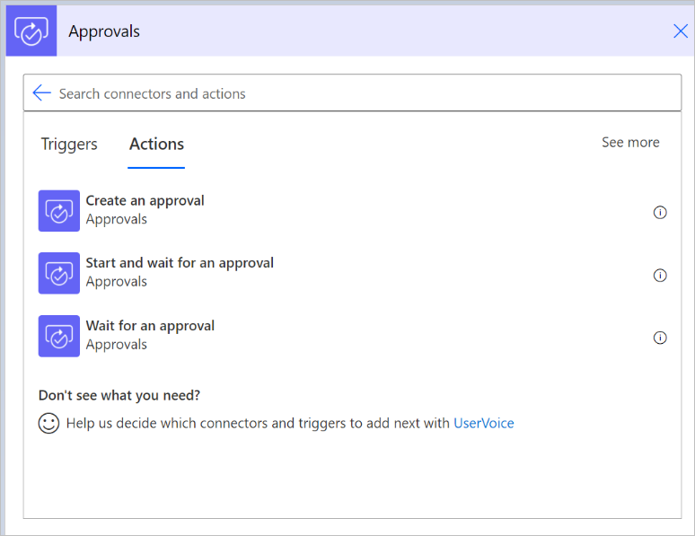

# Get started with approvals

Whether you need written acknowledgment from your manager or a formal authorization from a diverse group of stakeholders, getting things approved is part of almost every organization. 

With the approvals capability in Power Automate, you can automate sign-off requests and combine human decision-making for workflows. Some popular cases where approvals can be used include:

   - Approving vacation time requests.

   - Approving documents that need sign-off.

   - Approving expense reports.

When you submit an approval in a flow, approvers are notified and can review and act on the request.

## Approvals actions  
  
*Actions* are the events you want your flow to perform after the trigger starts the flow. For example, when a new item is added to a SharePoint list, trigger an approval to have somebody review the new item. 

Here's the full list of [Approval actions](https://docs.microsoft.com/connectors/approvals/#actions) that you can use in your flows.  
  

If you want to quickly get started with approvals, use the **Start and wait for an approval** action. This action lets you provide the information that should be in the approval request and the approvers who will receive the request. 

When you use the **Start and wait for an approval** action, The flow starts, and then waits for the approvers' response before it completes the run.  

There are four approval types you can use:

| **Approval type**                         | **Behavior**                                                                                                                                                                                                                                                                                           |
|-------------------------------------------|--------------------------------------------------------------------------------------------------------------------------------------------------------------------------------------------------------------------------------------------------------------------------------------------------------|
| Approve/Reject - Everyone must approve    | All approvers are given two options: **Approve** or **Reject**.   An response is needed from **each** approver before the flow run completes. The actions that follow the **Start and wait for an approval** action run after **all** of the approvers respond, or when a single rejection is done.                                                            
| Approve/Reject - First to respond         | Assigned approvers are given two option: **Approve** or **Reject**.   Approval or rejection by any approver completes the request. The actions that follow the **Start and wait for an approval** action run after any one of the approvers decides.       
| Custom Responses - Wait for all responses | You define the options the assigned approvers can choose from.  All approvers must respond to complete the process.     
| Custom Responses - Wait for one response  | You define the options the assigned approvers can choose from.   A response from any approver completes the process.      

## Prerequisites

If it’s the first-time you're using approvals in your organization, ensure you have the following prerequisites:

   - [A Microsoft Dataverse database](#permissions-to-create-a-dataverse-database).
   - [A valid license to create flows](#license-to-create-flows).

## Permissions to create a Dataverse database

When you create approval flows, they are saved in Dataverse. Initially, when you use the approvals connector in a cloud flow that’s located in a non-default environment, the system automatically provisions a database. To be successful, the user who runs the first approval flow must have an administrator role in the environment.

It can take a few minutes for the database provisioning to complete, and you’ll notice this delay the first time that you run the flow. Other users who create approval flows do not need any elevated permissions in the environment.

>[!NOTE]
>If you're using the default environment, you don't need to provision the Dataverse database. 

## License to create flows

Since the approvals connector is a standard connector, any license that grants access to Power Automate and the ability to use standard connectors is sufficient to create approval flows.

This could be a Power Automate, an Office 365, or a Dynamics 365 license with built-in Power Automate capabilities. You can find a list of these Office 365 and Dynamics 365 licenses in the [Microsoft Power Apps and Power Automate licensing guide](https://go.microsoft.com/fwlink/?linkid=2085130).

## Get started

Use one of the following options to get started creating approval flows.
  
1. Use an existing template - You can search the list of [approvals templates](https://flow.microsoft.com/search/?category=Approval) for your scenario and then follow steps to create a flow that suits your needs. 

1. Tweak an existing template - If one of the existing templates is similar, but doesn't fit your needs precisely, create a flow from that template and then tweak the flow to your liking. 

   After you create a flow from a template, it yours to modify or extend. Do this by adding, editing, or removing triggers and actions. 
   
   >[!TIP]
   >You can [copy paste](https://flow.microsoft.com/blog/introducing-clipboard-in-flow-designer-and-three-new-user-experience-updates/) actions in the same flow or across flows to speed up the editing process.   

1. Create an approval flow from scratch - If you couldn't find a suitable template, you can create a flow from scratch and then connect it to the services and the approvals you need by using the approvals actions. Learn [how to create a flow from scratch](https://docs.microsoft.com/power-automate/get-started-logic-flow).  

1. Consult the community for inspiration and help - Power Automate has a thriving community that can help if you are stuck or looking for some inspiration. Just head over to the [Power Automate forums](https://powerusers.microsoft.com/t5/Building-Flows/bd-p/BuildingFlows) to ask specific questions and get answers.

## Assign approvals to any user in your tenant

You can assign approvals to users in your current Dataverse environment or your Azure Active Directory (Azure AD) tenant, including guest users and Microsoft 365 groups. 

When you assign an approval to users who are not in your environment, they are automatically added so that we can process their responses and persist them for approvals history. 

The following tenant configurations do not allow this:

- When the AllowAdHocSubscriptions setting in Azure Active Directory (Azure AD) is disabled. In this case, you can request your tenant administrator to enable it. You can find more information about this in the self-service signup.
- If a security group has been used to control which users have access to the Dataverse environment.
- Power Automate [US Government plans](./us-govt.md).

Once you assign an approval request to a user, they can respond directly from an Outlook email, a Teams adaptive card, or the Power Automate action center, if they have a Power Automate, an Office 365, or a Dynamics 365 license with built-in Power Automate capabilities. You can find a list of these Office 365 and Dynamics 365 licenses in the Microsoft Power Apps and Power Automate licensing guide.

## Next steps

- Create [approval flows](modern-approvals.md)

 

[!INCLUDE[footer-include](includes/footer-banner.md)]
