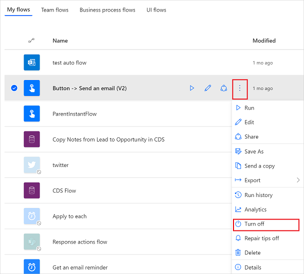

# Create a cloud flow in Power Automate

Create a cloud flow that performs one or more tasks automatically after it's triggered by an event. For example, create a cloud flow that notifies you by email when someone sends a tweet that contains a keyword you specify. In this example, sending a tweet is the event, and sending mail is the action.

## Prerequisites

- An account on [Power Automate](https://make.powerautomate.com)
- A Twitter account
- Office 365 credentials

[!INCLUDE[copilot-designer-note](./includes/copilot-designer-note.md)]

# [Classic designer](#tab/classic-designer)

## Specify an event to start the flow

First, select what event, or *trigger*, starts your flow.

1. Sign in to [Power Automate](https://make.powerautomate.com).

1. From the navigation bar on the left, select **My flows**.

1. Select **New flow**, and then select **Automated cloud flow**.

1. In the **Flow name** field, give your flow a name.

    If you skip this step, Power Automate will generate a name for you.

1. In the **Search all triggers** field, enter **twitter**.

1. Select **When a new tweet is posted - Twitter**.

    :::image type="content" source="./media/get-started-logic-flow/name-search-trigger.png" alt-text="Screenshot of name your flow and search for the Twitter trigger.":::

1. At the bottom of the screen, select **Create**.

   > [!TIP]
   > Connectors support multiple types of authentication. For example, SQL Server supports Microsoft Entra ID, SQL Server authentication, Windows authentication, and SQL connection string. Users choose which type of authentication they want to use when configuring a connector.

1. If you haven't already connected your Twitter account to Power Automate, select **Sign in to Twitter**, and then provide your credentials.
1. In the **Search text** box, type the keyword that you want to find.

## Specify an action

1. Select **New step**.

1. In the box that shows **Search connectors and actions**, enter **send email**, and then select **Send an email (V2)**.

1. If prompted, select the sign-in button, and then provide your credentials.
1. In the form that appears, enter your email address in the **To** box, and then select your name from the list of contacts that appears.
1. In the **Subject** box, enter **New tweet from:**, and then type a space.
1. In the list of tokens, select the **Tweeted by** token to add a placeholder for it.

    :::image type="content" source="./media/get-started-logic-flow/add-parameter.png" alt-text="[Screenshot of adding the Tweeted by dynamic content.":::

1. Select the **Body** box, and then select the **Tweet text** token to add a placeholder for it.

   Optionally, you can add more tokens, other text, or both to the body of the email.
1. Near the top of the screen, select **Save**.

# [Edit with Copilot](#tab/edit-with-copilot)

Using Copilot, you can use natural language to create a flow.

1. Simply ask Copilot to create your flow by typing the following prompt:

    **when a new tweet is posted, send an email to eug@contoso.com with Twitter username**

    Copilot suggests a flow based on your prompt:

    :::image type="content" source="./media/get-started-logic-flow/copilot-natural-language.png" alt-text="Screenshot of a prompt that uses natural language in Copilot.":::

1. Review and then provide the necessary connections to Twitter and Outlook.
1. Select **Next** and your flow appears on the designer.
1. Save the flow and it's ready to use.

    Your flow will trigger when any new tweets that mention the key phrase *Contoso Company* are posted. It will also send an email to the specified email address in the **Send an email** action.

---

## Test your flow

Send a tweet with the keyword that you indicated, or wait for someone else to post such a tweet.

Within a minute after the tweet is posted, an email message notifies you of the new tweet.

> [!TIP]
> Use the **Send email (V2)** action to format email in which you customize the font, use bold, italic or underline, customize the color and highlight, and create lists or links, and more.

## Manage a cloud flow

You can have up to 600 flows in your account. If you already have 600 flows, delete one before you create another flow.

1. Sign in to [Power Automate](https://make.powerautomate.com).

1. In the navigation bar on the left, select **My flows**.

1. In the list of flows, do any of the following:

   * To pause a cloud flow, set its toggle to **Off**.

       
   * To resume a cloud flow, set its toggle to **On**.

   * To edit a cloud flow, select the pencil icon that corresponds to the flow you want to edit.

   * To delete a cloud flow, select the **...** icon, select **Delete**, and then select **Delete** on the message box that appears.

   * To view the run history of a cloud flow, select the flow from the **My flows** page, and then view the history under the **28 day run history** section of the page that opens.

     Select a cloud flow run from the list of runs to see the inputs and outputs of each step.

## Related information

- [Add steps](multi-step-logic-flow.md), such as different ways to be notified, to your flow.
- [Run tasks on a schedule](run-scheduled-tasks.md), when you want an action to occur daily, on a certain date, or after a certain number of minutes.
- [Add a cloud flow to an app](/power-apps/maker/canvas-apps/using-logic-flows)
- [Get started with team flows](create-team-flows.md) and invite others to collaborate with you to design flows.
- [Training: Get started with Power Automate (module)](/training/modules/get-started-flows/)
- [Training: Enhance communication using Power Automate and the Office 365 Users Connector (module)](/training/modules/enhance-communication/)

[!INCLUDE[footer-include](includes/footer-banner.md)]