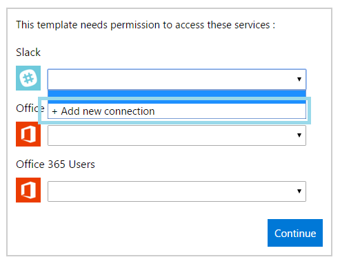
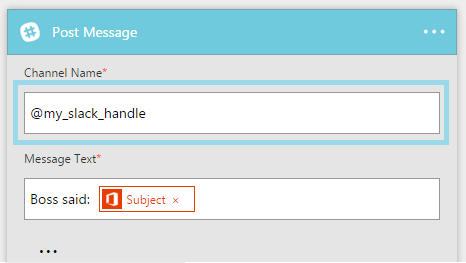
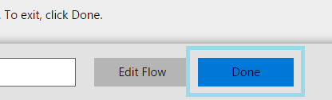

<properties
    pageTitle="Create a flow from a template | Microsoft Flow"
    description="Create a flow from any of several built-in templates."
    services=""
    suite="flow"
    documentationCenter="na"
    authors="aftowen"
    manager="erikre"
    editor=""
    tags=""
 />

<tags
  ms.service="flow"
    ms.devlang="na"
    ms.topic="article"
    ms.tgt_pltfrm="na"
    ms.workload="na"
   ms.date="04/08/2016"
   ms.author="anneta"/>

# Create a flow from a template in Microsoft Flow #
Create a flow from one of many built-in templates that can, for example, send you an email message when anyone sends a tweet that includes a particular keyword.

**Note:** [Create a flow from scratch](get-started-logic-flow.md) if you already have a process in mind and can't find a template for it.

**Prerequisites**

- An account on [flow.microsoft.com](https://flow.microsoft.com)
- A Twitter account
- Office 365 credentials

## Choose a template

1. In [flow.microsoft.com](https://flow.microsoft.com), select **Browse** in the top navigation bar, and then select a template, such as **Get Email Notification for Tweets**.

	

1. If prompted, connect to Office, Twitter, or both by selecting **Add new connection** in the drop-down list for each connection and then following the prompts.

	

1. Select **Open flow**.

	Your flow appears, showing each event with a blue title bar and each action with an orange title bar.

	

## Customize your flow ##

1. Select the title bar for an event to expand it, and then customize it (for example, by specifying a keyword that interests you).

	

1. Expand and customize the template's action or actions.

	For example, expand the **Send Email** action, and then customize the subject line, the body, and the recipient fields. By default, the message will be sent to you, the subject will include the name of the person who sent the tweet, and the body will include the content of the tweet, the date/time when it was sent, and other information.

1. Near the bottom of the screen, specify a name for your flow, and then select **Create flow**.

	

When a tweet is sent with the keyword that you specified, you'll receive an email message that contains the information that you specified.

## Next steps ##

- [Test your flow](testing-flows.md)
- [Publish your own template](publish-a-template.md)
