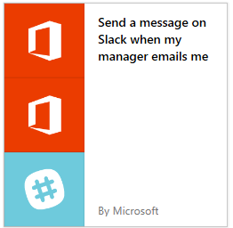

# Create a flow from a template in Power Automate

Create a flow from one of many built-in templates that can, for example, send you a Slack message when your manager sends you an email in Office 365.

>[!TIP]
>[Create a flow from scratch](get-started-logic-flow.md) if you already have a process in mind and can't find a template for it.

**Prerequisites**

* An account on [flow.microsoft.com](https://flow.microsoft.com)
* A Slack account
* Office 365 credentials

## Choose a template

1. In [flow.microsoft.com](https://flow.microsoft.com), select the **Search all templates** search box, enter **Slack**, and then press enter.
1. You'll see only templates related to Slack, so you can now select **Send a message on Slack when my manager emails me**.
   
    
1. Confirm that this template will do what you want, and then select **Use this template**.
1. If you aren't signed into Office or Slack, select **Sign in** and then follow the prompts.
   
1. After you confirm your connections, select **Continue**.
   
    Your flow appears, showing each action with an orange title bar.
   
    

## Customize your flow

1. Select the title bar for an event to expand it, and then customize it (for example, by specifying a filter on the email that interests you).
1. Actions that require input from you will automatically be expanded.
   
    For example, the **Post message** action is expanded because you need to enter a channel, such as your *\@username*. You can also customize the message content. By default, the message will contain just the subject, but you can include other information.
   
1. Near the top of the screen, specify a name for your flow, and then select **Create flow**.
1. Finally, if you're happy with your flow, select **Done**.

Now, when your manager sends you an email, you'll receive a Slack message that contains the information that you specified.

## Next steps

* [Watch your flow in action](see-a-flow-run.md)
* [Publish your own template](publish-a-template.md)
* [Use a template for the Common Data Service](common-data-model-intro.md)
* [Get started with team flows](create-team-flows.md) and invite others to collaborate with you to design flows.

