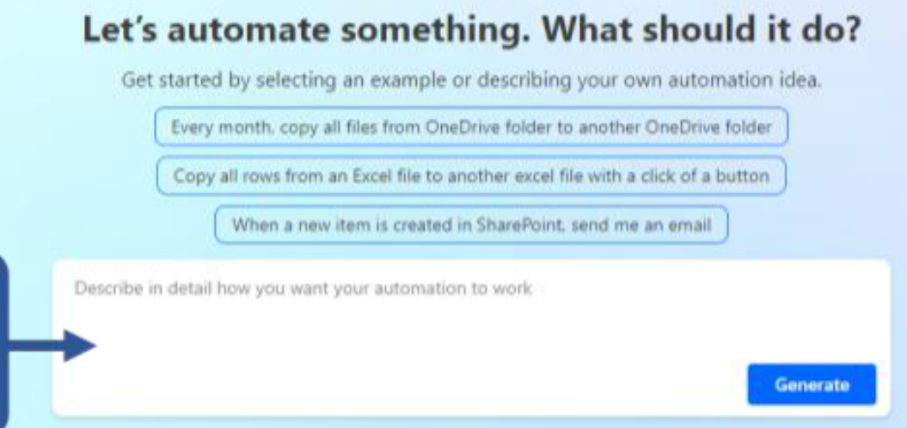
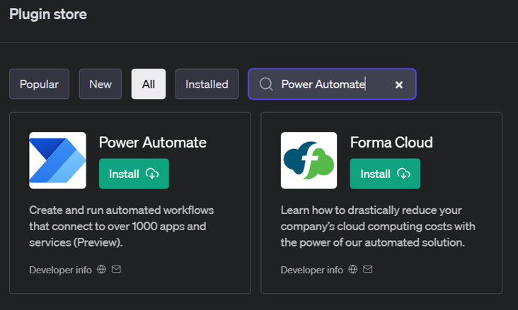
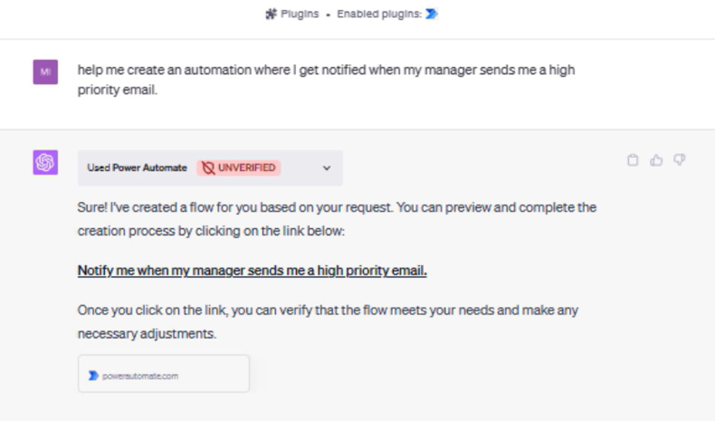
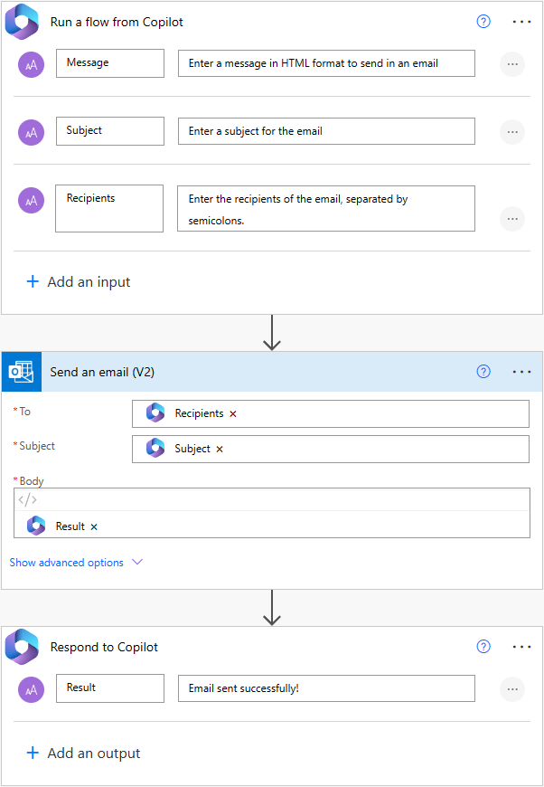
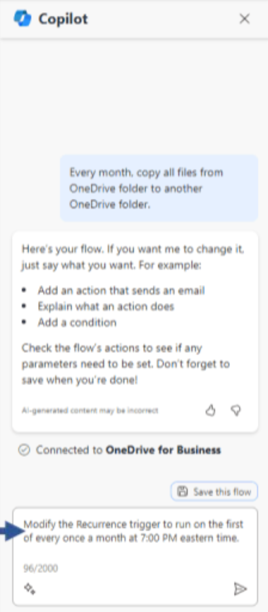
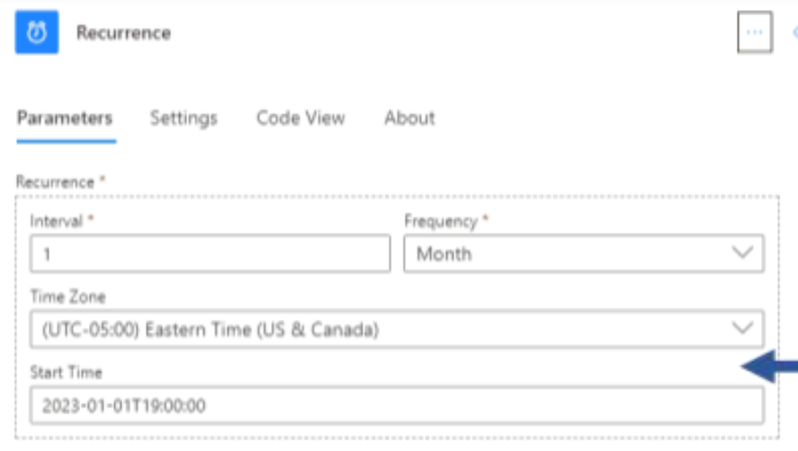
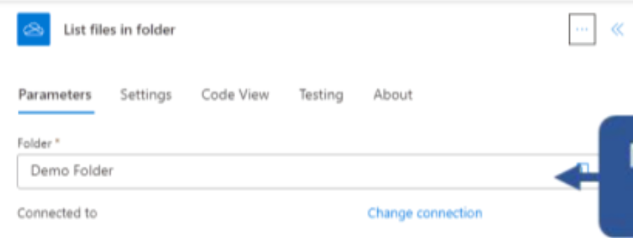

# Get started with Power Automate

This article provides a tutorial for you to learn how to create and modify a cloud flow using Copilot. The completed flow copies all files from a specific OneDrive for Business folder to another OneDrive for Business folder.

## Build a cloud flow using Copilot

The Power Automate maker portal provides multiple ways to create workflows for your organization. For this tutorial, you create and modify a cloud flow using Copilot.

1. Sign in to [Power Automate](https://make.powerautomate.com).
1. In the Copilot field, describe what kind of flow you want to create. Use natural language and be as specific as possible.

    Enter the following prompt:

```copilot-prompt
Every month, copy all files from OneDrive folder to another OneDrive folder.
```

<!--Puneet: Add the prompt in the screenshot-->


As you type, Copilot offers suggestions. You can select a suggestion, or you can continue typing your own prompt.

3. When you're satisfied with your prompt, select **Generate**.

    Based on your description, Copilot begins to create a suggestion for your flow.

    

    If you want to display another suggestion, select the **Show a different suggestion** checkbox.

1. Select **Keep it and continue**.
1. Review your connected apps and services. A green checkmark indicates that the connection is valid. If you see a red exclamation mark, select the connection to fix it.

    

1. Select **Create flow**.

## Make changes to your cloud flow

After your flow is created, you can make changes manually, or you can use Copilot to assist you. You can make changes directly it the designer<!--link-->, or you can use the Copilot pane to make changes.

As you're making changes, use the icons on the toolbar to the left to adjust the size and appearance of your flow. You can also move your flow anywhere on the screen by dragging with a traditional mouse, or using another navigation device.

### Change the trigger

In this section, you change the trigger <!--link--> of your flow to run on a specific schedule using Copilot.

1. Select the **Recurrence** trigger to open the configuration pane to the left.

    Notice that the **Time Zone** and **Start Time** are incomplete.

    

1. Create a Copilot prompt to fill in the missing information. In the Copilot field, enter the following prompt:

```copilot-prompt
Modify the Recurrence trigger to run on the first of every month at 7:00 PM Eastern Time.
```

1. Select Submit ()

    

    When Copilot finishes changing your cloud flow, this message displays: **The Recurrence trigger has been successfully modified to run on the first of every month at 7:00 PM Eastern Time.**

1. To view your changes, select the **Recurrence** trigger in the Copilot pane. The **Start Time** and **Time Zone** fields are now filled in.

    

## Change an action

Change the action <!--link--> of your flow to save files to a different OneDrive folder using Copilot. In this section, you modify the OnDrive folder that the flow gets files from.

1. Select the **List files in folder** action to open the configuration pane to the left.

    Notice there's no specific folder identified.

    

1. In the Copilot field, enter the following prompt:

```copilot-prompt
Set the folder in the List files in folder step to Demo Folder.
```

1. Select Submit ()
 
1. To view your change, select the **List files in folder** action in the Copilot pane. The **Folder** field is now filled in with the folder you specified.

    

### Rename a trigger or action

In this section, you rename the **Recurrence** trigger to run on the first of the month.

1. In the Copilot field, enter the following prompt:

```copilot-prompt
Rename the Recurrence step to run on the first of the month.
```

1. Select Submit ()

    When Copilot finishes changing your cloud flow, this message displays: **The Recurrence step has been successfully renamed to run on the first of the month.**

1. You changed your mind and want to revert to the original name. To undo the change, select **Undo** in the Copilot pane.

    In the **Revert your flow** screen, select **Revert** to return your flow to the way it was before Copilot made the change.

1. When you're satisfied with your cloud flow, save it. You can do this either by selecting **Save** on the toolbar at the top of the screen, or by selecting **Save the flow** in the Copilot pane.

Congratulations! You successfully created a cloud flow using Copilot. You can now run the flow to test it using the flow checker.

## Related information

[Explore the Power Automate home page](getting-started.md)
[Find and fix errors with Flow Checker](error-checker.md)
  