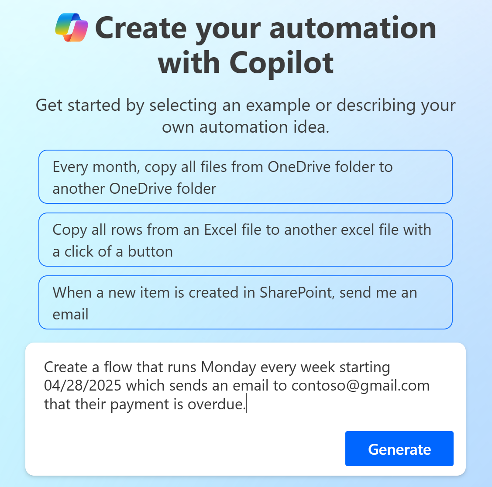
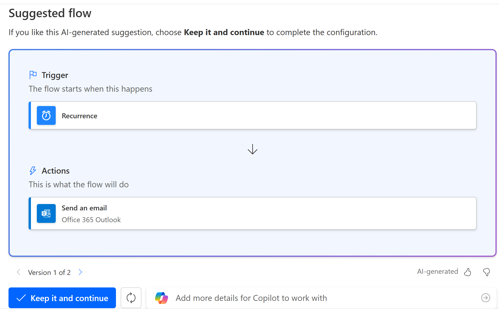
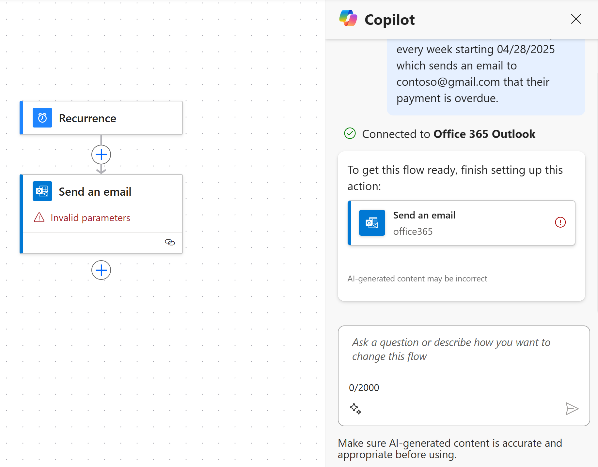
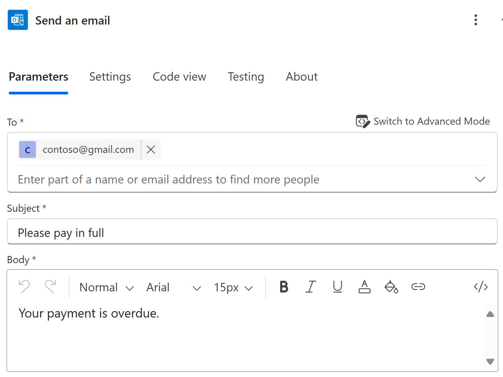

# Get started with Power Automate tutorial

This article provides a tutorial for you to learn how to create a cloud flow using Copilot. Copilot is a feature in Power Automate that helps you create flows using natural language. You can use Copilot to create flows, add actions, and modify existing flows. <!--say more-->

The completed flow in this tutorial sends an email weekly to a customer with an overdue account.

## Build a cloud flow using Copilot

The Power Automate maker portal provides multiple ways to create workflows for your organization. For this tutorial, you create and modify a cloud flow using Copilot.

1. Sign in to [Power Automate](https://make.powerautomate.com).
1. In the Copilot field, describe what kind of flow you want to create. Use natural language and be as specific as possible.

    Enter the following prompt:

```copilot-prompt
Create a flow that runs Monday every week starting 04/28/2025 which sends an email to contoso@gmail.com that their payment is overdue. If they pay by May 31, they can avoid a late fee.
```

As you type, Copilot offers suggestions. You can select a suggestion, or you can continue typing your own prompt.

3. When you're satisfied with your prompt, select **Generate**.

    

    Based on your description, Copilot begins to create a suggested trigger and actions for your flow.

1. Select **Keep it and continue**.

    

1. Review your connected apps and services. A green checkmark indicates that the connection is valid.
 
    If you see a red exclamation mark, select the connection to fix it.

1. Select **Create flow**.

    

## Use Copilot to  fininsh setting up an action

After your flow is created, you can make changes manually, or you can use Copilot to assist you. You can make changes directly it the designer<!--link-->, or you can use the Copilot pane to make changes.

In this section, add a subject for your email.

1. In the Copilot pane, select **Send an email**.
1. In the **Subject** field, enter the following text:

```copilot-prompt
Your account is overdue
```



1. Select **Collapse** (**<<**) to hide the configuration pane.

    As you're making changes, use the icons on the toolbar to the left to adjust the size and appearance of your flow. You can also move your flow anywhere on the screen by dragging with a traditional mouse, or using another navigation device.

1. Practice adjusting the size of your flow by doing the following:
    1. Select the **Zoom in** icon (**+**) to zoom in.
    1. Select the **Zoom out** icon (**-**) to zoom out.
    1. Drag your flow anywhere on the canvas to reposition it.

1. On the toolbar at the top of the screen, select **Save**.

    A green message appears at the top of the screen, indicating that your flow was saved successfully.

    

Congratulations! You successfully created a cloud flow using Copilot. You can now run the flow to test it using the flow checker.

## Related information

[Explore the Power Automate home page](getting-started.md)
[Find and fix errors with Flow Checker](error-checker.md)
  