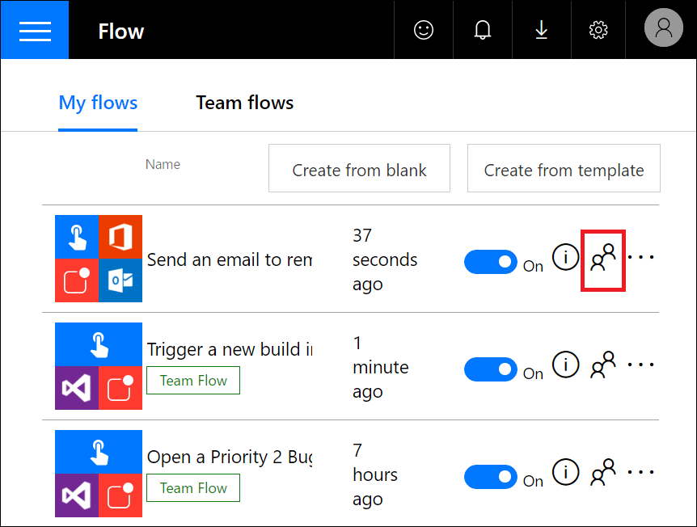
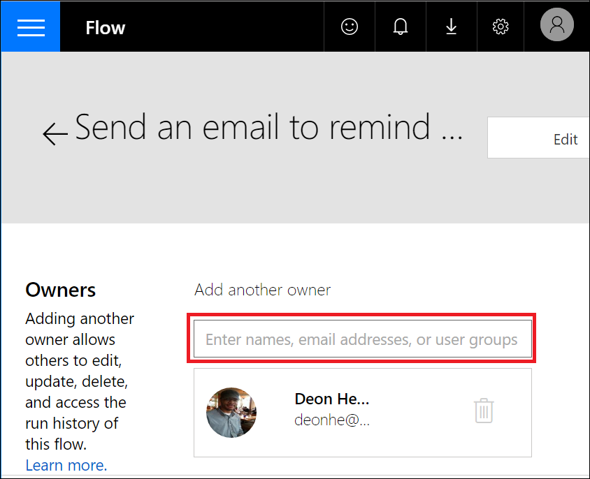
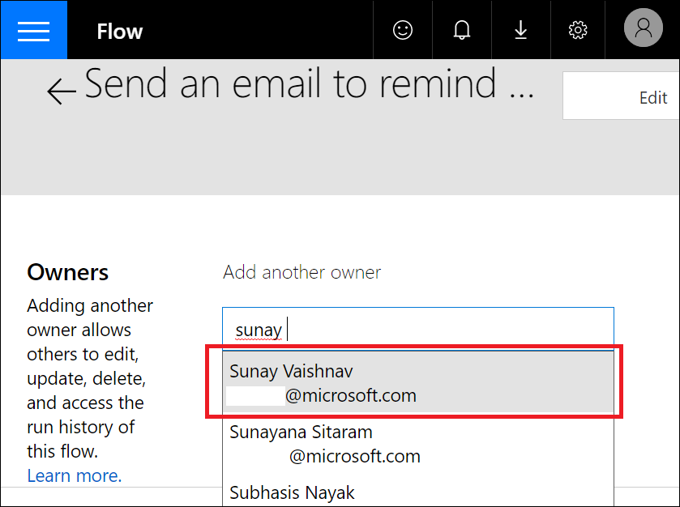
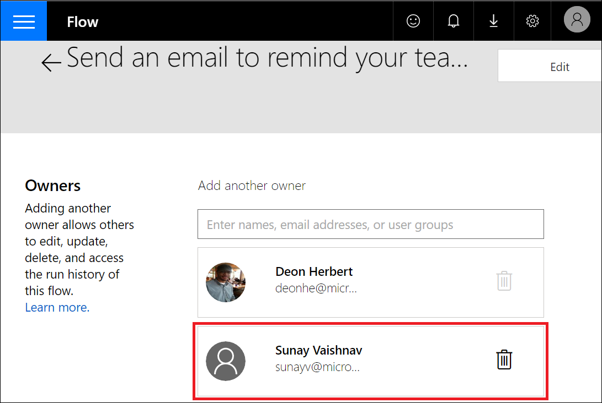
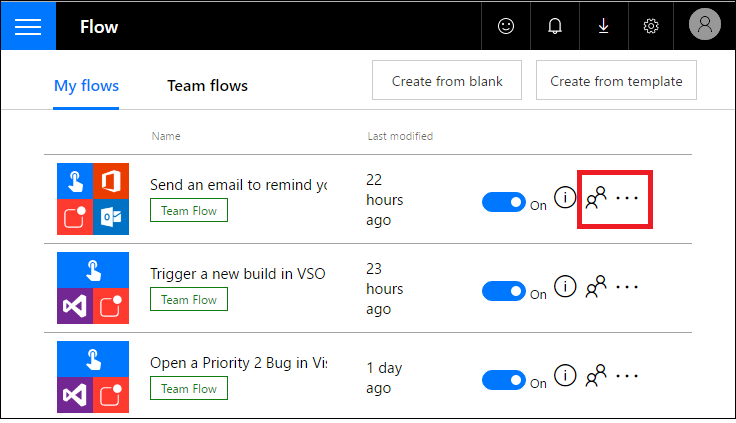
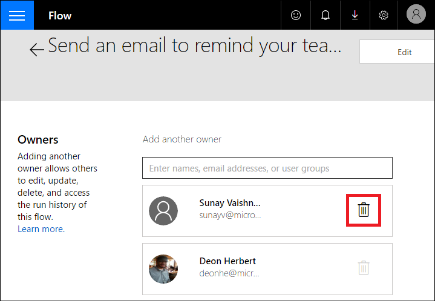
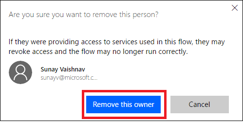

<properties
    pageTitle="Learn how to add other owners to a flow and create team flows | Microsoft Flow"
    description="Microsoft Flow makes it easy automate repetitive tasks. You can add users or groups as owners and collaborate with the to design and manage your flows."
    services=""
    suite="flow"
    documentationCenter="na"
    authors="msftman"
    manager="anneta"
    editor=""
    tags=""/>

<tags
   ms.service="flow"
   ms.devlang="na"
   ms.topic="article"
   ms.tgt_pltfrm="na"
   ms.workload="na"
   ms.date="02/03/2017"
   ms.author="deonhe"/>

# Get started with team flows

Now you can invite others on your team to collaborate with you to design and manage flows. Simply add any user or group from your organization as an owner of your flow and you can all participate in the design and management of the flow. 

After you add at least one other owner, your flow becomes a **Team Flow** and, you can find all team flows that you have access to on the **Team flows** tab of the [Microsoft Flow portal](https://flow.microsoft.com).

When you create a team flow, all owners will have the ability to perform these actions:

Action | Description
----|----
Delete |Co-owners can delete the flow
Edit | Co-owners can edit the flow by changing how the flow works. 
Update | Make design changes to the flow such as adding or removing other [services](https://flow.microsoft.com/services/).
Change permissions | Co-owners can add and remove other owners, but cannot remove the flow's creator.
View run history | Co-owners can view the history of all runs of the flow.

>[AZURE.NOTE] Co-owners cannot remove the original creator from the list of owners of a flow.

While all owners can use all existing services in a specific flow, the co-owner is not allowed to modify the credentials used in any connection that was created by another owner. A co-owner can use connections only in the flow that the connection was created in.

## Prerequisites

In order to create **team flows**, you must have access to a [paid Microsoft Flow plan](https://flow.microsoft.com/pricing/).

## Create a team flow by adding an owner

In this walk-through, you will create a **team flow** by adding an owner to an existing flow. If you already have a team flow, you can use this process to add other owners to it as well.

### Prerequisites

In order to create a team flow or add an owner to an existing team flow, you must:

- be an owner or the creator of the flow
- use a [paid Microsoft Flow plan](https://flow.microsoft.com/pricing/)

Let's get started:

1. Select the **people** icon for the flow you wish to add an owner to:
     
2. Enter the name, email address, or phone number of the person or group you're adding as an owner:
     
3. Select the appropriate user from the filtered list displayed:
     
4. Notice the user or group you just selected is now an owner of the flow:
     
5. Congratulations, your **team flow** has been created:
     

## Remove a flow owner

>[AZURE.IMPORTANT] If you remove an owner whose credentials are being used to access one or more services in the flow, you may need to update the credentials for those services so that the flow continues to run properly. Also note that an owner cannot remove the creator of the flow.

### Prerequisites

In order to create a team flow or add an owner to an existing team flow, you must:

- be an owner or the creator of the flow
- use a [paid Microsoft Flow plan](https://flow.microsoft.com/pricing/)

Follow these steps to remove an owner from a flow:

Let's get started:

1. Select the **people** icon for the flow from which you wish to remove the owner:
     
2. Select the **Delete** icon that corresponds to the owner you wish to remove:
     
3. Select the **Remove this owner** button to indicate you are sure you want to remove this owner:
     
4. Congratulations, the user or group you just removed is no longer listed as an owner of the flow: 
      

## Embedded and other connections

Connections used in a flow can fall into two categories:

- Embedded - embedded connections are connections that are currently being used in the flow.
- Other - other connections are connections that have been defined for a specific flow, but are not being used in that flow currently. 

If an owner removes a connection from a flow, that flow will be displayed in the *Other* connections list, where it remains until an owner includes it in the flow again. 

You can see the list of connections below the **Owners** list of a flow's properties:  
       

## Next steps

- [Get started with Microsoft Flow](./getting-started.md)
