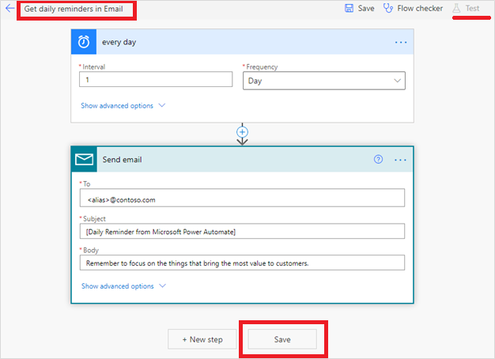

# Power Automate 시작하기 

환영합니다! Power Automate에 무얼 기대하시나요? 여러분이 하실 수 있는 예제 몇가지를 다음과 같이 준비해봤습니다.
* 업무 프로세스 자동화
* 기일이 지난 작업을 자동으로 알림 보내기
* 스케줄에 맞춰 시스템간 업무 데이터 이동하기
* 거의 300 곳의 데이터 소스 또는 공개적으로 사용가능한 모든 API에 연결하기
* 심지어 엑셀에서 데이터 연산과 같은 사용하는 로컬 컴퓨터에서 업무를 자동화하기 

여러분의 데스크톱 컴퓨터에서 하는 마우스 클릭, 자판 두드리기 그리고 복사와 붙여넣기 단계 등을 녹화 함으로써 반복적인 수작업을 단순히 자동화 할 경우 절약되는 시간을 한 번 생각해보세요! Power Automate는 자동화에 관한 모든 것을 아우릅니다. 

 

> [!VIDEO https://www.youtube.com/embed/H4H_jPJWlxU]

## Power Automate는 누구를 위한 건가? 

*당신은 어떤 능력을 가져야 합니까?* 
기본적인 업무 사용자에서부터 IT 전문가까지 모두 노코드(no-code)/로우코드(low-code) 플랫폼인 Power Automate를 활용해 업무를 자동화 할 수 있습니다.

*Power Automate로 혜택을 볼 수 있는 산업은 어디입니까?* 
다음에서 몇몇 기업들이 어떻게 Power Automate를 사용해서 Power Platform 솔루션을 실행하고 있는지를 확인해보세요: 

  * [은행](https://customers.microsoft.com/en-us/story/821782-illimity-bank-banking-power-automate)
  * [리테일](https://customers.microsoft.com/en-us/story/drivetime-retail-consumer-goods-azure)
  * [제조](https://customers.microsoft.com/en-us/story/810656-hexion-manufacturing-power-platform)
  * [보험](https://customers.microsoft.com/en-us/story/811345-aioi-nissay-dowa-insurance-microsoft-power-platform)
  * [보건의료](https://customers.microsoft.com/en-us/story/vnshs-health-provider-microsoft-flow) 

[산업별 사례 찾아보기](https://customers.microsoft.com/en-us/search?sq=%22Power%20Automate%22&ff=story_product_categories%26%3EPower%20Automate&p=0&so=story_publish_date%20desc)

자동화를 생성하기 위해 가장 먼저 해야 할 일은 [회원가입](sign-up-sign-in.md)이며, 만일 Power Automate 계정을 갖고 계신다면, [로그인](https://flow.microsoft.com/signin)입니다.

## 다양한 흐름들

아래 표를 확인해 사용할 사례에 맞는 형태의 흐름에 대해 좀 더 학습하실 수 있습니다.

| **흐름 종류**                                                                       | **사용사례**                                                                                  | **자동화 목표**                                                                             |
|-------------------------------------------------------------------------------------------|-----------------------------------------------------------------------------------------------|----------------------------------------------------------------------------------------|
| [자동화된 흐름(Automated flows)](get-started-logic-flow.md)                 | 특정인에게서 이메일을 받거나 소셜미디어에서 여러분의 회사에 대한 언급이 있는 경우와 같이 어떤 이벤트가 발생한 경우 시작되는 자동화 생성하기.| 클라우드 또는 온 프레미스용 [연결자(Connectors)](https://docs.microsoft.com/connectors/)를 활용해 여러분의 계정들을 연결하고 각 계정들이 서로 대화를 할 수 있게 지원. |
| [인스턴스 흐름(Instant flows)](introduction-to-button-flows.md)              | Start an automation with a click of a button. You can automate for repetitive tasks from your Desktop or Mobile devices. For example, instantly send a reminder to the team with a push of a button from your mobile device.                      |     Wide range of tasks such as requesting an approval, an action in Teams or SharePoint.                                                                                |
| [예약된 흐름](run-scheduled-tasks.md)                    | Schedule an automation such as daily data upload to SharePoint or a database.             |Tasks that need to be automated on a schedule.                                                                            |
| [비즈니스 프로세스 흐름](business-process-flows-overview.md) | Ensure that  everyone in your company follows the same process by defining a set of steps for people to follow.                 | Human processes such as customer service requests, approvals, IT development,...                                                                        |
| [UI flows](ui-flows/overview.md)                                                | Record  clicks and keyboard strokes from your Desktop and Web applications and automate the playback of manual steps on legacy software.                    | Desktop and Web applications that do not have APIs available for automation.    |

## Check out the start page 

[On the start page](https://flow.microsoft.com) for Power Automate, you can [explore a diverse set of templates](https://flow.microsoft.com/templates) and learn about the key features for Power Automate. You can get a quick sense of what's possible and how Power Automate could help your business and your life.

Each template is designed for a specific purpose. For example, there are templates for sending you a text message when your boss emails you, adding Twitter leads to Dynamics 365, or backing up your files. These templates are just the tip of the iceberg. They're intended to inspire you to create customized flows for the exact processes you need.

## Create your first flow 

1. Select a template that's useful for you. A simple template is [**Get daily reminders in Email**](https://flow.microsoft.com/galleries/public/templates/45a3399aa29345308f08b6db0a9c85b9/):

    

1. Select **Continue**.

    

1. Enter the email addresses to which the daily reminder will be sent. Next, enter the reminder message. Finally, select **Create flow**, and then verify that your flow is running as expected.

    

    > [!NOTE]
    > You can explore the conditions that trigger the flow and the action that results from that event. Play around with the settings to make the flow your own. You can even add or delete actions.

1. Select **Done**.

[Follow this tutorial](get-started-logic-template.md) to learn more about creating flows from templates.

## Get creative

Now that you've created your first flow from a template, use any of the more than [380 data sources](https://flow.microsoft.com/connectors/) that Power Automate supports to [create your own flows from scratch](get-started-logic-flow.md).

When you create a flow from scratch, you control the entire workflow. Here are a few ideas to get your started:

- [Flows with many steps](multi-step-logic-flow.md).
- [Run tasks on a schedule](run-scheduled-tasks.md).
- [Create an approval flow](wait-for-approvals.md).
- [Watch a flow in action](see-a-flow-run.md).
- [Publish a template](publish-a-template.md).
- [Create flows from a Microsoft Teams template](https://flow.microsoft.com/connectors/shared_teams/microsoft-teams/).

## Peek at the code

You don't need to be a developer to create flows; however, Power Automate does provide a **Peek code** feature that allows anyone to take a closer look at the code that's generated for all actions and triggers in a flow. Peeking at the code could give you a clearer understanding of the data that's being used by triggers and actions. Follow these steps to peek at the code that's generated for your flows from within the Power Automate designer: 

1. Select the **...** menu item at the top right corner of any **action** or **trigger**. 
1. Select **Peek code**.

    

1. Notice the full JSON representation of the actions and triggers. This includes all inputs, such as the text you enter directly, and expressions used. You can select expressions here and then paste them into the **Dynamic Content** expression editor. This can also give you a way to verify the data you expect is present in the flow.

    
   

## Find your flows easily

When your creative juices start *flowing*, you might create many flows. Don't worry, finding your flows is easy - just use the search box on the **My flows**, **Team flows**, **Connections**, or **Solutions** screen to display only flows that match the search terms you enter.

 
> [!NOTE]
> The search filter only finds flows that have been loaded into the page. If you don't find your flow, try selecting **Load more** at the bottom of the page.

## Get notifications when something's wrong

Use the Power Automate notification center (located at the top right of the designer) to quickly see a list of flows have failed recently. The notification center displays a number that indicates the number of flows that failed recently.

From the notification center, you can navigate to the **Activity** page of Power Automate to see all your flows that recently ran, sent notifications, or failed.

## Use the mobile app 

Download the Power Automate mobile app for [Android](https://aka.ms/flowmobiledocsandroid), [iOS](https://aka.ms/flowmobiledocsios), or [Windows Phone](https://aka.ms/flowmobilewindows). With this app, you can [monitor flow activity](mobile-monitor-activity.md), [manage your flows](mobile-manage-flows.md) and [create flows from templates](mobile-create-flow.md).

## We're here to help 

We're excited to see what you do with Power Automate, and we want to ensure you have a great experience. Be sure to check out our [guided learning](https://flow.microsoft.com/guided-learning/) tutorials and [join our community](https://go.microsoft.com/fwlink/?LinkID=787467) to ask questions and share your ideas. [Contact support](https://go.microsoft.com/fwlink/?LinkID=787479) if you run into any issues.
