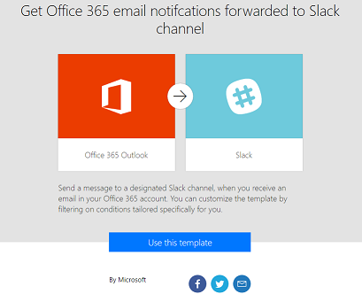

<properties
	pageTitle="Get started | Microsoft Flow"
	description="Quick ways to get started automating your work with Microsoft Flow"
	services=""
	suite="powerapps"
	documentationCenter="na"
	authors="stepsic-microsoft-com"
	manager="erikre"
	editor=""
	tags=""/>

<tags
   ms.service="flow"
   ms.devlang="na"
   ms.topic="hero-article"
   ms.tgt_pltfrm="na"
   ms.workload="na"
   ms.date="04/24/2016"
   ms.author="stepsic"/>

# Get started with Microsoft Flow #
Welcome! Microsoft Flow is a *preview* product to help you set up automated workflows between your favorite apps and services to synchronize files, get notifications, collect data, and more. After you [sign up](https://flow.microsoft.com/documentation/sign-up-sign-in/), you can quickly start to automate your work.

## Check out some templates ##
If you [visit the home page](https://flow.microsoft.com) for Microsoft Flow, you can [explore a diverse set of templates](https://flow.microsoft.com/templates). Without even signing in, you can get a quick sense of what's possible and how Microsoft Flow could help your business and your life.

Each template is designed for a specific purpose such as sending you a text message when your boss emails you, adding Twitter leads to CRM, or backing up your files. These templates are just the tip of the iceberg and are intended to inspire you to create flows that are customized to the exact processes that you need.

## Create your first flow ##
When you're ready, [sign in](https://flow.microsoft.com/signin) on your tablet, your desktop computer, or even your phone.

Now you can [use a template](https://flow.microsoft.com/documentation/get-started-logic-template/) to get started. To use a specific template, sign in to whatever services that type of template uses.

After you sign in, explore the events that trigger the flow and the actions that result from those events. Play around with the settings to make the flow your own, and even add or delete actions. Finally, select **Create flow**, and then verify that your flow is running as expected (or just select **Done**).

## Get creative ##
Now that you have some idea of what a flow can do and a bit of experience, [create a flow from scratch](https://flow.microsoft.com/documentation/get-started-logic-flow/) based on these data sources and others:

- an Excel file in a cloud-storage account such as Dropbox, OneDrive, or Google Drive
- a Google sheet
- a SharePoint list
- Salesforce or Microsoft Dynamics CRM Online with custom entities
- a SQL Azure table

When you create a flow from scratch, the entire flow comes straight from your brain to the screen. You're also free to explore different approaches such as the ones in these topics:

- [Flows with many steps](https://flow.microsoft.com/documentation/multi-step-logic-flow/)
- [Run tasks on a schedule](https://flow.microsoft.com/documentation/run-tasks-on-a-schedule/)
- [Create an approval flow](https://flow.microsoft.com/documentation/wait-for-approvals/)
- [Watch a flow in action](https://flow.microsoft.com/documentation/see-a-flow-run/)
- [Publish a template](https://flow.microsoft.com/documentation/publish-a-template/)

## Work with flows from your phone ##
Download our mobile app to your iPhone, where you can:

- [monitor flow activity](https://flow.microsoft.com/documentation/mobile-monitor-activity/), such as successes, failures, and the time when each flow ran most recently
- [manage each flow](https://flow.microsoft.com/documentation/mobile-manage-flows/), such as enabling or disabling it and viewing its events and actions

## Questions? Ideas? We're here to help ##
We're excited to see what you can do with Microsoft Flow, and we want to make sure that you have a great experience. Check out the detailed tutorials here for more help, and [join our community](http://go.microsoft.com/fwlink/?LinkID=787467) to ask questions and share your ideas. [Contact support](http://go.microsoft.com/fwlink/?LinkID=787479) if you run into any issues. Note that Microsoft Flow is currently in preview.
