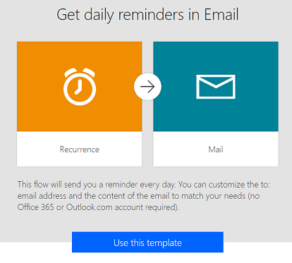
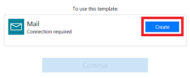
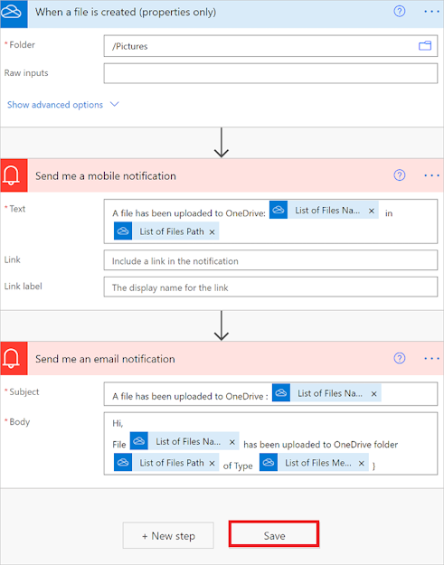
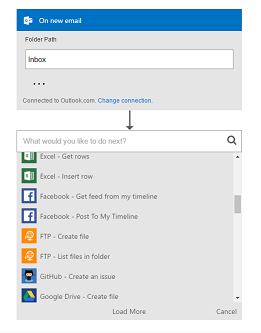
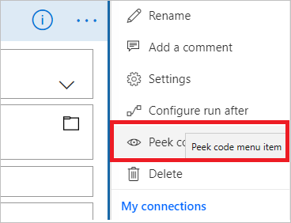
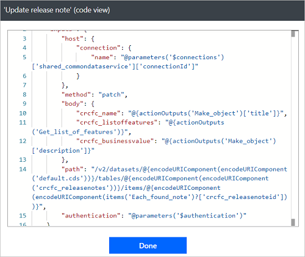
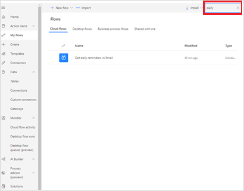

# Get started with Power Automate

Welcome! What can you expect from Power Automate? Here are a few examples of what you can do with Power Automate.

* Automate business processes
* Send automatic reminders for past due tasks
* Move business data between systems on a schedule
* Connect to more than 500 data sources or any publicly available API
* You can even automate tasks on your local computer like computing data in Excel. 

Just think about time saved once you automate repetitive manual tasks simply by recording mouse clicks, keystrokes and copy paste steps from your desktop! Power Automate is all about automation. 

 

> [!VIDEO https://www.microsoft.com/videoplayer/embed/RE4qNQm]

## Who is Power Automate for?

*What skills do you need to have?*
Anyone from a basic business user to an IT professional can create automated processes using Power Automate's no-code/low-code platform.

*What industries can benefit from Power Automate?*
Check out how some companies implemented Microsoft Power Platform solutions using Power Automate in: 

  * [Banking](https://customers.microsoft.com/story/821782-illimity-bank-banking-power-automate)
  * [Retail](https://customers.microsoft.com/story/drivetime-retail-consumer-goods-azure)
  * [Manufacturing](https://customers.microsoft.com/story/810656-hexion-manufacturing-power-platform)
  * [Insurance](https://customers.microsoft.com/story/811345-aioi-nissay-dowa-insurance-microsoft-power-platform)
  * [Healthcare](https://customers.microsoft.com/story/vnshs-health-provider-microsoft-flow) 

Find [examples from your industry](https://customers.microsoft.com/search?sq=%22Power%20Automate%22&ff=story_product_categories%26%3EPower%20Automate&p=0&so=story_publish_date%20desc)

The first step in creating an automation is to [sign up](sign-up-sign-in.md), or, if you already have an account with Power Automate, [sign in](https://flow.microsoft.com/signin).

## What are the different types of flows?

Visit the [flow types](flow-types.md) article to learn more about the different types of flows that you can create to automate your tasks.

## Check out the start page

[On the start page](https://flow.microsoft.com) for Power Automate, you can [explore a diverse set of templates](https://flow.microsoft.com/templates) and learn about the key features for Power Automate. You can get a quick sense of what's possible and how Power Automate could help your business and your life.

Each template is designed for a specific purpose. For example, there are templates for sending you a text message when your boss emails you, adding Twitter leads to Dynamics 365, or backing up your files. These templates are just the tip of the iceberg. They're intended to inspire you to create customized flows for the exact processes you need.

## Create your first flow

1. Select a template that's useful for you. A simple template is [**Notify and Email when a new file is uploaded to OneDrive**](https://flow.microsoft.com/galleries/public/templates/ef6bf28037ca11e7870df906aa521b7a/notify-and-email-when-a-new-file-is-uploaded-to-onedrive/).

    

1. Select **Continue**.

   

1. Select the OneDrive folder that you want to monitor.

   

1. Select **Save**.

    

  >[!NOTE]
  >You can explore the conditions that trigger the flow and the action that results from that event. Play around with the settings to make the flow your own. You can even add or delete actions.

>[!TIP]
>[Follow this tutorial](get-started-logic-template.md) to learn more about creating flows from templates.

## Get creative

Now that you've created your first flow from a template, use any of the more than [380 data sources](https://flow.microsoft.com/connectors/) that Power Automate supports to [create your own flows from scratch](get-started-logic-flow.md).

When you create a cloud flow from scratch, you control the entire workflow. Here are a few ideas to get your started:

- [Flows with many steps](multi-step-logic-flow.md).
- [Run tasks on a schedule](run-scheduled-tasks.md).
- [Create an approval flow](wait-for-approvals.md).
- [Watch a cloud flow in action](see-a-flow-run.md).
- [Publish a template](publish-a-template.md).
- [Create flows from a Microsoft Teams template](https://flow.microsoft.com/connectors/shared_teams/microsoft-teams/).

## Peek at the code

You don't need to be a developer to create flows; however, Power Automate does provide a **Peek code** feature that allows anyone to take a closer look at the code that's generated for all actions and triggers in a cloud flow. Peeking at the code could give you a clearer understanding of the data that's being used by triggers and actions. Follow these steps to peek at the code that's generated for your flows from within the Power Automate designer:

1. Select the **...** menu item at the top right corner of any **action** or **trigger**.
1. Select **Peek code**.

    

1. Notice the full JSON representation of the actions and triggers. This includes all inputs, such as the text you enter directly, and expressions used. You can select expressions here and then paste them into the **Dynamic Content** expression editor. This can also give you a way to verify the data you expect is present in the flow.

    

## Find your flows easily

When your creative juices start *flowing*, you might create many flows. Don't worry, finding your flows is easy - just use the search box on the **My flows**, **Team flows**, **Connections**, or **Solutions** screen to display only flows that match the search terms you enter.

 
> [!NOTE]
> The search filter only finds flows that have been loaded into the page. If you don't find your flow, try selecting **Load more** at the bottom of the page.

## Get notifications when something's wrong

Visit the cloud flow activity page to see the list of cloud flows that recently ran, sent notifications, or have failed.

1. Sign into [Power Automate](https://powerautomate.com).
1. Select **Monitor** on the left side of the screen.
1. Select **Cloud flow activity**.

   

## Use the mobile app

Download the Power Automate mobile app for [Android](https://aka.ms/flowmobiledocsandroid), [iOS](https://aka.ms/flowmobiledocsios), or [Windows Phone](https://aka.ms/flowmobilewindows). With this app, you can [monitor flow activity](mobile-monitor-activity.md), [manage your flows](mobile-manage-flows.md) and [create flows from templates](mobile-create-flow.md).

## Get help planning your Power Automate projects

If you're ready to start your Power Automate project, visit the [guidance and planning article](./guidance/planning/introduction.md) to get up and running quickly.

## We're here to help

We're excited to see what you do with Power Automate, and we want to ensure you have a great experience. Be sure to check out our [guided learning](https://flow.microsoft.com/guided-learning/) tutorials and [join our community](https://go.microsoft.com/fwlink/?LinkID=787467) to ask questions and share your ideas. [Contact support](https://go.microsoft.com/fwlink/?LinkID=787479) if you run into any issues.

[!INCLUDE[footer-include](includes/footer-banner.md)]
