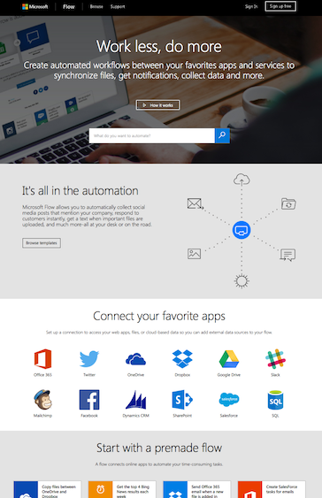

<properties
	pageTitle="Get started | Microsoft Flow"
	description="Quick ways to get started automating your work with Microsoft Flow"
	services=""
	suite="flow"
	documentationCenter="na"
	authors="stepsic-microsoft-com"
	manager="erikre"
	editor=""
	tags=""/>

<tags
   ms.service="flow"
   ms.devlang="na"
   ms.topic="hero-article"
   ms.tgt_pltfrm="na"
   ms.workload="na"
   ms.date="10/22/2016"
   ms.author="stepsic"/>

# Get started with Microsoft Flow #

<iframe width="560" height="315" src="https://www.youtube.com/embed/iMteXfAvDSE?list=PL8nfc9haGeb55I9wL9QnWyHp3ctU2_ThF" frameborder="0" allowfullscreen></iframe>

Welcome! Microsoft Flow is a product to help you set up automated workflows between your favorite apps and services to synchronize files, get notifications, collect data, and more.

The first step is to [sign up](sign-up-sign-in.md), or, if you already have an account with Microsof, you can directly [sign in](https://flow.microsoft.com/signin) on your tablet, your desktop computer, or even your phone.

## Check out the home page ##
[On the home page](https://flow.microsoft.com) for Microsoft Flow, you can [explore a diverse set of templates](https://flow.microsoft.com/templates) and read about some key features for Microsoft Flow. You can get a quick sense of what's possible and how Microsoft Flow could help your business and your life.

Each template is designed for a specific purpose such as sending you a text message when your boss emails you, adding Twitter leads to Dynamics 365, or backing up your files. These templates are just the tip of the iceberg and are intended to inspire you to create flows that are customized to the exact processes that you need.

## Create your first flow ##

You will need to find a flow template that would be useful for you. A very simple template is [**Get daily reminders in Email**](https://flow.microsoft.com/galleries/public/templates/45a3399aa29345308f08b6db0a9c85b9/) :

Using this template is very easy: first, select **Use this template**.

Then select **Create** and accept the terms and conditions.

Now you can explore the conditions that trigger the flow and the action that result from that event. Play around with the settings to make the flow your own, and even add or delete actions. Finally, select **Create flow**, and then verify that your flow is running as expected (or just select **Done**).

Explore other templates, and [follow this tutorial](get-started-logic-template.md) to get details of how to create more flows from templates.

## Get creative ##
Now that you have some idea of what a flow can do and a bit of experience, [create a flow from scratch](get-started-logic-flow.md) based on these data sources and others:

- an Excel file in a cloud-storage account such as Dropbox, OneDrive, or Google Drive
- a Google sheet
- a SharePoint list
- Salesforce or Microsoft Dynamics 365 with custom entities
- a SQL Azure table
- [the Microsoft Common Data Service](common-data-model-intro.md)

When you create a flow from scratch, the entire flow comes straight from your brain to the screen. You're also free to explore different approaches such as the ones in these topics:

- [Flows with many steps](multi-step-logic-flow.md)
- [Run tasks on a schedule](run-tasks-on-a-schedule.md)
- [Create an approval flow](wait-for-approvals.md)
- [Watch a flow in action](see-a-flow-run.md)
- [Publish a template](publish-a-template.md)

## Use the mobile app ##
Download the [iPhone](https://itunes.apple.com/us/app/microsoft-flow/id1094928825?ls=1&mt=8) or [Android](https://play.google.com/store/apps/details?id=com.microsoft.flow) version of the app to your mobile device, where you can:

- [monitor flow activity](mobile-monitor-activity.md), such as successes, failures, and the time when each flow ran most recently
- [manage each flow](mobile-manage-flows.md), such as enabling or disabling it and viewing its events and actions
- [create a flow from a template](mobile-create-flow), such as one for getting a push notification when you receive mail from a sender that you specify

## Questions? Ideas? We're here to help ##
We're excited to see what you can do with Microsoft Flow, and we want to make sure that you have a great experience. Check out the detailed tutorials here for more help, and [join our community](http://go.microsoft.com/fwlink/?LinkID=787467) to ask questions and share your ideas. [Contact support](http://go.microsoft.com/fwlink/?LinkID=787479) if you run into any issues. Note that Microsoft Flow is currently in preview.
