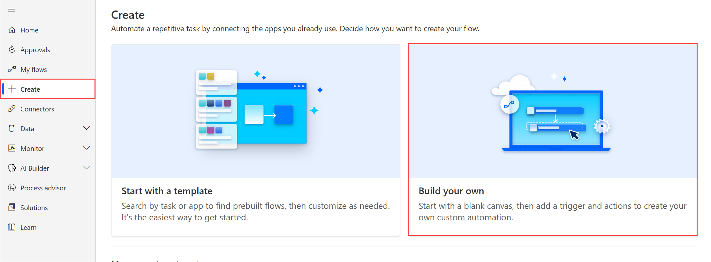
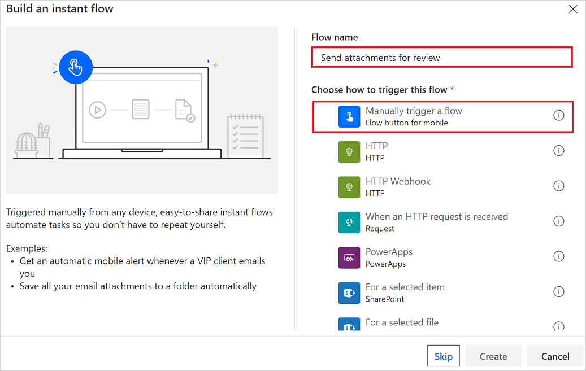
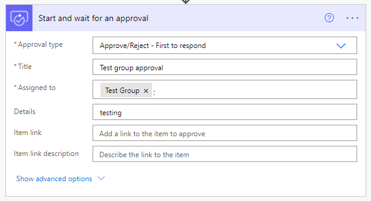
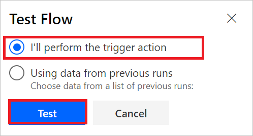

# Request approvals from Microsoft 365 groups

You can send approvals to [Microsoft 365 groups](/microsoftteams/office-365-groups) and to individuals. It's useful to send approvals to groups in scenarios where you need an approval from **any one** person in the group. For instance:

* You need the approval of a representative of the leadership team for a project.
* You want the copy of the new marketing material to be approved by someone on the social media team.

>[!TIP]
>Only a single user from the group needs to respond to the approval. That user's response is used to represent the entire group.

## Send an approval to a Microsoft 365 group

Approvals to groups behave exactly like approvals to users, it's just the entity that the approval is being sent to that's different. Let's look at a simple example.

>[!NOTE]
>This example uses the **First to respond** action, but you can combine this action with other types of approvals as well.

### Create the flow

1. Sign in to [Power Automate](https://powerautomate.com).
1. Select **My flows** > **New** > **Instant &mdash; from blank**.

    

1. Give your flow a name, search for and then select **Manually trigger a flow**, and then select **Create**.

    

1. Select the **Manually trigger a flow** trigger > **Add an input** > **File**.

     This step configures your flow so that when it runs, it requests a file from the user to trigger your flow.

1. Select **New step**.
1. Search for **Approvals**, and then select **Start and wait for an approval**.
1. On the **Start and wait for an approval** card, for **Approval type**, select **Approve/reject - First to respond**.
1. Enter the following:

   - **Title**: This is a short description that gives the approver some details about the approval request.
   - **Details**: This text shows up in the approval request.

1. In the **Assigned to** field, start entering the name of the group to which you want to send the approval. The **Assigned to** field accepts both user and Microsoft 365 group inputs. If you know the email ID associated with the group, you can include that as well. 

   

   >[!TIP]
   >You can include multiple groups and users in the **Assigned to** field.

1. Select **Save** to save your flow.

### Test your flow

1. Select **Test**.
1. Select **I'll perform the trigger action**.

     

1. Select **Test** > **Continue**.

1. Select **Run flow**.

   You'll see that the test run starts.

     

1. Select **Flow Runs Page** to monitor the status of the test.

### Approve the request

For mail-enabled groups, the group to which the approval is sent receives a notification to respond to the approval. Members of the group can also view the approval in the Approvals action center on the Power Automate portal and in the Approvals app in Microsoft Teams.

## What to expect when you send approval requests to groups and users

You can choose to send an approval to multiple groups, or even a combination of groups and users. Here are a few examples of such scenarios and their expected outcome:

* The **First to respond** approval sent to group 1 and group 2: At least one user from *either* group 1 or group 2 needs to approve.
* The **Everyone must respond** approval sent to group 1 and group 2: At least one user from *both* group 1 and group 2 needs to approve.
* The **First to respond** approval sent to group 1 and user 1: At least user 1 or one member from group 1 needs to approve.
* The **Everyone must respond** approval sent to user 1 and group 1: Both user 1 and at least one member from group 1 needs to approve.

## Learn more

In most approval flows, you'd want to notify the person who requests the approval of the decision. Follow the [modern approvals article](modern-approvals.md#add-an-email-action-for-approvals) to learn how to add a **condition** to an approval flow to take specific actions based on the **outcome** of the request.
