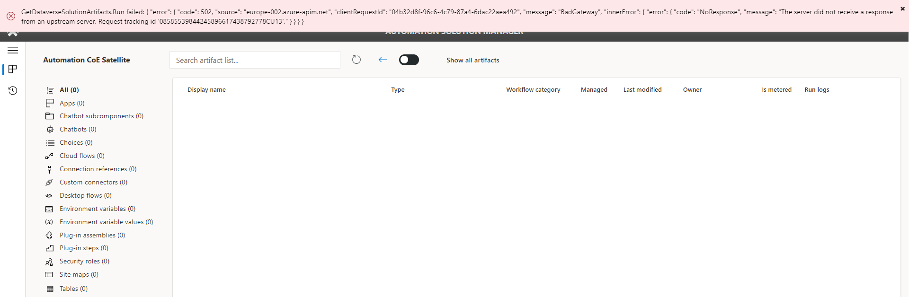

# FAQ
===

This section focuses on the most common questions and answers.

What are the datacenter region codes?
-------------------------------------

These values are crucial when configuring Satellite’s environment variables.
Each region has different URLs. The following is a list of regions and their
URL:

| **Region** | **URL**                  |
|------------|--------------------------|
| Region     | URL                      |
| NAM        | crm.dynamics.com         |
| DEU        | crm.microsoftdynamics.de |
| SAM        | crm2.dynamics.com        |
| CAN        | crm3.dynamics.com        |
| EUR        | crm4.dynamics.com        |
| FRA        | crm12.dynamics.com       |
| APJ        | crm5.dynamics.com        |
| OCE        | crm6.dynamics.com        |
| JPN        | crm7.dynamics.com        |
| IND        | crm8.dynamics.com        |
| GCC        | crm9.dynamics.com        |
| GCC High   | crm.microsoftdynamics.us |
| GBR        | crm11.dynamics.com       |
| ZAF        | crm14.dynamics.com       |
| UAE        | crm15.dynamics.com       |
| GER        | crm16.dynamics.com       |
| CHE        | crm17.dynamics.com       |
| CHN        | crm.dynamics.cn          |

**For more information see** [Datacenter
regions](https://docs.microsoft.com/en-us/power-platform/admin/new-datacenter-regions)

How can the RPA CLI be used to extend the Automation CoE?
---------------------------------------------------------

Read more about the [RPA CLI](https://aka.ms/rpacli)

The most common errors and fixes
--------------------------------

#### No Organization is matching the given dataset: unq0a5fac6XXXXXXXXXXXXX.crm

The issue might be due to a wrongly entered environment variable value for
Environment Unique Name of CoE Main. If your environment is provisioned in
Australia for instance you need to put the Australian region suffix to the crm
domain eg crm6 instead of crm. Once this is fixed you will be able to Turn On
all cloud flows. [Read more about
regions](#what-are-the-datacenter-region-codes).

Reference the two links below to:

1.  [How to change environment variables inside managed
    solution](#environment-variables-not-editable-after-import).

2.  [Force new values of environment variables when changed
    manually](#environment-variables-using-old-values-if-changed-manually).

#### GetDataverseSolutionArtifacts.Run failed

This error happens inside the Automation Solution Manager app (Inside
Satellite). When trying to view the solution artifacts.

First check out these flows:

**Get Dataverse Bearer Token (Azure KeyVault Env)**

**Get Dataverse Solution Artifacts**

The error inside the Flow might be like:

There could be two (2) main causes of this error.

1.  Application user not created inside Satellite environment.  
    [Create Application user inside satellite
    environment](#create-application-user-inside-dataverse-per-satellite-env).

2.  Satellite environment variables not configured properly.

>   [Check and confirm all values of your environment
>   variables](#environment-variables).