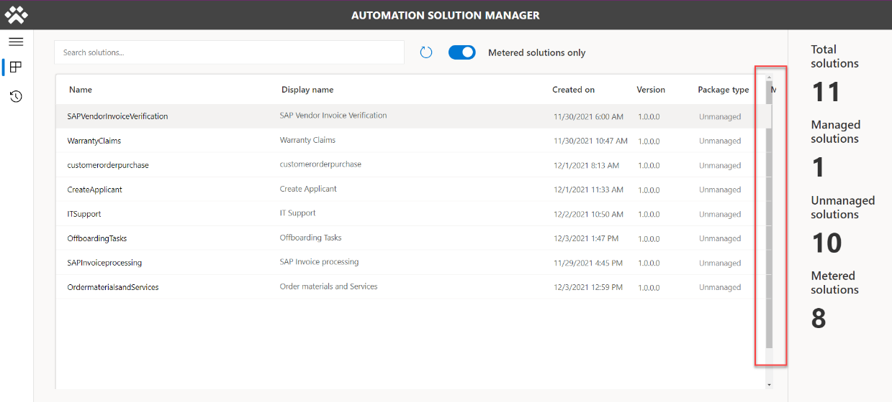
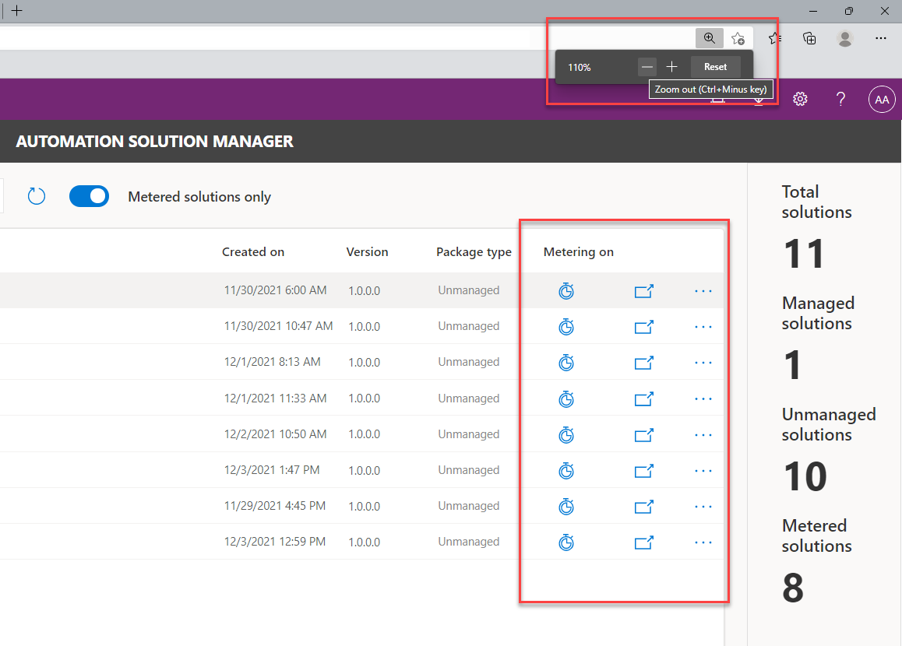

# Limitations
===========

Environment variables not editable after import
-----------------------------------------------

You cannot update the values for environment variables from within the solution
since it is **Managed**.

Fix: To update Environment Variables:

1.  Go to [Power Automate](https://flow.microsoft.com/).

2.  On the left pane, select **Solutions**.

3.  Select the **Default Solution** and change the filter to show **Environment
    Variables**.

4.  Select a variable that you want to update, and then configure its **Current
    Value**.

Environment variables using old values if changed manually
----------------------------------------------------------

When environment variable values are changed directly within an environment
instead of through an ALM operation like solution import, flows will continue
using the previous value

Fix: **For canvas apps, the new value will be used during the next session. For
example, closing the app and then playing it again.**

**With cloud flows, the flows must currently be de-activated and re-activated to
use the updated value.**

Automation Solution Manager Resolution
--------------------------------------

On certain resolution sizes the screen is automatically enlarging everything.
This cuts off some of the buttons when using the app.

Fix: Zoom out

Cannot Meter Non-Solution Aware Flows
-------------------------------------

At this time, the current solution cannot meter any flows that are not inside a
solution.

Fix:

All Flows that need to be metered, **need to be put inside a solution**.

Cloud Flows must follow specific naming convention before they can be used for metering 
----------------------------------------------------------------------------------------

All solution-aware cloud flows that you want to be metered, must follow a new
naming convention that is internally being validated via **RegEx
(_AP-[0-9]{9}_[0-9]{3}\\b)**. This is the expected format:

*[CloudFlowName]_AP-[9digits]_[3digits]*

e.g. **MostLikleyTheBest-CLoUdfLoW_AP-000001013_001.** The last 3 digits can be
used for advanced use cases and are typically 00**1** if you only have **one**
solution per automation project. If you have multiple solutions for a single
project, you could increase that number by 1 for each additional solution if you
wish to distinguish them.

This can be bypassed by selecting the information button inside the Solution
Manager App.

Flow Exception Framework
------------------------

-   Disabling or suspending Desktop flows is not supported. Only parent cloud
    flow can be turned off (if this has been configured)

-   If you’ve chosen to require Acknowledgements upon failures, please note that
    all flow runs remain in a waiting stage until either the email has been
    acknowledged or the flow timed out.

Desktop flows Impact Analysis sync limitation (No data in app)
--------------------------------------------------------------

There is a limitation where only new or modified desktop flows will be analysed
and shown in the app. Either by:

-   Modifying the Desktop flow

-   Importing Desktop flow (solution)

-   Creating a new Desktop flow

Currently a solution can be used to extend the Automation CoE to sync all
Desktop flows from an environment using the [RPA CLI](https://aka.ms/rpacli).
(<https://aka.ms/rpacli>)

[Read more on how to use the RPA CLI for the Automation
CoE](#how-can-the-rpa-cli-be-used-to-extend-the-automation-coe)