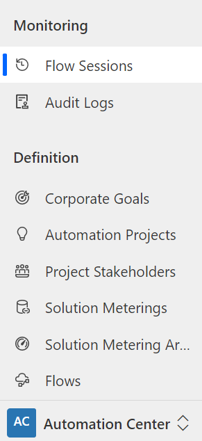
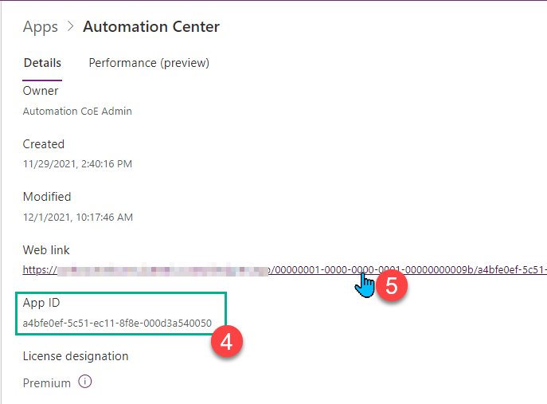

# Configure Automation CoE Toolkit
================================

#### Define configuration data

Using the Automation CoE Admin account, navigate to the Main environment. You
want to open the app

**Automation Center**, this is where we configure how several aspects of the
Automation CoE will function.

When the app opens, your left navigation should look like this:

There are a few things we need to setup/configure when you first import the
Toolkit.

First, we are going to add an Automation Goal. Follow these steps to add an
Automation Goal.

1.  Inside the Automation Center Click Corporate Goals tab.

2.  Click + New

3.  Fill in the required fields (Sample data provided below)

| **Field**                | **Value**                       |
|--------------------------|---------------------------------|
| Goal Name                | Cost Savings through Automation |
| Period From              | 11/1/2021                       |
| Period To                | 11/1/2022                       |
| Target Efficiency Gain % | 20                              |
| Target Total Savings     | 50000                           |

Click **Save & Close**.

Next, we will configure some configurations

These configurations are split into **3** sections

1.  General - configurations that are related to resources and processes

2.  ROI Calculation - configurations that will be used as a scoring metric to
    better determine estimated ROI and complexity of an Automation Project

3.  Configuration - info pertaining to the Automation CoE Toolkit apps. Will be
    used to build a Console where users can launch related apps

#### Steps to configure general

Select **"Automation Center"** in the bottom navigation bar \> Switch
to **"Setup"**

#### Environments

1.  Inside the environment tab select a Satellite environment.

2.  Change **Is Satellite Environment** to **Yes**.

3.  Click **Save & Close.**

4.  Do this for all your **Satellite environments** (DEV, TEST, PROD, Etc.)

#### Departments

1.  Inside the department tab select **+ New**

2.  Create as many departments as your organization may need. Here is a sample
    of the departments:

-   Accounting

-   Enterprise Integration

-   Finance

-   Human Resources

-   Information Technology

-   Logistics

-   Operational Change Management

-   Purchasing

#### Process Categories

1.  Inside the process categories tab select **+ New**

2.  Create top level categories that will have child categories (subcategories).
    Here is a sample:

-   Artificial Intelligence

-   Claims

-   Invoicing

-   Legacy System

#### Process Sub categories

1.  Either inside the process sub categories tab or directly inside a Process
    category. You want to define sub processes that relate in some way.

2.  Click **New Process Sub Category**.

3.  Sample data is below

4.  Artificial Intelligence

    -   Forms Processing

    -   Forms Validation

5.  Claims

    -   Return

    -   Warranty

6.  Invoicing

    -   Internal

    -   External

    -   Other

7.  Legacy System

    -   Complex

    -   No API

    -   Other

#### Roles (App Roles)

These roles do not give access to anything, only used as lookups for the
fallback record if needed.

1.  Create the **Automation CoE Admin** account as the **CoE Owner**

| **Field**           | **Value**                 |
|---------------------|---------------------------|
| Display Name        | Anything (Auto CoE Owner) |
| Type                | **CoE Owner**             |
| User Principal Name | The email of the user     |

2.  Create **CoE Admins** - At least 1 **CoE Admin** must be initialized to
    configure the **fallback**

| **Field**           | **Value**                 |
|---------------------|---------------------------|
| Display Name        | Anything (Auto CoE Admin) |
| Type                | **CoE Admin**             |
| User Principal Name | The email of the user     |

#### Base Configuration - Fallback

This table should only have 1 record defined. This record is used if any of the
values that are needed to complete processing is null or not defined

1.  Define 1 fallback record (See screenshot below for example)

Steps to configure ROI calculation
----------------------------------

Still inside the **"Setup"** page you can find the ROI calculation
configurations. These tables are used to calculate the complexity of
each **Automation Project** (scores). Some values are also being used for
estimated ROI and savings

#### Processing Frequency Scores

This table has a value and score for each record. Below are values that should
be used, scores can be modified.

| **Value** | **Score** |
|-----------|-----------|
| Daily     | 12        |
| Hourly    | 18        |
| Monthly   | 3         |
| Quarterly | 1         |
| Weekly    | 5         |

#### Average Automation Steps Scores

This table can be fully customizable based on your organizations needs/process.
Table is used to get the **Score** for the **Average Automation Steps** which is
inputted by the user when a new **Automation Project** is requested. Below are
some examples, but more or less can be added.

| **Range**     | **Value From** | **Value To** | **Score** |
|---------------|----------------|--------------|-----------|
| \>= 1, \< 5   | 1              | 5            | 1         |
| \>= 250       | 250            | 999999999    | 10        |
| \>= 5, \< 250 | 5              | 250          | 5         |

#### Processing Peaks Scores

This table has a value and score for each record. Below are values that should
be used, scores can be modified.

| **Value** | **Score** |
|-----------|-----------|
| daily     | 15        |
| hourly    | 20        |
| monthly   | 5         |
| quarterly | 2         |
| weekly    | 10        |

Configuration - Console
-----------------------

These tables are used by the **Automation Console** app, as well as
the **Project Approval** automation.

| **Name**           | **App Description**                                           | **AppID / App Link**                                        |
|--------------------|---------------------------------------------------------------|-------------------------------------------------------------|
| Automation Project | Create and manage your automation projects                    | [See Below (Next page)](#how-to-get-canvas-app-urlid)       |
| Automation Center  | Manage and configure all aspects of your automation resources | [See Below (Next page)](#how-to-get-model-driven-app-urlid) |

#### How to get canvas app URL/ID

Inside the [Maker Portal](https://make.powerapps.com/)

1.  Select **Apps** tab on the left navigation

2.  Click the 3 dots (more commands) on the app

3.  Click details

#### How to get model driven app URL/ID

Inside the [Maker Portal](https://make.powerapps.com/)

1.  Select **Apps** tab on the left navigation

2.  Click the 3 dots (more commands) on the app

3.  Click details

4.  Copy **AppID**

5.  Click the **Web Link**

6.  Click Properties

7.  Copy Unified Interface URL (Reference the screenshots below for the steps)

<!-- todo: -->

<!-- > [!div class="nextstepaction"]
> [Next step: Core components for Power Automate RPA SAP GUI automation](core-components.md) -->
