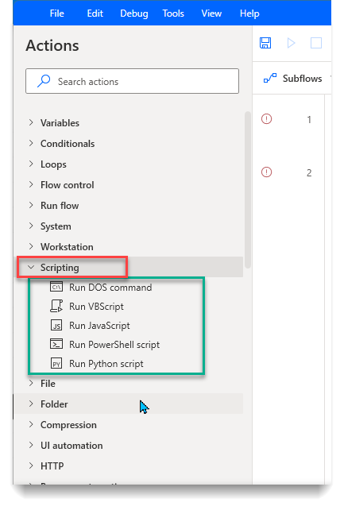

# DLP Impact Analysis for Desktop Flows
=====================================

Feature details
---------------

The recently launched preview for DLP support for PAD actions is a critical and
highly requested governance feature addition, as most organizations expect the
same governance breadth and depth for RPA as we have for the DPA-based flows.

This new DLP support will allow even the most risk-averse companies to enable
Power Automate Desktop across the enterprise, which would enable citizen
automation developers to achieve unprecedented productivity gains and save
thousands of hours of highly repetitive and error-prone tasks that ultimately
lead to higher employee and customer satisfaction.

Administrators and CoE teams can define which action groups and individual
actions can be used as part of desktop flows created with Power Automate for
Desktop. In the case of policy violations (e.g. VBScript was not allowed but was
used in a desktop flow), the platform notifies the maker that this action has
been disabled by the policy, so that saving the flow is not possible. However,
it’s important to note that bots that have already been developed and deployed
might also be affected by policy changes, potentially causing production bots to
stop without prior notice.

#### Components

**Canvas App**

-   DLP Impact Analysis for PAD

**Cloud Flows**

-   Remove Deleted Action from DLP Profile

-   Sync Flow Definition

**Column security profiles**

-   Desktop Flow Script Field Security

**Custom API**

-   Desktop Flow Definition Analysis

**Custom API Request Parameter**

-   Desktop Flow Definition Id

-   Store Extracted Desktop Flow Script

**Environment variables**

-   Desktop Flows Base URL

-   Environment Id

-   Environment URL

-   Store Extracted Script

**Plug-in assemblies**

-   AutoCoE.Extensibility.Plugins

**Security roles**

-   Desktop Flow Definition Admin

**Tables**

-   Desktop Flow Action

-   Desktop Flow Definition

-   Desktop Flow DLP Impact Profile

**Power BI**

-   Advanced PAD DLP Impact Analysis

How to use DLP Impact Analysis
------------------------------

The canvas app is a one screen app used for basic filtering and visibility into
the actions used in Desktop flows. With this app we can easily see what Desktop
flows will be impacted if we decide to disable certain Modules or Actions within
the [new DLP policies for Desktop
flows](https://docs.microsoft.com/en-us/power-automate/desktop-flows/data-loss-prevention)**.**

This App can be accessed in Main or any Satellite environment.

Some of the fields in the filter include:

-   Module – This is the Module the Action belongs to for example **Scripting**.

-   Action – The individual Actions that are under Module under Scripting there
    are Run DOS command, Run JavaScript, Run Python script, etc.

**Occurrences** are how many times the Action is used in the Desktop flow.

#### Scenario – Analyze impact of Scripting Module

Note, PAD DLP Impact Analysis App is in both main and satellite. Satellite
versions only show Desktop flows that are in the current environment. If opening
the app from main, you get an overview of all the satellite environments.

**Script field inside Desktop Flow Definitions table does NOT get synced to main
from satellite.**  

Using the filter pane on the left, to filter by **Scripting** module, we can
select all actions or select one by one to see which Desktop flows would be
impacted.

All Scripting Actions:

Only Python actions:

TIP: Clicking on the Desktop flow name will bring you directly to the flow.

Advanced PAD DLP Impact Analysis Dashboard
------------------------------------------

Data can be visualized by using the [Automation CoE Main
Dashboard](#main-dashboard).