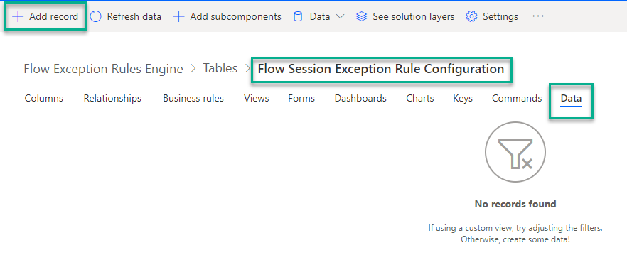
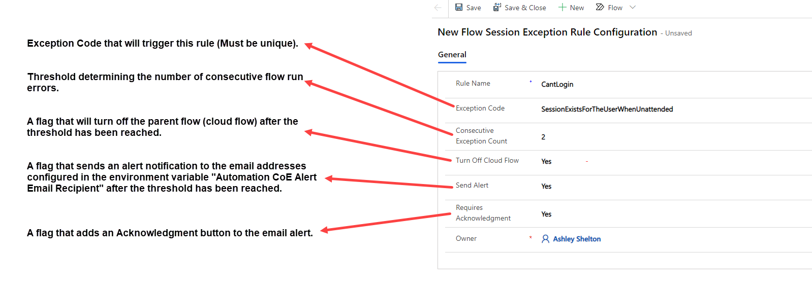
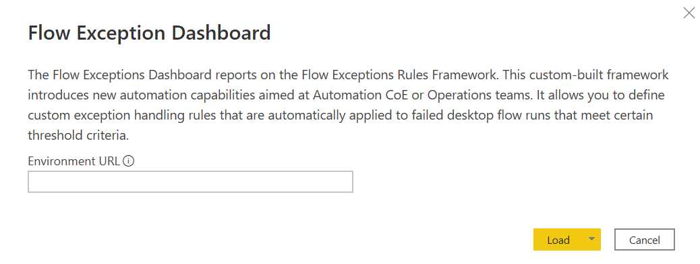
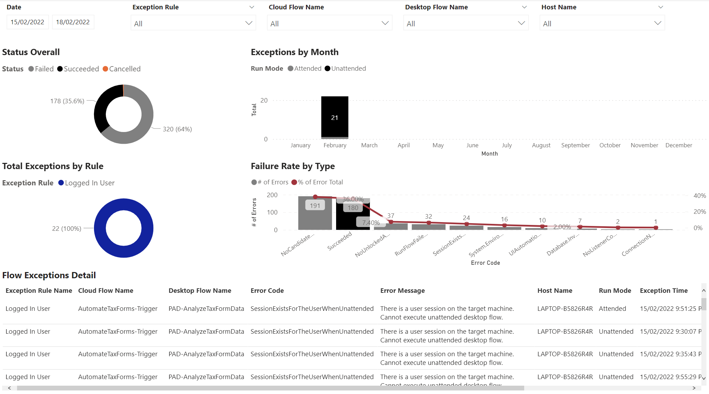
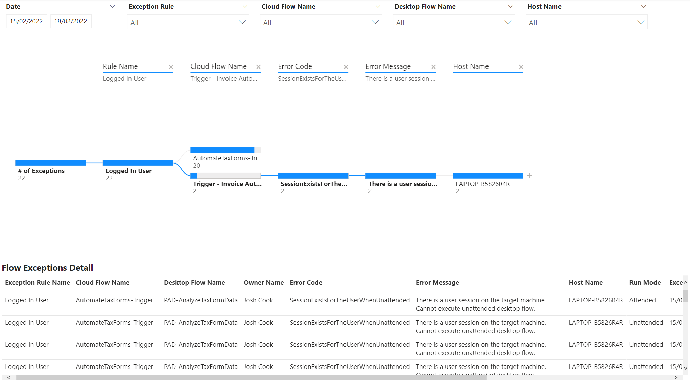

# Flow Exception Rules Framework
==============================

The **Flow Exception Rules Framework** is a combination of solutions components
inside the Satellite Solution.

This custom-built framework introduces new automation capabilities aimed at
automation CoE or operations teams. It allows you to define custom exception
handling rules that are automatically applied to failed desktop flow runs that
meet certain threshold criteria.

Feature details
---------------

Desktop flow execution results together with their statuses are automatically
stored in a Dataverse table named Process (**flowsession** is the internal name)
which allows us to build custom solutions that would further process its data in
automations. A common use case would be to automatically turn off a calling
parent cloud flow if its desktop flow reported 3 consecutive errors including
the same error code such as **WindowsIdentityIncorrect** or
**NoUnlockedActiveSessionForAttended**, etc.

#### Components

These components are part of the [Automation Satellite
solution](#_Assign_Flow_Session)

1.  **Table –** Flow Session Exception Rule Configuration – Used to define
    exception rules

2.  **Table –** Flow Session Exception – Used as flow exception log and
    downstream analytics

3.  **Cloud flow** – Flow Session Exception Sync – Main processing flow that
    takes processing instructions from the above rule configuration

4.  **Security Role –** Flow Session Exception Admin – Provides full CRUD
    permissions to the Flow Session Exception data captured in above’s tables

5.  **Environment Variable** – Automation CoE Alert Email Recipient – Defines
    the email address or distribution list where operational reports and alerts
    should be sent to

Configure Flow Exception Rules Framework
----------------------------------------

Important to note that the below steps should be done with a user with the
following roles:

-   [Flow Session Exception Admin](#_Assign_Flow_Session)

-   Basic User

-   Environment Maker

1.  Open a browser, navigate to <https://flow.microsoft.com> and sign-in with
    your account.

2.  Navigate to your **Satellite** environment.

3.  Select **Solutions** tab.

4.  Find and select **Automation CoE Satellite.**

5.  Select **Tables**, find these 2 tables:

    -   Flow Session Exception Rule Configuration

    -   Flow Session Exception

>   **Note** if you do not see the above **tables** make sure you have been
>   assigned these [roles mentioned](#flow-exception-rules-framework)

1.  select the table **Flow Exception Rule Configuration** to add a **new**
    record.

2.  Click the **Data** tab. Click **+Add record**

1.  Here is an example configuration rule. If you want to monitor multiple error
    codes, then you must create a record for each error code you want to
    monitor.

**See table below**

| **Field**                   | **Value**                             |
|-----------------------------|---------------------------------------|
| Rule Name                   | CantLogin                             |
| Exception Code              | SessionExistsForTheUserWhenUnattended |
| Consecutive Exception Count | 2                                     |
| Turn Off Cloud Flow         | Yes                                   |
| Send Alert                  | Yes                                   |
| Requires Acknowledgment     | Yes                                   |

Flow Exceptions Dashboard
-------------------------

To visualize and report on the Flow Exceptions configured, the Flow Exceptions
Dashboard can be utilized.

When you launch the Power BI template, enter the URL for the environment you
wish to report on:

*Note:* The URL must be entered in the following format:
[organization].crm[N].dynamics.com

Example: **contosttest.crm.dynamics.com**

The **Flow Exceptions** tab will allow you to filter by Date, Exception Rule,
Cloud Flow Name, Desktop Flow Name, or Host Name:

Below is a summary of the information provided in this tab:

**Status Overall –** Overall count and percentage of Failed vs. Successful Flows
for the environment

**Total Exceptions by Rule –** Displays the total number of Flow runs,
categorized by each Exception Rule setup through the Flow Exceptions Framework

**Failure Rate by Type –** Displays the total number of errors for the
environment across all Flows, the number of Successful runs, and the % of
frequency for each error compared to all other errors.

**Exceptions by Month –** Displays the total number of Exceptions triggered for
each Rule according to the Flow Exception Framework, categorized by Month

**Flow Exception Detail –** Displays the detailed information for the Flow
Exceptions

The **Flow Exceptions (Tree)** tab allows you to filter by Date, Exception Rule,
Cloud Flow Name, Desktop Flow Name, or Host Name:

Below is a summary of the information provided in this tab:

**Flow Exceptions Tree Diagram –** Displays and allows you to drill into
specific Flows organized into the following categories: Cloud Flow Name, Desktop
Flow Name, Error Code, Error Message, Run Mode, or Host Name

**Flow Exception Detail –** Provides detailed information on the Flow Exceptions

DLP Impact Analysis for Desktop Flows
=====================================

Feature details
---------------

The recently launched preview for DLP support for PAD actions is a critical and
highly requested governance feature addition, as most organizations expect the
same governance breadth and depth for RPA as we have for the DPA-based flows.

This new DLP support will allow even the most risk-averse companies to enable
Power Automate Desktop across the enterprise, which would enable citizen
automation developers to achieve unprecedented productivity gains and save
thousands of hours of highly repetitive and error-prone tasks that ultimately
lead to higher employee and customer satisfaction.

Administrators and CoE teams can define which action groups and individual
actions can be used as part of desktop flows created with Power Automate for
Desktop. In the case of policy violations (e.g. VBScript was not allowed but was
used in a desktop flow), the platform notifies the maker that this action has
been disabled by the policy, so that saving the flow is not possible. However,
it’s important to note that bots that have already been developed and deployed
might also be affected by policy changes, potentially causing production bots to
stop without prior notice.

#### Components

**Canvas App**

-   DLP Impact Analysis for PAD

**Cloud Flows**

-   Remove Deleted Action from DLP Profile

-   Sync Flow Definition

**Column security profiles**

-   Desktop Flow Script Field Security

**Custom API**

-   Desktop Flow Definition Analysis

**Custom API Request Parameter**

-   Desktop Flow Definition Id

-   Store Extracted Desktop Flow Script

**Environment variables**

-   Desktop Flows Base URL

-   Environment Id

-   Environment URL

-   Store Extracted Script

**Plug-in assemblies**

-   AutoCoE.Extensibility.Plugins

**Security roles**

-   Desktop Flow Definition Admin

**Tables**

-   Desktop Flow Action

-   Desktop Flow Definition

-   Desktop Flow DLP Impact Profile

**Power BI**

-   Advanced PAD DLP Impact Analysis
