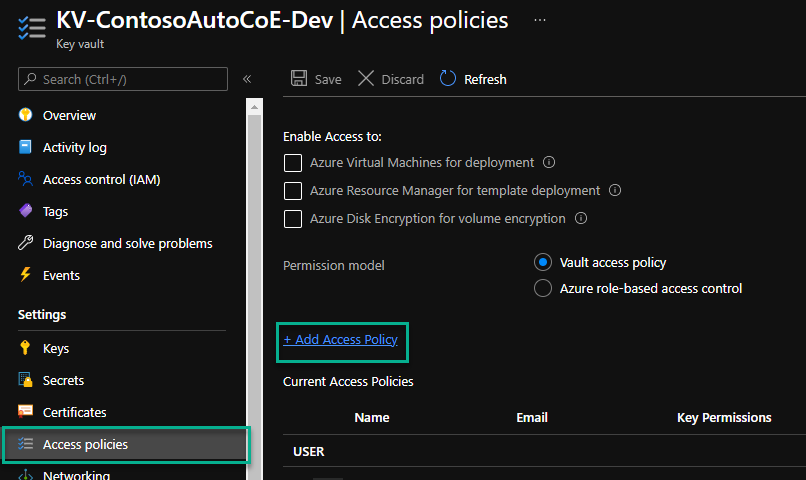
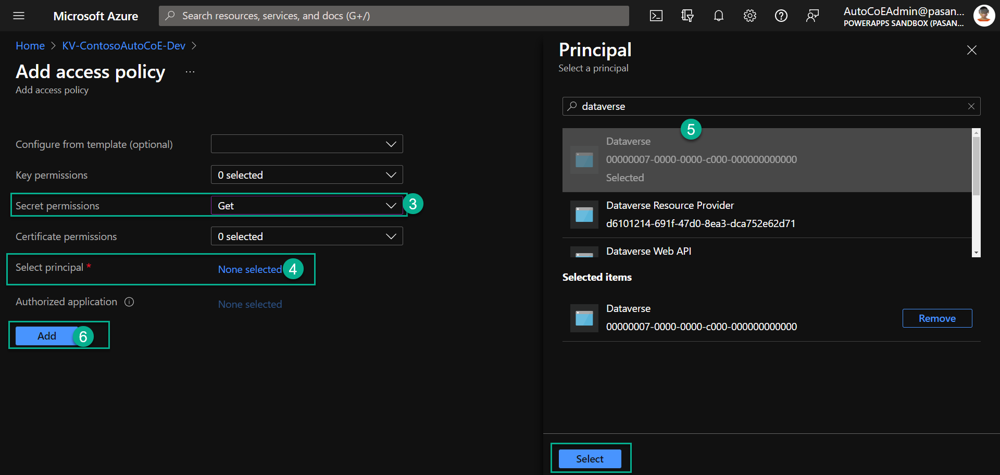

# Prerequisites to install and use the Automation CoE Toolkit

The following prerequisites are required to install and use the Automation CoE Toolkit

- An administrative account, which is called **Automation CoE Admin** or similar.

  The Automation CoE requires access to your Power Platform environments, and some Azure resources, such as Key Vault and app registration). Therefore, the account you set up as the **Automation CoE Admin** needs the following.

## Roles

- Microsoft Power Platform service admin, or Dynamics 365 service admin.
- Account must be mail enabled.
- Azure contributor role (for Key Vault and app registration).

## Azure app registration

An Azure app registration, this is used for an application user for the Dataverse Web API in each of the satellite environments.

## Azure Key Vault

Azure Key Vault(s) is used to store secrets for the Azure app registration mentioned earlier in the article, depending on your requirements. There might be one Key Vault per satellite environment. Here's an example of how you may name your Key Vaults.

- KV-Contoso-Dev
- KV-Contoso-Test
- KV-Contoso-Prod

>[!NOTE]
>The Automation CoE uses the new [Azure Key Vault secrets (preview)](/powerapps/maker/data-platform/EnvironmentVariables#use-azure-key-vault-secrets-preview).

1. Register the **Microsoft.PowerPlatform** resource provider in your Azure subscription. Follow these steps to verify and configure it: [Azure resource providers and types](https://docs.microsoft.com/azure/azure-resource-manager/management/resource-providers-and-types).

   Azure Key Vault must have **Get** secret access policy set for the Dataverse service principal.

1. Select **Add Access Policy**.

   

1. In the **Secret permissions** dropdown select **Get**.
1. Next to **Select principal**, select **None selected**, and then search for **Dataverse**.
1. Select the Dataverse service principal with the **00000007-0000-0000-c000-000000000000** identity.
1. Select **Add**.

   

1. Select **Save**. Once added, the access policy should look similar to the following image.

   

## License requirements

<!--todo: confirm if it's any of these licenses needed-->
- Microsoft 365 license (E3, E5).
- Power Automate per user with attended RPA license (non-trial).
- Power Apps Per User license (non-trial).
- Power BI Pro license.
