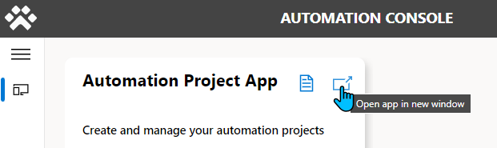
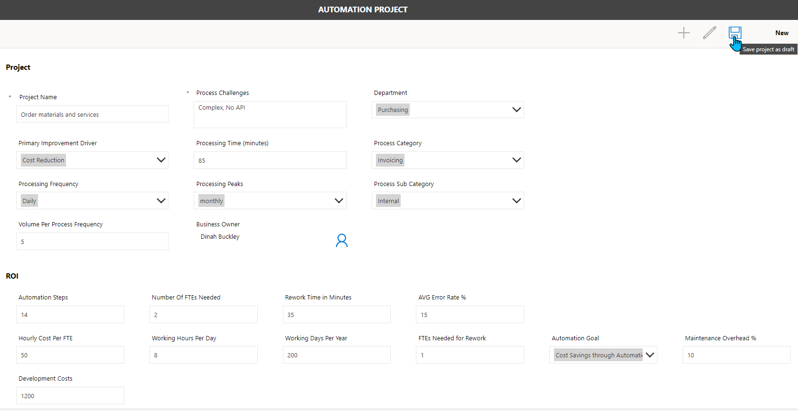
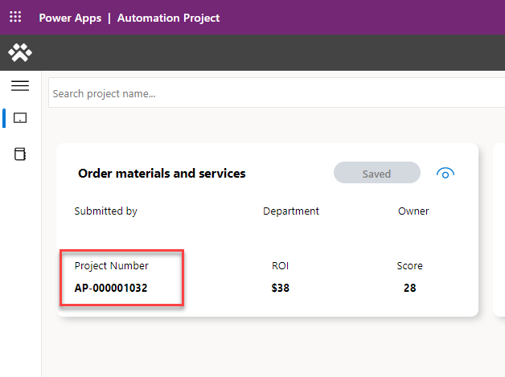

# Project End to End Scenario
===========================

The below test cases are full end to end processes. End to end for an automation
project consists of:

1.  Create automation project request.

2.  Request Approved or Rejected. Approval sent to Business Process Owner or
    Fallback if none selected.

3.  Project Admin maps automation project to a new or existing environment.

4.  Maker creates solution and develops the automation project

5.  When solution is deployed to prod (manually for now) Automation Admin maps
    solution to project by metering the solution and its artifacts.

6.  After metering has been enabled for the solution. The flow / process can be
    triggered, and data will sync back to main in near real time.

7.  Verify in the main solution that the Flow Sessions are being synced.

8.  Verify data calculations are correct (Power BI)

Refer to the following table to see what roles and permissions are needed for
each step

User roles definition
---------------------

| **Name**                | **Security roles**                                               |
|-------------------------|------------------------------------------------------------------|
| Maker                   | Automation Project Contributor, Basic User, Environment Maker    |
| Approver/Business Owner | Automation Project Viewer                                        |
| CoE Admin               | Power Platform Admin (Or System Admin for all environments used) |

Order materials and services (Example 1)
----------------------------------------

#### Request automation project (Maker)

As a **Maker** in the **main** environment

1.  Launch [Automation
    Project](https://github.com/microsoft/automation-coe/wiki/How-to-use-Automation-Project) app
    from either

    -   **Automation Console** app

    -   **Automation Project** app directly

1.  Create a new Automation Project request by clicking the + or selecting the
    New Project tab.

2.  Fill in the details as follows:

| **Question**           | **Value**                                     |
|------------------------|-----------------------------------------------|
| Project Name           | Order materials and services                  |
| Process Challenges     | Complex, No API                               |
| Department             | ANY                                           |
| Improvement Driver     | ANY                                           |
| Processing Time        | 85                                            |
| Process Category       | ANY                                           |
| Processing Frequency   | Daily                                         |
| Processing Peaks       | monthly                                       |
| Process Sub Category   | ANY                                           |
| Volume Per Process     | 5                                             |
| Business Owner         | Business Approver or leave blank for Fallback |
| ROI                    |                                               |
| Automation Steps       | 14                                            |
| Number Of FTEs Needed  | 2                                             |
| Rework Time in Minutes | 35                                            |
| AVG Error Rate %       | 15                                            |
| Hourly Cost Per FTE    | 50                                            |
| Working Hours Per Day  | 8                                             |
| Working Days Per Year  | 200                                           |
| FTEs Needed for Rework | 1                                             |
| Automation Goal        | ANY                                           |
| Maintenance Overhead % | 10                                            |
| Development Costs      | 1200                                          |

3.  Click Save

Once saved you will be brought back to the Dashboard screen. When an automation
project has been saved, a Flow is triggered and used to calculate the ROI
potential and complexity score, based on the information provided.

1.  Click the Refresh button within the App. Until the ROI and Score shows up.
    (Should only take a few seconds after save)

2.  Now we must submit the request for approval, click the icon on the card to
    open.

3.  Click Submit

Now the request has been submitted and can be approved or rejected by the
Business Owner we specified, or if none was provided the Fallback approver will
be used.

If this is the first time an Approval is being used within this environment, it
will take around 5 min for the approval solutions to initialized. This is only a
onetime thing and can be avoided by following the steps laid out in the setup
steps.

#### Approve automation project (Approver)

As an Approver in the main environment

1.  Open the approval from either:

-   Microsoft Teams (preferred)

-   Power Automate Actions tab

-   Outlook Email

1.  Approve request

#### Map automation project to an environment (DEV)

As a CoE Admin in the main environment:

1.  Open the Automation Center App.

2.  Select the automation project that was just approved.

3.  Click the Related tab \> Environments.

4.  Map the record to an environment (DEV).

**Perform step 5 only when the automation project has been deployed to TEST**

1.  Map automation project to TEST

**Perform step 6 only when the automation project has been deployed to PROD**

1.  Map automation project to PROD

#### Create / Export solution (DEV/TEST)

As a Maker in the satellite environment:

1.  Maker goes into DEV environment and creates a new solution.

2.  If department publisher does not exist. Maker will create one for their
    department to be used.

3.  Create a Desktop Flow

4.  Create a Cloud Flow that will trigger the Desktop Flow. Name the Cloud Flow
    using the following [naming
    convention](#cloud-flows-must-follow-specific-naming-convention-before-they-can-be-used-for-metering):  
    [CloudFlowName]_[AutomationProjectNumber]_[3digits]

| CloudFlowName           | Your meaningful name for your process                                                                                                                                                                                                                                                   |
|-------------------------|-----------------------------------------------------------------------------------------------------------------------------------------------------------------------------------------------------------------------------------------------------------------------------------------|
| AutomationProjectNumber | Displayed in the Automation Project app                                                                                                                                                                                                                                                 |
| 3digits                 | The last 3 digits can be used for advanced use cases and are typically 001 if you only have one solution per automation project. If you have multiple solutions for a single project, you could increase that number by 1 for each additional solution if you wish to distinguish them. |

**Note, the renaming process can also be done easier inside the** [Automation
Solution Manager](#rename-cloud-flow-to-match-convention) **app.**

1.  The Cloud Flow should be triggering the Desktop Flow based on the frequency
    defined in the automation request.

2.  Test by running the Cloud / Desktop Flows.

3.  Deploy to test (Manual)

#### Automation Project gets mapped to TEST

1.  Maker exports manually and deploys to test.

2.  Automation Project gets mapped to the TEST environment manually by the CoE
    Admin.

3.  Maker does basic functional testing.

#### Automation Project gets mapped to PROD

As a CoE Admin in the satellite environment (PROD).

CoE Admin maps solution to automation project by metering the solution and its
artifacts

1.  Open the Automation Solution Manager app.

2.  Select the solution for your automation project and meter by clicking the
    "+".

3.  Once metered, meter the artifact (The trigger cloud flow).

4.  Navigate to the metered artifact (cloud flow) and trigger it. (This will
    sync a flow session to main)

5.  Wait for run to complete

#### Verify data sync to main

As a CoE Admin in the main environment.

1.  Open the Automation Center app

2.  Open the Flow Sessions tab

3.  Filter on newest complete time if needed and verify that the run we
    triggered is there

Next, we can validate the ROI calculations using **Power BI and the Excel ROI
Calculator.**

1.  Take the same information entered in the Automation Project app, enter it
    into the Excel ROI Calculator.

2.  Compare Power BI with the results from the Excel ROI Calculator.