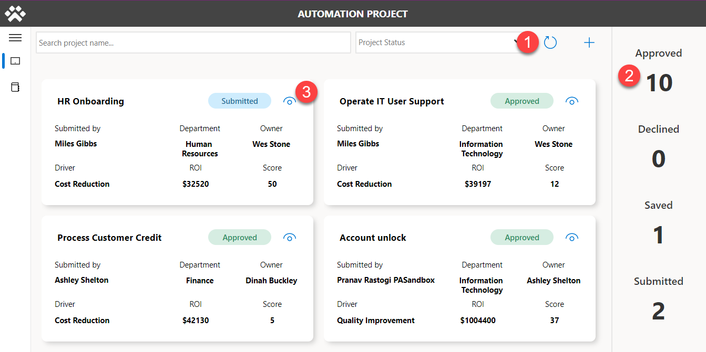
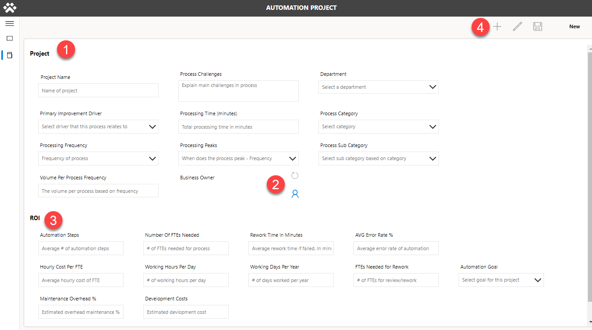
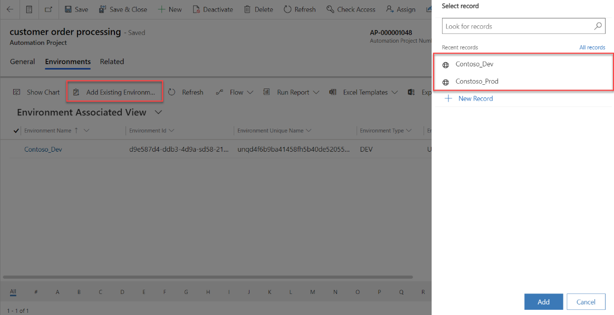
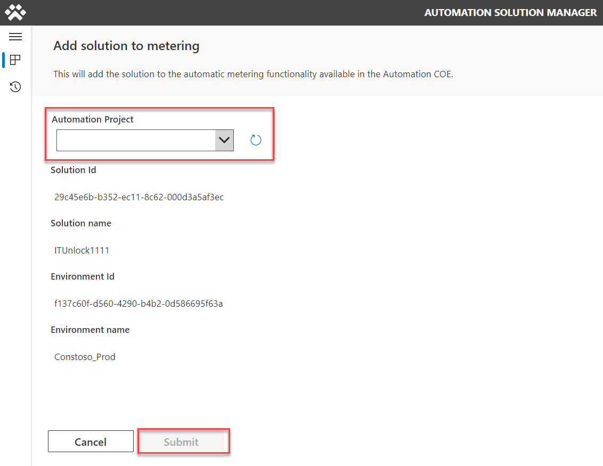
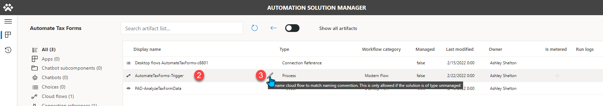
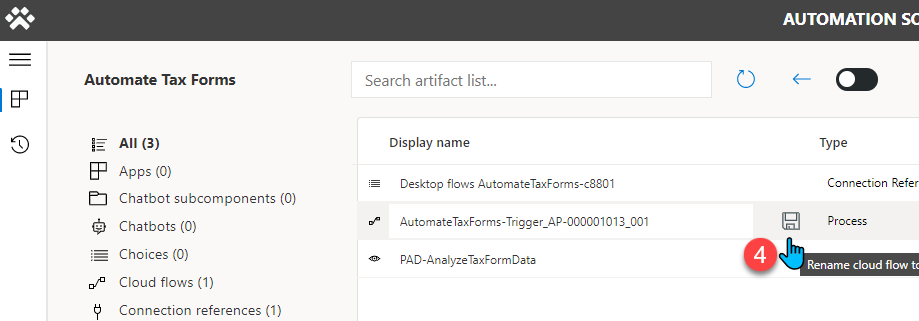
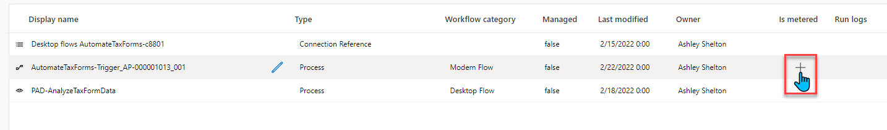
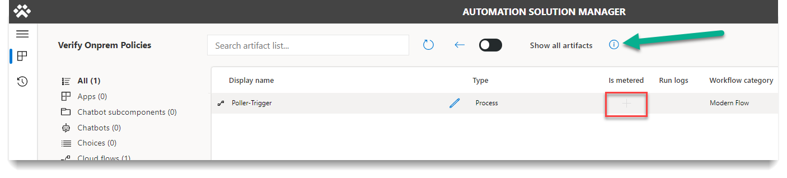
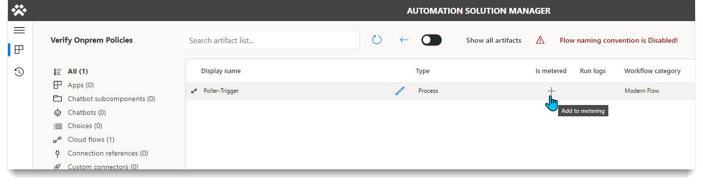

# How to use the automation CoE toolkit

This article details how to use each component in the Automation CoE Toolkit. Each section will contains the functionality and the features.

## Automation Console app

### Functionality

The Automation Console app is used to launch Automation CoE-specific apps. You must update the information for the apps manually. [The setup process goes over configuring the Automation Console](./configure-automation-coe.md#console-configuration)

### Features

- The automation console is a console-like dashboard of all apps that can launched in one place.

- Documentation linked <!--todo: what's this for?-->

## Automation Project app

### Automation project functionality

The purpose of this app is to request and approve new automation projects. The automation approver receives a deep link to the project screen to view all automation project details.

### Automation project features

#### Project Dashboard (Home Screen)

Here's a listing of the experience you'll receive when you launch the app, based on your role.

| **Role**            | **What you see**                                          |
|---------------------|-----------------------------------------------------------|
| Project Admin       | See all automation project requests.                          |
| Project Contributor | Sees only automation project requests that you created.|
| Project Viewer      | Sees all automation projects in view mode.       |

Some features include:

- Command bar - Use the command bar to filter automation projects by status. Select **"+"** to open the **New Project** screen.
- Details side bar - This side bar gives an overview of all the automation projects you can access, based on your role.
- Automation project details card - Provides an overview of the requested project details.

   
   <!--todo: this screenshot should not have steps. it's just showing the options.-->

#### New Project screen

On this screen, you can perform the following tasks.

- Create a new automation project.
- Edit an existing automation project.
- View project details.

1. Project information section - Fill out the information as it relates to the automation project.
1. Business owner field - This is the approver for the request. If no business owner is selected, the fallback is used.
1. ROI information section - Provide this information as it relates to ROI for the automation project.
1. Command bar - Use for new, save, edit, and submit tasks on the form. This submit button is available after the automation project has is saved.

   

Some fields are required to save the form. This is because when you submit a request, a flow (**Calculate ROI saving potential for automation project**) runs. This flow calculates the complexity score and then populates this information when you select the save button.

## Automation Center app

### Functionality of the automation center app

CoE admins use the Automation Center app to maintain the configuration and map automation projects to environments. You can also access flow sessions and metered artifacts in the automation center app.

### Features of the automation center app

#### Create / maintain configuration data

Learn more about how to create and maintain the configuration data in [setting up the Automation CoE Toolkit](./configure-automation-coe.md).

#### Map automation projects to environments

CoE admins will map automation projects to environments after the request is approved.

1. Select **Automation Projects** tab.
1. Select the record you want to map.
1. Select the **Related** tab > **Environments**.

   

1. Select **Add Existing Environments**.
1. Select the environment you want to use, or create a new one.
1. Select **Add** > **"Save & Close"**.

<!--todo: steps seems missing or screens needs to be updated-->

## Automation Solution Manager app

### Functionality of the solution manager app

The Automation Solution Manager app is used by **System Admins (System Administrator)** to enable the metering of solutions and their artifacts. Once a solution and artifact has been metered, data syncs between the environment and main in near realtime.

### Features  of the solution manager app

#### Turn on metering for a solution

After you create a solution in an environment, it shows up in the list. The **+** icon displays when metering is turned off for a solution.

1. Select the **"+"** on the solution you want to meter.
1. In the new screen, select your automation project from the list. If it's not listed, select the **Refresh** button until it shows up.
1. Select **Submit**, and then select **Yes** on the confirmation screen that appears.

   

#### Rename a cloud flow to match convention

Follow these steps to rename a cloud flow to match the [naming convention](./use-automation-coe-toolkit.md#rename-a-cloud-flow-to-match-convention) from the Automation Solution Manager app home screen.

1. Select **...**  for the solution that interests you.
1. Select the cloud flow that you want to rename.
1. Select the pencil icon that appears.
   The pencil icon only appears for unmanaged flows only.

   

   The [naming convention](./use-automation-coe-toolkit.md#rename-a-cloud-flow-to-match-convention) should apply automatically.

1. Select the **Save** icon.

   

>[!NOTE]
The last 3 digits will default to 001. If you have multiple solutions for a single project, you could increase that number by 1 for each additional solution if you wish to distinguish them. Read more about the [naming convention](./use-automation-coe-toolkit.md#rename-a-cloud-flow-to-match-convention).

#### Meter solution artifacts

<!--todo: I don't understand this. please clarify.-->
This is where we meter the artifacts for the Flow Sessions to show up in our main environment. We can get to the solution screen from the Home screen by clicking the 3 dots. **". . ."**

1. Under the **Is metered** column, select the **"+"** icon to add to it metering. If this option is grayed out, then the cloud flow does not follow the [naming schema](./use-automation-coe-toolkit.md#rename-a-cloud-flow-to-match-convention), if needed.

   

1. After you select the **+** icon, the meter icon appears.

   Now data will be **flowing** to main (flow sessions).

   

#### Bypass Flow naming convention

There is an option to bypass the naming convention.

To bypass the naming convention, click on the ‘i’ icon and acknowledge the warning.

Now you can meter the flow.

