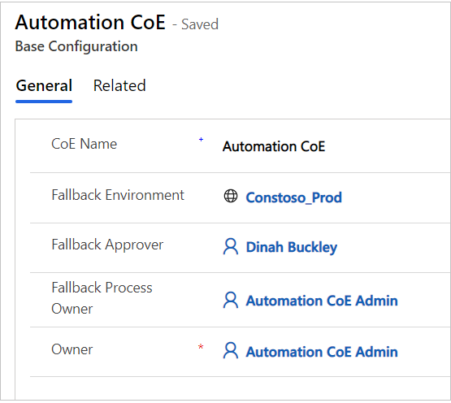
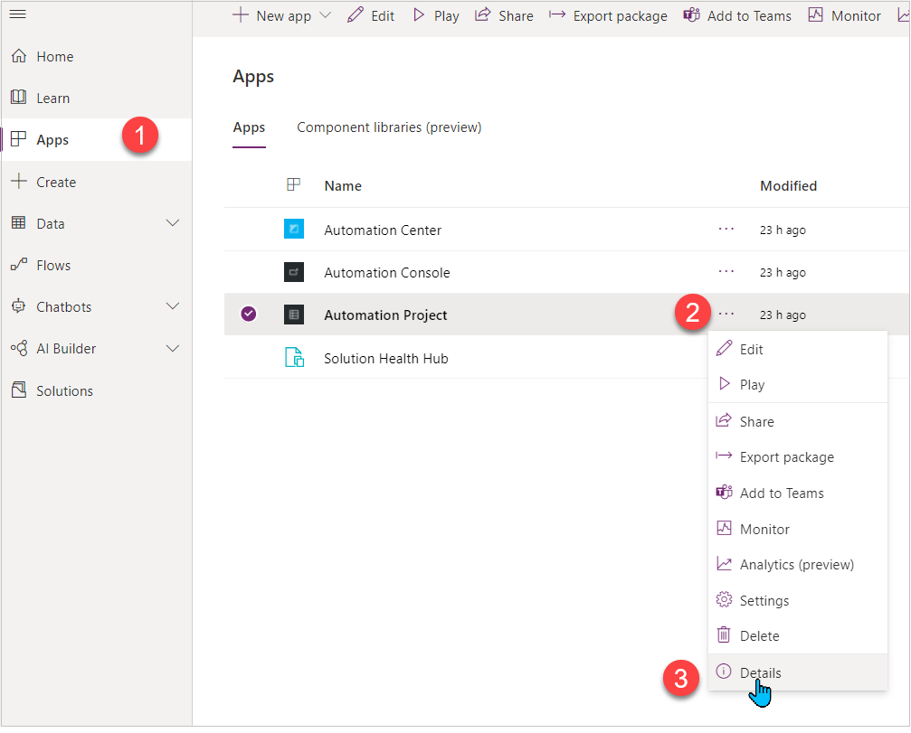
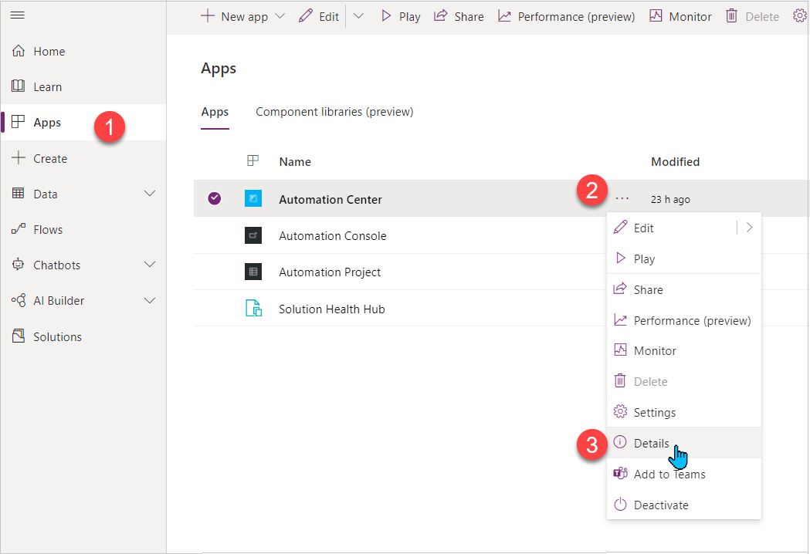

# Configure Automation Kit

## Define configuration data for the Automation Kit

Use the Automation Kit admin account, go to the main environment, and then open the automation center app. The **Automation Center** is where we configure how several aspects of how the Automation Kit functions.

There are a few things you need to configure when you first import the kit.

First, add an automation goal. Follow these steps to add an automation goal.

1. Sign in with your Automation CoE Admin account, and then go to the main environment.
1. Open the **Automation Center** app.

   You'll use the automation center app to configure how the Automation Kit operates.

1. Inside the Automation Center, select the **Corporate Goals** tab.
1. Select **New**.
1. Fill in the required fields. The following table presents some sample data as a guide.

    | **Field**                | **Value**                       |
    |--------------------------|---------------------------------|
    | Goal Name                | Cost Savings through Automation |
    | Period From              | 11/1/2021                       |
    | Period To                | 11/1/2022                       |
    | Target Efficiency Gain % | 20                              |
    | Target Total Savings     | 50000                           |

1. Select **Save & Close**.

Next, we'll make further configurations. This configuration is split into the following three sections:

1. [General](#steps-to-configure-general) - Configuration that's related to resources and processes.
2. [ROI calculation](#steps-to-configure-roi-calculation) - Configuration that's used as a scoring metric to better determine the estimated ROI and complexity of an automation project.
3. [Console configuration](#configuration---console) - Information that pertains to the Automation Kit apps. This configuration is used to build a console where users can launch the related apps.

### Steps to configure general

Select **"Automation Center"** in the bottom navigation bar, and then switch to **"Setup"**.

#### Environments

1. Select a **Satellite Environment** on the **Environment** tab.
2. Change **Is Satellite Environment** to **Yes**.
3. Select **Save & Close**.
4. Repeat the previous three steps for all of your **Satellite environments** (DEV, TEST, PROD, and so on).

   

#### Departments

1. On the **Department** tab, select **New**.
1. Create as many departments as your organization needs. Here's a sample of the departments that an organization may need.

   - Accounting
   - Enterprise Integration
   - Finance
   - Human Resources
   - Information Technology
   - Logistics
   - Operational Change Management
   - Purchasing

#### Process categories

1. On the **Process Categories** tab select **New**.
1. Create top level categories that will have child categories (subcategories). Here is a sample names of the categories that an organization may need.

   - Artificial Intelligence
   - Claims
   - Invoicing
   - Legacy System

#### Process subcategories

Define the subcategories that relate in some way.

1. Select **New Process Sub Category** and define the subcategories as your organization needs. Here are some samples you can use as a guide.

1. Artificial Intelligence

   - Forms Processing
   - Forms Validation

1. Claims

   - Return
   - Warranty

1. Invoicing

   - Internal
   - External
   - Other

1. Legacy System

   - Complex
   - No API
   - Other

#### Roles (app roles)

These roles don't give access to anything. They're used as lookups for the fallback record, if needed.

1. Create the **Automation CoE Admin** account as the **CoE Owner**.

    | **Field**           | **Value**                          |
    |---------------------|------------------------------------|
    | Display Name        | Anything (Auto CoE Owner)          |
    | Type                | **CoE Owner**                      |
    | User Principal Name | The email address for the user     |

1. Create **CoE Admins** - At least one **CoE Admin** must be initialized to configure the **fallback**.

    | **Field**           | **Value**                 |
    |---------------------|---------------------------|
    | Display Name        | Anything (Auto CoE Admin) |
    | Type                | **CoE Admin**             |
    | User Principal Name | The email of the user     |

1. Create **developer** role – This role is optional and is used to sync maker information back to main.

    | **Field**           | **Value**                 |
    |---------------------|---------------------------|
    | Display Name        | Anything (Miles Gibbs - Dev) |
    | Type                | **Developer**             |
    | User Principal Name | The email of the user     |

#### Base configuration - fallback

This table should only have one record defined. This record is used if any of the values that are needed to complete processing is null or not defined.

1. Define one fallback record. Use the following screenshot as a guide for your fallback record.

   

## Steps to configure ROI calculation

Inside the **Setup** page, you can find the ROI calculation configuration. These tables are used to calculate the complexity of each **Automation Project** (scores). Some values are also used for estimated ROI and savings.

### Processing frequency scores

The following table displays a value and score for each record. You must use these values. You can modify the scores.

| **Value** | **Score** |
|-----------|-----------|
| Daily     | 12        |
| Hourly    | 18        |
| Monthly   | 3         |
| Quarterly | 1         |
| Weekly    | 5         |

### Average automation steps scores

The following table contains some examples, and it's fully customizable based on your organization's needs and processes. The table is used to get the score for the average automation steps which the user inputs when they request a new automation project. You can modify this table per your needs.

| **Range**     | **Value From** | **Value To** | **Score** |
|---------------|----------------|--------------|-----------|
| \>= 1, \< 5   | 1              | 5            | 1         |
| \>= 250       | 250            | 999999999    | 10        |
| \>= 5, \< 250 | 5              | 250          | 5         |

### Processing peaks scores

This table has a value and score for each record. Here are the values that should be used. You can modify the scores to suit your needs.

| **Value** | **Score** |
|-----------|-----------|
| daily     | 15        |
| hourly    | 20        |
| monthly   | 5         |
| quarterly | 2         |
| weekly    | 10        |

## Configuration - console

The automation console app and the project approval automation use these tables.

| **Name**           | **App description**                                           | **AppID / App Link**                                        |
|--------------------|---------------------------------------------------------------|-------------------------------------------------------------|
| Automation Project | Create and manage your automation projects                    | [Follow these steps.](#how-to-get-canvas-app-urlid)       |
| Automation Center  | Manage and configure all aspects of your automation resources | [Follow these steps.](#how-to-get-model-driven-app-urlid) |

### How to get canvas app URL/ID

Sign in to the [maker portal](https://make.powerapps.com/), and then perform the following steps:

1. Select the **Apps** tab on the left navigation bar.
1. Select the **...** (more commands) on the app.
1. Select **Details**.

   

1. Copy the AppID.
1. Copy the web link.

### How to get model driven app URL/ID

Sign in to the [maker portal](https://make.powerapps.com/), and then perform the following steps:

1. Select **Apps** tab on the left navigation bar.
1. Select the **...** (more commands) on the app.
1. Select **Details**.

   

1. Select **Properties**.
1. Copy Unified Interface URL.

> [!IMPORTANT]
> You may need to switch to classic mode to see the properties pane.
