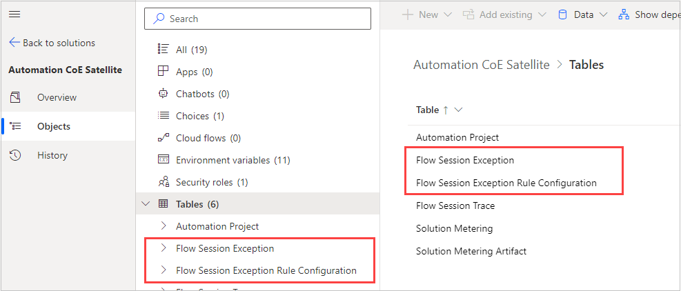
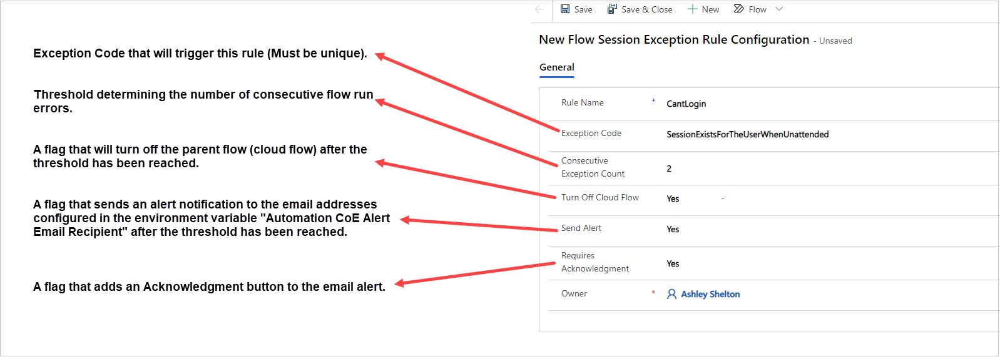
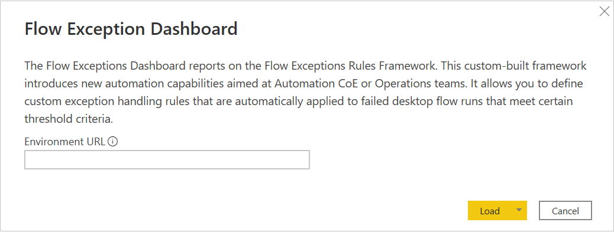

# Flow exception rules framework

The flow exception rules framework is the combination of components in the satellite solution.

This custom-built framework introduces new automation capabilities that are aimed at automation Center of Excellence (CoE) or operations teams. It allows you to define custom exception handling rules that are automatically applied to failed desktop flow runs that meet certain threshold criteria.

## Feature details

Desktop flow execution results together with their statuses are automatically stored in a Dataverse table named *process* (flowsession is the internal name) which allows us to build custom solutions that further process its data in automation. A common use case is to automatically turn off a parent cloud flow if its child desktop flow reports three consecutive errors, including the same error code such as *WindowsIdentityIncorrect* or *NoUnlockedActiveSessionForAttended*, etc.

### Components

These components are part of the [Automation Satellite solution](./setup-automation-kit.md#import-the-satellite-solution-into-the-satellite-environment)

Type|Name|Description
----|----|-----
Table|Flow Session Exception Rule Configuration|This table is used to define exception rules.
Table|Flow Session Exception|This table is used for flow exception logs and downstream analytics.
Cloud flow|Flow Session Exception Sync|This is the main processing flow that takes processing instructions from the rule configuration.
Security Role| Flow Session Exception Admin|Provides full CRUD permissions to the Flow Session Exception data captured in above’s tables.
Environment Variable|Automation CoE Alert Email Recipient|Defines the email address or distribution list where operational reports and alerts should be sent to.

## Configure flow exception rules framework

>[!IMPORTANT]
>These steps must be done with a user with the following roles.

- [Flow Session Exception Admin](./setup-automation-kit.md#assign-security-roles)
- Basic User
- Environment Maker

1. Sign into [Power Automate](https://flow.microsoft.com).
1. Go to your satellite environment.
1. Select the **Solutions** tab.
1. Find, and then select **Automation CoE Satellite.**
1. Select **Tables**, and then find these tables.

    - Flow Session Exception Rule Configuration
    - Flow Session Exception

>[!NOTE]
>If you don't see the tables mentioned in the previous step, confirm that you have the [roles mentioned](#flow-exception-rules-framework).

1. Select the **Flow Exception Rule Configuration** table.
1. Select the **Data** tab.
1. Select **Add record**.

1. Here is an example configuration rule. If you want to monitor multiple error codes, you must create a record for each error code that you want to monitor.

   

    This table contains the field names and the corresponding values.

    | **Field**                   | **Value**                             |
    |-----------------------------|---------------------------------------|
    | Rule Name                   | CantLogin                             |
    | Exception Code              | SessionExistsForTheUserWhenUnattended |
    | Consecutive Exception Count | 2                                     |
    | Turn Off Cloud Flow         | Yes                                   |
    | Send Alert                  | Yes                                   |
    | Requires Acknowledgment     | Yes                                   |

## Flow exceptions dashboard

To visualize and report on the flow exceptions configured, the flow exceptions dashboard can be utilized.

When you launch the Power BI template, enter the URL for the environment you wish to report on:

>[!NOTE]
>The URL must be entered in the following format: `[organization].crm[N].dynamics.com`. For example, **contosttest.crm.dynamics.com**

The **Flow Exceptions** tab allows you to filter by date, exception rule, cloud flow name, desktop flow name, or host name.

Here is a summary of the information provided in this tab.

**Status Overall –** Overall count and percentage of failed vs. successful flows for the environment.

**Total Exceptions by Rule –** Displays the total number of flow runs, categorized by each exception rule setup through the flow exceptions framework.

**Failure Rate by Type –** Displays the total number of errors for the environment across all flows, the number of successful runs, and the percent of frequency for each error compared to all other errors.

**Exceptions by Month –** Displays the total number of exceptions triggered for each rule according to the flow exception framework, categorized by month.

**Flow Exception Detail –** Displays the detailed information for the flow exceptions.

The **Flow Exceptions (Tree)** tab allows you to filter by date, exception rule, cloud flow name, desktop flow name, or host name.

Here is a summary of the information provided in this tab.

**Flow Exceptions Tree Diagram –** Displays and allows you to drill into specific flows organized into the following categories: cloud flow name, desktop flow name, error code, error message, run mode, or host name.

**Flow Exception Detail –** Provides detailed information on the flow exceptions.
