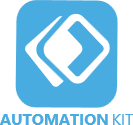
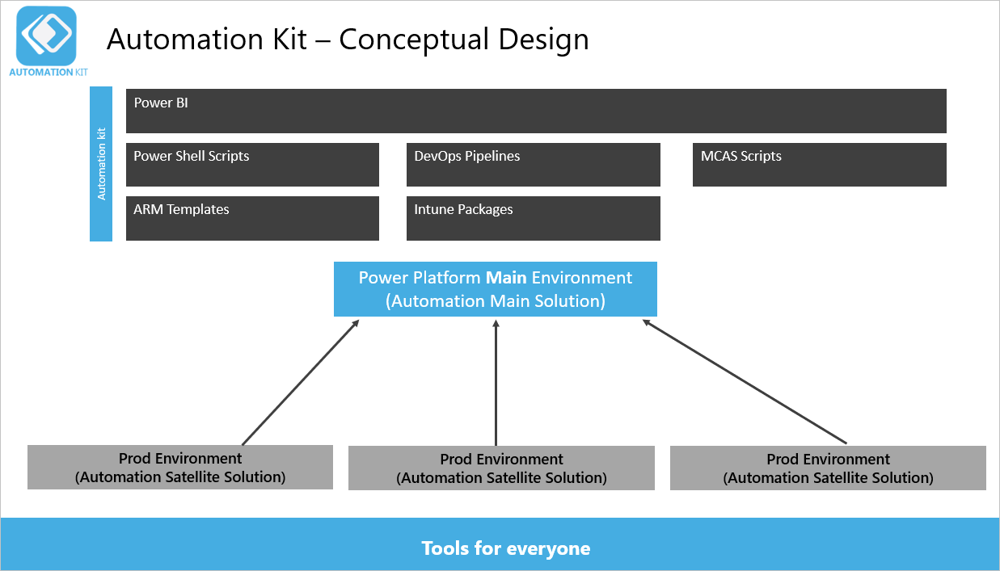
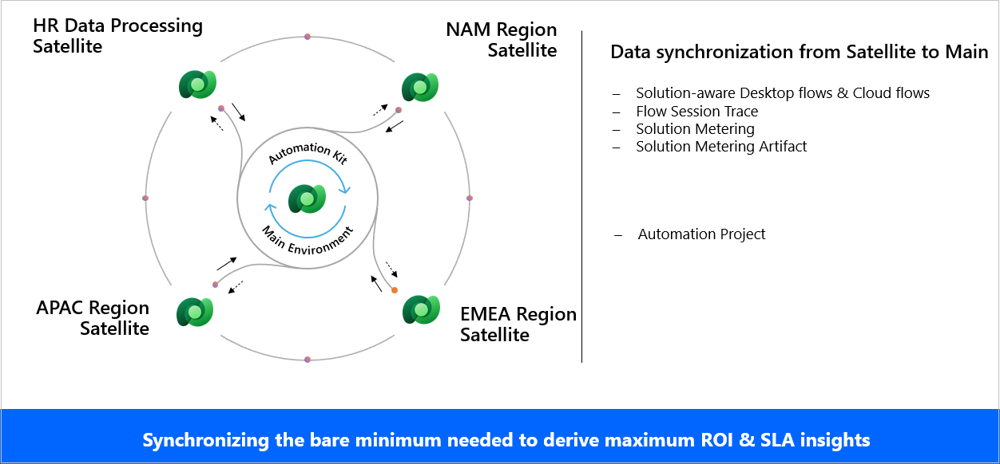

# Overview of the Automation Kit

The Automation Kit is set of tools that accelerates the use and support of Power Automate for desktop for automation projects. The kit provides tools that help you manage automation projects and monitor them to estimate money saved and return on investment (ROI).

The Automation Kit applies the [HEAT (Holistic Enterprise Automation Techniques)](/power-platform/guidance/automation-coe/heat) to support your organization.

The kit is especially useful to an Automation Center of Excellence (CoE) team, which is a team of experts who support automation within your organization. They have good knowledge about Power Automate for desktop, set up and maintain the Automation Kit, and maintain the configuration data such as departments, process categories, goals, and more.

The goal of the Automation Kit is to enable organizations to manage, govern, and scale automation platform adoption based on best practices. The Automation Kit provides the following items in support of your Automation Center of Excellence.

- **Near-real time ROI / SLA**: Short and long-term analytics to drive towards your business goals.
- **Tools for all users**: These tools are for makers (citizen and pro developers), your Automation CoE team, and executive sponsors.
- **End-to-end automation lifecycle**: These tools help to automate and manage all aspects of hyperautomation scenarios, including ALM and templates to drive consistency.
- **Enterprise readiness**: Helps to secure, govern, audit, and monitor your automation deployment.

## Automation Kit components

The Automation Kit supports an automation CoE with the following components:

1. **Automation Project**: This project is a canvas app that supports requesting automation projects and submitting them for approval.
1. **Automation Center**: This is a model-driven app that organizations can use to create and maintain automation assets, such as master data records, map resources and environments, and assign roles to employees.
1. **Automation Solution Manager**: This is a canvas app in satellite environments that enables the metering of solutions and their artifacts.
1. **Cloud flows**: These cloud flows use Dataverse tables to sync data from satellite environments, in near real time, to the main environment.
1. A Power BI dashboard that provides insights and monitors your automation assets.

These two solutions contain the components in the kit.

- The main solution, which you deploy to the main environment.
- The satellite solution, which you deploy in each satellite environment.

Use satellite environments to develop and test your automation projects before you deploy them to production. The production satellite monitors and meters the solutions and solution artifacts for an automation project.

The data from the metered solutions syncs to the main environment in near real time for monitoring on a dashboard.

## Conceptual design

The Automation Kit has the following conceptual design components.

The key element of the solution is the Power Platform main environment.

There are usually several satellite production environments that run your automation projects. Depending on your environment strategy, these could also be development or test environments.

Between these environments there is a near-real-time synchronization process that includes cloud or desktop flow telemetry, machine and machine group usage, and audit logs. The Power BI dashboard for the Automation Kit displays this information.

## Near real-time data synchronization

The synchronization processes the minimum data that's required to calculate the ROI and SLA. It doesn't create a complete inventory of all low code assets.

The components in satellite environments could be organized by geography or capability. The cloud flows in these environments push information about metered cloud and desktop flows in near real-time to the automation main environment.
