# Setup automation kit

## Setup Checklist

This is a checklist for initially setting up the automation kit. **Use this checklist with the below docs.**

### Prerequisites

- Admin account with a premium license. <!--todo: link to the prem licenses-->
- An environment named **main**, for example, "orgname_Main"). <!--todo: this isn't clear, should the env be called "main" or must it have "main" in the name-->
- Configured Azure Key Vault.

### Import the main solution

- Import **AutomationCoEMain_x_x_x_x_managed** into your **main** environment.
- Provision the approvals solution (optional). <!--todo: what are the steps to do this?-->
- Confirm all flows in the solution are turned on.
- Assign security roles. <!--todo: assign these roles to whom?-->
- Share the apps with appropriate users. <!--todo: who are the "appropriate users--> 

### Import the satellite solution

- Create Azure AD app registration (Dataverse API) for each satellite.
- Define satellite environments (new or existing).
- Create application users in all satellite environments.
- Import AutomationCoESatellite_x_x_x_x_managed.
- Configure environment variables.
- Confirm all flows in the solution are enabled.
- Share the app with appropriate users. <!--todo: who are the "appropriate users--> 

### Define configuration data

<!--todo: this section is vague-->
- General data configured; ROI data configured; Console data configured
- Flow Exception Rules Framework

## Setup main

>[!IMPORTANT]
>Perform all steps with the **Auto CoE Admin** account that's mentioned in the prerequisites.

### Import the main solution into the main environment

1. Create an environment in which to set up the CoE.
    1. Go to the [Power Platform admin center](https://admin.powerplatform.microsoft.com/).
    2. Select Environments > + New, and then enter a name, type, and purpose.
    3. Select **Yes** to create the database, and then select **Next**.
    4. Keep sample apps and data set to **No**.
    5. Select **Save**.
1. Go to your new environment.
    1. Go to [flow.microsoft.com](https://flow.microsoft.com/).
    2. Go to the environment you just created in which the main solution will be imported. For this example, we're importing to the environment named **Contoso_Main**.


1. On the left pane, select **Solutions**.
1. Select **Import**, and then **Browse**.
1. Select the Automation CoE main solution (**AutomationCoEMain_x_x_x_x_managed.zip**).
1. After the compressed (.zip) file loads, select **Next**.
1. Review the information, and then select **Next**.
1. Establish connections to activate your solution. If you create a new connection, you must select **Refresh**. You won't lose your import progress.
1. Select **Import**.

   The import process can take 10-20 minutes to complete.

1. After importation completes, verify that all the flows are **turned on** and share the apps with the appropriate users.

### Provision the approvals solution (optional)

This step is optional. The only reason for doing this step is to speed up the setup process.

In new environments, Power Automate approvals isn't configured by default. After Power Automate initiates an approval, the approvals solution gets created.

This process usually takes 5-10 minutes. So, we can easily do this step while the main solution is being imported.

1. Go to [flow.microsoft.com](https://flow.microsoft.com/).

   This is where the main solution is being imported.

1. Select the **My flows** tab on the left > **New flow** > **Instant cloud flow**.
1. Under the button trigger, add the **Start and wait for approval** action to the flow.
1. Fill in your details to trigger the flow.

   Here is an example of how you can configure the **Start and wait for approval** action.

   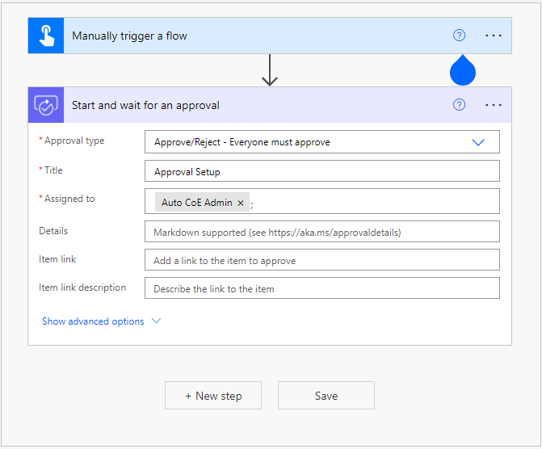

   [Learn more about Approvals Provisioning](https://support.microsoft.com/topic/power-automate-approvals-provisioning-overview-and-troubleshooting-2306313a-49fa-efde-c716-a34c573ec942).

### Assign security roles

Once the importation completes, assign security roles to members of the organization. The main solution comes with three security roles.

Review roles and assign roles based on responsibility.

- **Automation Project Admin** - Maintains the configuration data in the Automation CoE and maps automation projects to environments.
- **Automation Project Contributor** - Generates or requests new automation projects.
- **Automation Project Viewer** - The business process owner who approves or rejects automation project requests.

1. Go to the [Power Platform admin center](https://admin.powerplatform.microsoft.com/).
1. Select your main environment.
1. Select **See all** under **Security roles** on the **Access** card.
1. Select the security role, and then add members to the security role.

### Sync environments

1. The main solution has a cloud flow called **Sync Environments**. Select this flow, and then trigger it if it hasn’t run.

1. Wait for the run to complete.

### Import the desktop flow actions csv

Next, we want to import all the desktop flow actions from the csv file into the **Desktop Flow Action** table.

This must be done for all environments to which the Automation kit is installed, such as main and all satellites.

1. Open a browser, navigate to [Power Automate](https://flow.microsoft.com) and sign-in with your account.
1. Navigate to your environment where the solution is installed.
1. Select Solutions tab.
1. Find and select Automation CoE Main solution.
1. Select the table, Desktop Flow Action.
1. Click the Import dropdown near the top.
1. Select Import data from Excel.
1. After the popup opens, select the **Upload** button, and then upload the included Excel file (autocoe_desktopflowactions.csv).
1. Wait for the **mapping status** to show as successful.
1. Select **Import**.
1. After the import completes, verify that the data was imported.

## Setup satellites

### Create an Azure AD app registration to connect to Dataverse Web API

Use the following steps to create an app registration that will be used by flows in the satellite environment.

1. Sign in to [Azure](https://portal.azure.com/).
1. Go to **Azure Active Directory** > **App registrations**.
1. Select **New Registration**.
1. Enter a name (for example, Automation CoE Dataverse API), leave everything else, and the select **Register**.
1. In the **Overview tab**, select **Add an Application Id URI**.
1. Select **Set**, leave the default, and then select **Save**.

### Add a new client secret

1. Select **Certificates & secrets.**
1. Select **New client secret.**
1. Enter description (for example, Auto CoE Dataverse), and then select appropriate expiry value.
1. Select **Add**.
1. Copy down the secret value that's generated.

   This secret will be added to **Azure Key Vault** in a later step.

1. Go back to the **Overview** tab and then copy down the following information.

    - Application (client) ID
    - Directory (tenant) ID

1. Next go to your Azure Key Vault, this is where we will store the values so that Power Automate can use them to call the Dataverse Web API.

### Create secrets for the client Id and tenant Id you copied earlier

1. Inside the **Secrets** tab, select **Generate/Import**.
1. Use a descriptive name for each secret. Here are a few examples.

    - KVS-AutomationCoE-ClientID
    - KVS-AutomationCoE-TenantID
    - KVS-AutomationCoE-Secret

### Create a new environment or use an existing environment for your satellite

Microsoft recommends that you have the satellite solution imported inside your production environment. Follow the [steps to import the main solution](#import-the-main-solution-into-the-main-environment) if you create a new environment.

#### Create application user inside Dataverse (Per satellite Env)

1. Go to the [Power Platform admin center](https://admin.powerplatform.microsoft.com/).
1. Select the satellite environment, and then select **Settings**.
1. Select Users + permissions > Application Users > New app user.
1. Select **Add an app**.

1. Select the app registration that was created in previous steps.
    >[!TIP]
    >Verify the AppID if you're unsure.

1. Select a business unit.
1. Add the **System Administrator** security role.
1. Select **Create**.

   Your application user displays after it's created.

   

### Import the satellite solution into the satellite environment

1. Sign into [Power Automate](https://flow.microsoft.com).
1. Select your designated environment for the satellite solution.

   For this example, we're importing to the environment named **Contoso_Prod.**

1. On the left pane, select **Solutions**.
1. Select **Import**, and then **Browse**.
1. Select the Automation CoE satellite solution (**AutomationCoESatellite_x_x_x_x_managed.zip**).
1. When the compressed (.zip) file loads, select **Next**.
1. Review the information, and then select **Next**.
1. Establish connections to activate your solution. If you create a new connection, you must select **Refresh**. You won't lose your import progress.

### Configure environment variables

1. To get the information for the environment variables, open a new tab.
2. Navigate to the satellite environment from the [maker portal](https://make.powerapps.com).
3. Select the **Settings** in the top right nav bar > **Session details Developer resources**.

Next, we need to get the **URL path** for our **Azure Key Vault secrets**.

The Azure Key Vault secrets are using the new environment variable type. These environment variables need to be in the following format.
  
   ```azurecli
   /subscriptions/{Subscription ID}/resourceGroups/{Resource Group Name}/providers/Microsoft.KeyVault/vaults/{Key Vault Name}/secrets/{Secret Name}
   ```

Follow these steps to get the format.

1. Go to [Azure Portal](https://portal.azure.com/#home), navigate to your Key Vault with the secrets for your [App Registration](#create-an-azure-ad-app-registration-to-connect-to-dataverse-web-api).
1. Select the **Secrets** tab.
1. Copy the **URL**.
1. Paste the URL into notepad.
1. Remove everything from **https://** to **/resource**.

   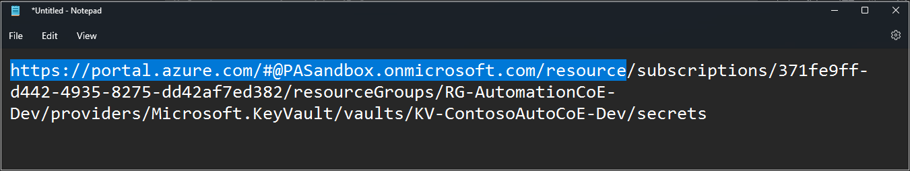

1. At the end of the URL, add **/{SecretName}**. Replace **{secretname}** with your **secret name**.

   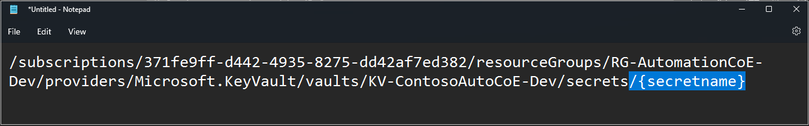

1. Do this for all three Azure Key Vault secrets (Client ID, Client Secret, Tenant ID).

    See the example in the screenshot. These reference strings are needed for three environment variables.

   

   Use this information for the environment variables.

|  | **Environment variable name**         | **Description**                                                                                                                                                                                                                                                                                 |  |
|--|---------------------------------------|-------------------------------------------------------------------------------------------------------------------------------------------------------------------------------------------------------------------------------------------------------------------------------------------------|--|
|  | AKV Client Id Secret                  | Azure Key Vault secret for client Id (application Id) from app registration: /subscriptions/{Subscription ID}/resourceGroups/{Resource Group Name}/providers/Microsoft.KeyVault/vaults/{Key Vault Name}/secrets/{Secret Name}                                                                   |  |
|  | AKV Client Secret Secret              | Azure Key Vault secret for secret from app Registration                                                                                                                                                                                                                                         |  |
|  | AKV Tenant Id Secret                  | Azure Key Vault secret for Tenant Id from app Registration                                                                                                                                                                                                                                      |  |
|  | Automation CoE Alert Email Recipient  | The email address where operational reports and alerts should be sent to, for this environment. **(**[See Exception Framework](#flow-exception-rules-framework)**)**                                                                                                                            |  |
|  | Automation Project app Id             | Enter the **Automation Project** app Id of the Power Apps that is deployed with the main solution (main environment)                                                                                                                                                                            |  |
|  | Desktop Flows Base URL                | Open a new tab > Navigate to [Power Automate](https://flow.microsoft.com/) . Select the environment where you’re installing the solution.                                                                                                                                                       |  |
|  | Environment Id                        | Use **Session details** to find this value from current environment that you are importing into (satellite)                                                                                                                                                                                     |  |
|  | Environment Name                      | Display name of the current environment (satellite)                                                                                                                                                                                                                                             |  |
|  | Environment Region                    | Region of the satellite. Can be found in the Power Platform admin center                                                                                                                                                                                                                        |  |
|  | Environment Unique Name               | Use **Session details** to find this value from the current environment that you are importing into (**satellite**) Also must add **.crm** to the end of the string. Example: unq08ed139e532b4edc8f38851fd1bb3279.crm. Please note that the extension 'crm', 'crm[x]' etc. is region dependent. |  |
|  |                                       | [See Datacenter regions](/power-platform/admin/new-datacenter-regions)                                                                                                                                                                                                                          |  |
|  | \*Environment Unique Name of CoE Main | Use **Session details** to find this value **from Main**. Also must add **.crm** to the end of the string. For example: unq08ed139e532b4edc8f38851fd1bb3279.crm. Please note that the extension 'crm', 'crm[x]' etc. is region dependent.                                                       |  |
|  |                                       | [See Datacenter regions](/power-platform/admin/new-datacenter-regions)                                                                                                                                                                                                                          |  |
|  | Environment URL                       | Open a new tab > navigate to [Power Platform admin center](https://microsoft.sharepoint.com/teams/AutomationCOE/Shared%20Documents/General/Releases/PAD%20DLP%20Impact%20Analysis/Docs/aka.ms/ppac).                                                                                            |  |
|  | Flow Session Trace Record Owner Id    | This is the UserID (guid) from the Users table inside the satellite environment for the admin account. Select Tables under Data on the left > User > Data > Change view to **"All columns"** Find the **Auto CoE Admin** account and copy the value under **User**. Flow User Id (guid):        |  |
<!--below is part of the Desktop Flows Base URL steps-->
1. Select **My flows** tab.
1. Copy the web address up to …environments/
1. You can also get the **environment id** from this URL.

1. Select your environment.
1. Right click the environment URL.
1. Select **Copy link**.

<!--End-->

1. After you've configured all the environment variables, select **Import**.
1. After the importation completes, verify and turn on all the flows.
1. Share all apps with the appropriate users.

### Assign Security Roles

Once the import is complete, assign the following roles, based on responsibility.

- **Flow Session Exception Admin** – Admin role which provides full CRUD permissions to the flow session exception data captured in the tables below. <!--todo where are the tables (in main)-->

    - Flow Session Exception Rule Configuration
    - Flow Session Exception

- **Desktop Flow Definition Admin** – Role which provides full CRUD permissions to these tables.

    - Desktop Flow Action
    - Desktop Flow Definition
    - Desktop Flow DLP Impact Profile

1. Sign into the [Power Platform admin center](https://admin.powerplatform.microsoft.com/).
1. Select your main environment.
1. Select **See all** under **Security roles** on the **Access** card.

1. Select the Security role > **Search for and assign roles defined above.** <!--todo: ?-->

### Assign column security profiles

Inside the solution, there is a column security profile. This profile enables users to see the script field inside the **Desktop Flow Definition** table. This role should only be assigned to CoE Admins, due to the sensitive information that may be visible.

The script field is synced and stored inside the Desktop Flow Definition table by default. If you would like to **not** sync this information, follow the [Disabling Sync of Script field](#disable-syncing-of-desktop-flow-script-optional) steps. Otherwise, follow these steps to assign the security profile.

1. Select the column security profile, **Desktop Flow Script Field Security**.
1. Under **Members**, select **Users**.
1. Select **Add**.
1. Once the popup opens, search for the user to whom you want to assign this profile.
1. Select the checkbox for the user.
1. Select **Select**.

   The user should show in the **Selected records** list.

   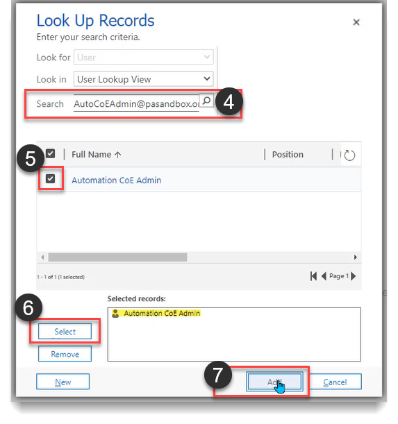

1. Select **Add**.

### Import the desktop flow actions csv (satellite)
<!--This section is the exact same as other heading-->
Follow these steps to import all the desktop flow actions from the included csv file into the **Desktop Flow Action** table.

1. Open a browser, navigate to [Power Automate](https://flow.microsoft.com) and sign-in with your account.
1. Navigate to your environment where the solution is installed.
1. Select Solutions tab.
1. Find and select Automation CoE satellite solution.
1. Select the table, Desktop Flow Action.
1. Click the Import dropdown near the top.
1. Select Import data from Excel.
1. After the popup opens, select the **Upload** button, and then upload the included Excel file (autocoe_desktopflowactions.csv).
1. Wait for the **mapping status** to show as successful.
1. Select **Import**.
1. After the import completes, verify that the data was imported.

### Disable syncing of desktop flows script (Optional)

By default, the Desktop flows definition script is stored inside the Desktop Flow Definition table. This field could contain sensitive information.

>[!WARNING]
>System Administrators and higher can view the definition tables and fields by default.

Follow these steps in the environment in that contains the solution to disable sync.

1. Select the **Solutions** tab.
1. Select the Default Solution and click Environment Variables. <!--todo: am not seeing this on my login-->
1. Find, and then select **Store Extracted Script**.

1. Under **Current value**, click **New value**.
1. Change to **No**.
1. Select **Save**.

>[!NOTE]
>You must stop and then start all flows in an environment after you make changes to environment variables for the flows to get the new environment variable values. [See Limitations](./coe-limitations.md).

>[!IMPORTANT]
>The script field isn't synced back to main due to security. You can extend the Automation CoE to configure your environment to sync data back to main, if needed.

## Setup the Automation CoE Power BI dashboard

To launch the Power BI dashboard for the Automation Center of Excellence, you will need the environment URL for your main environment (the environment where **Automation CoE Main** is located).

1. To obtain the environment URL, sign into the Power Platform admin center > Environments > select the environment, and then note the **Environment URL**.

   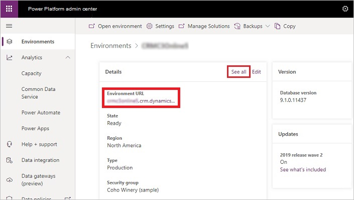

1. Launch the Power BI template and then enter the environment URL.

   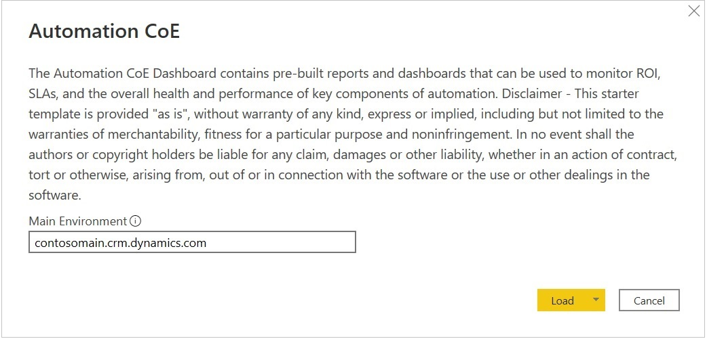

### Main dashboard

The main Power BI dashboard has the following sections.

1. **Home** - This screen provides an overview of key KPIs for the Automation CoE.

   

1. **Project Backlog** - Provides details of the ideas and projects submitted, status, and ranks based on estimated savings and complexity.

   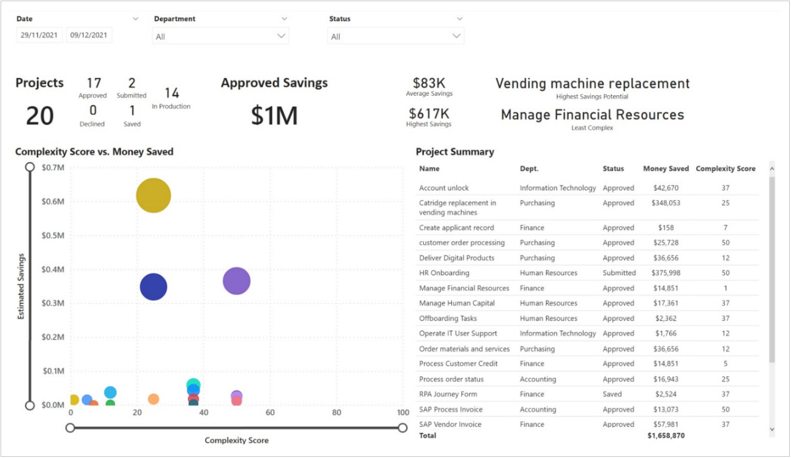

1. **Business KPI** - Displays business details for savings realized, efficiency, hours saved, and other business metrics.

   

1. **Goals** - Outlines savings and efficiency goals for the organization, and the status by department and project.

   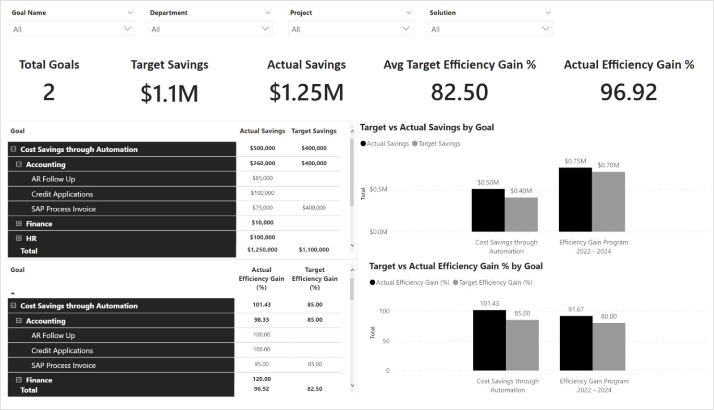

1. **ROI** - Overall ROI for the Projects implemented.

   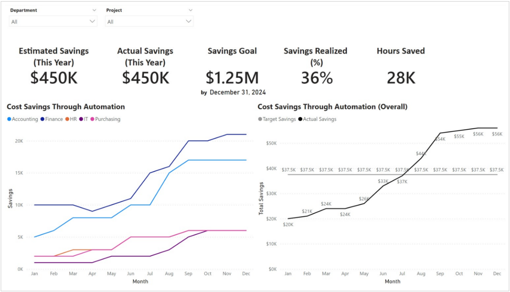

1. **ROI Financials** - Displays information regarding ROI *actual* vs *estimate* by year, quarter, and month.

   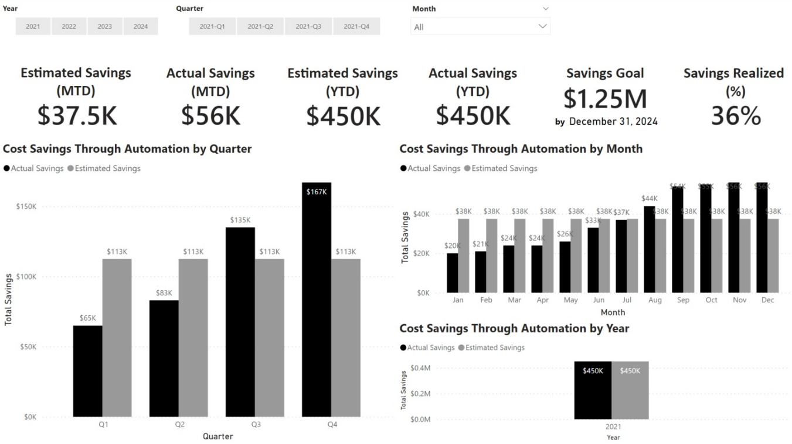

1. **Solutions** - Provides an overview of solutions in production, hours saved, error rates, and bot success KPIs.

   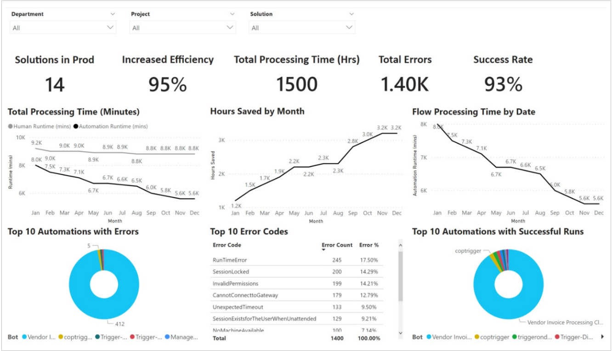

1. **Machines** - Displays detailed information on machine utilization and activity.

   

1. **Flow Overview** - Summarizes the number flows created, runs, status, and top 10 makers, machines, and flows.

   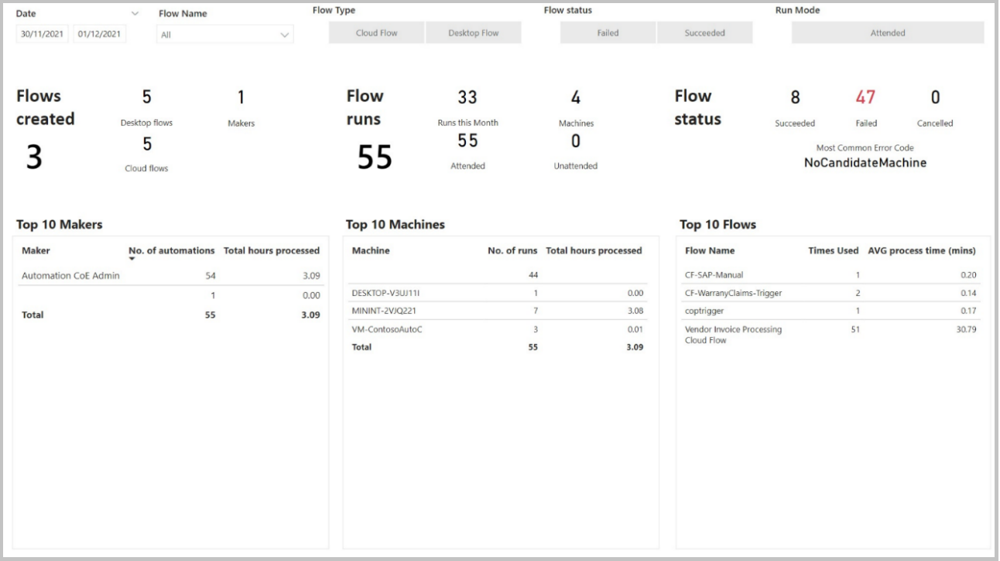

1. **Flow Run Detail** - Detailed information on flow runs, durations, status, run modes, hosts, and errors.

   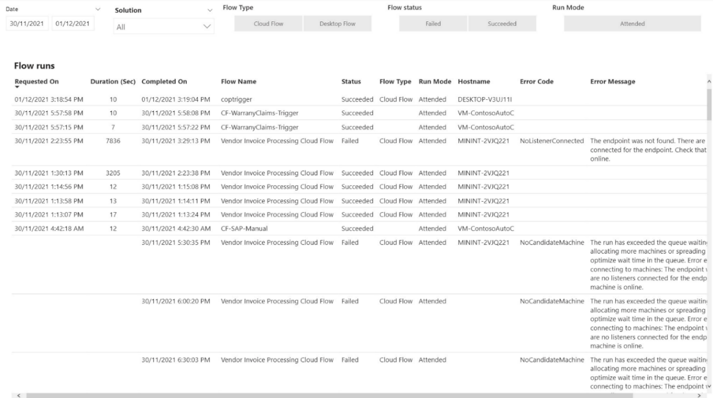

1. **Run Performance** - Shows a graphical display of run performance day over day.

   

1. **Control Chart** - Displays an overview of flow processing time averages and operational performance within control points.

   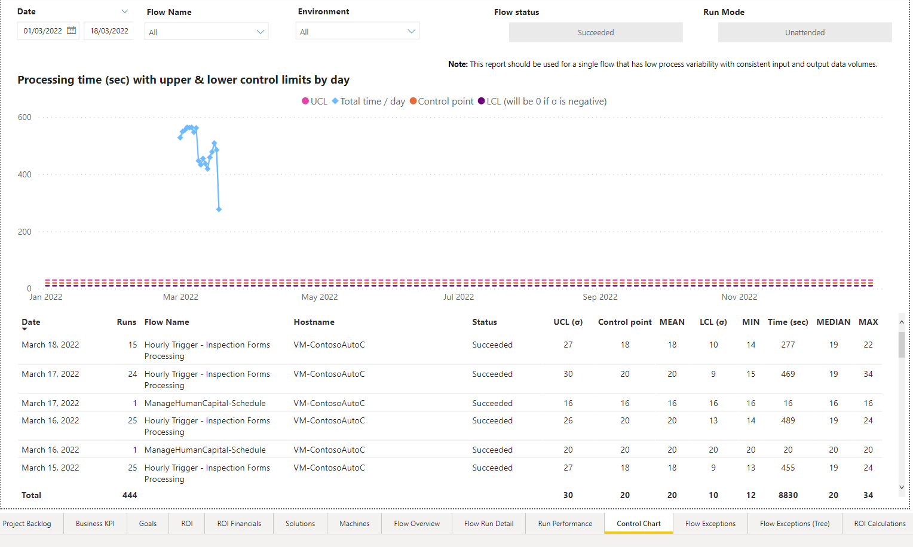

1. **Flow Exceptions** – Enables you to filter by date, exception rule, cloud flow name, desktop flow name, or host name.

   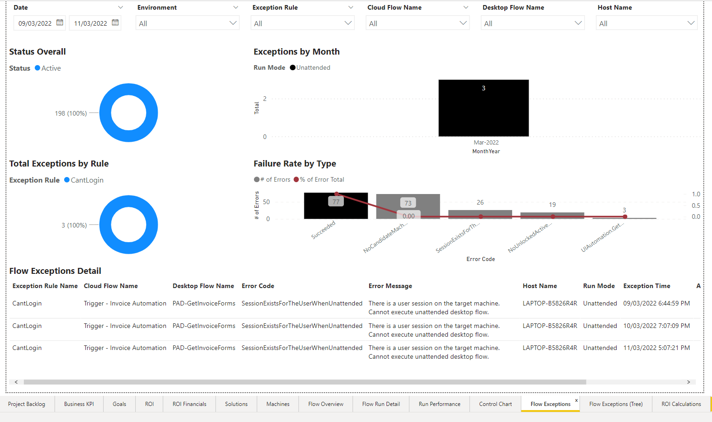

1. **Flow Exceptions Tree Diagram –** Displays and allows you to drill into specific flows organized by categories, including cloud flow name, desktop flow name, error code, error message, run mode, or host name.

   

1. **Action Usage Analysis** – Just like the Power App but with added filters and an email owner button. <!--todo: I am not following this-->

   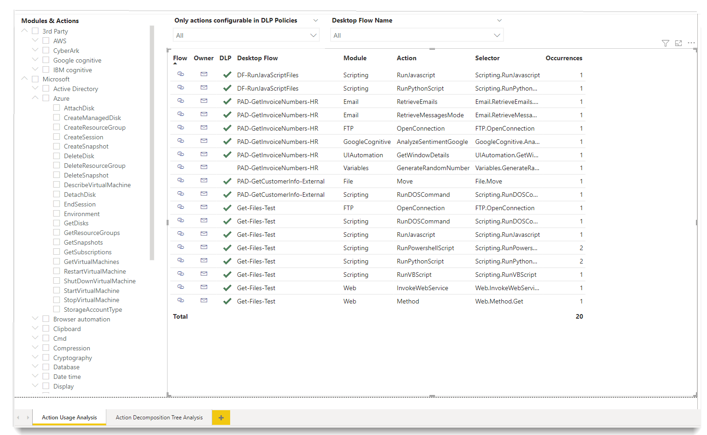

1. **Action Decomposition Tree Analysis** – Tree like diagram that shows how each action module or flow relates in a tree-like diagram.

   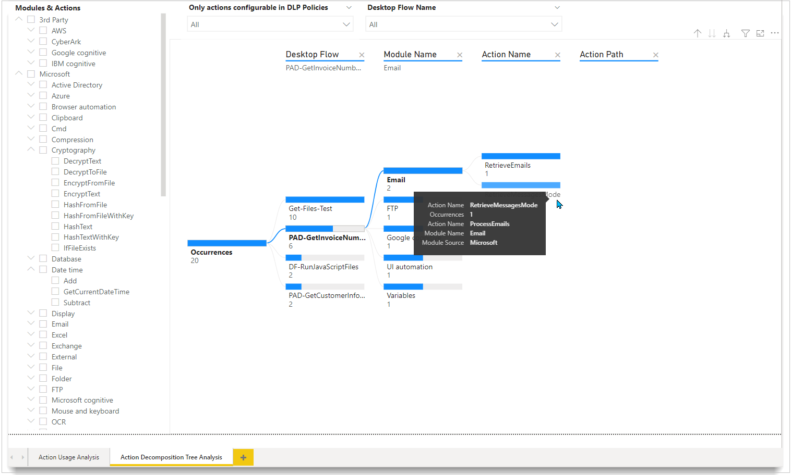

1. **ROI Calculations** - Contains examples on how calculations related to ROI and efficiency are determined throughout the dashboards.

   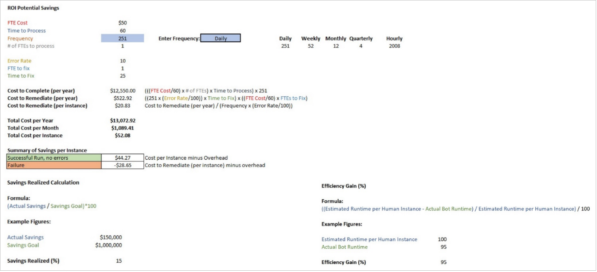

Every detail page consists of the following items.

- Filters (Department, Project, Solution).
- High-level statistics.
- Useful visuals.

### ROI calculations

Example data:

| **Cost element**       | **Input** |
|------------------------|-----------|
| FTE Cost               | $50/hr   |
| Time to Process (mins) | 60 mins   |
| Frequency              | Daily*   |
| # of FTEs to Process  | 1         |
| Error Rate (%)         | 10%       |
| # of FTEs to Fix      | 1         |
| Time to Fix (mins)     | 25        |
| Overhead               | 15%       |

Hourly = 2008, Daily = 251, Weekly = 52, Monthly = 12, Quarterly = 4
calculation Formula

**Total Cost per Year** = Cost to complete (per Year) + cost to remediate (per year)

**Cost to Complete (per Year):** ((((FTE Cost/60) x # of FTEs to process) x time to process (mins)) x frequency)

**Cost to Remediate (per Year):** (((Frequency x (Error Rate/100)) x Time to Fix (mins)) x FTE Cost/60) x # of FTEs to Fix))

**Full Formula:** ((((FTE Cost/60) x # of FTEs to Process) x Time to Process (mins)) x Frequency) + (((Frequency x (Error Rate/100)) x Time to Fix (mins)) x FTE Cost/60) x # of FTEs to Fix))

### ROI calculation example

#### Summary of cost calculations

| **Cost element**                 | **Calculation**                                                                                      |
|----------------------------------|------------------------------------------------------------------------------------------------------|
| Cost to Complete (per Year)      | \$12,550 (((FTE Cost/60) x # of FTEs to Process) x Time to Process) x Frequency                     |
| Cost to Remediate (per Year)     | \$522.92 ((Frequency x (Error Rate/100)) x Time to Fix (mins)) x ((FTE Cost/60) x # of FTEs to Fix) |
| Cost to Remediate (per Instance) | \$20.83 (Cost to Remediate (per Year) / (Frequency x (Error Rate/100))                               |
| Total Cost per Year              | \$13,072.92 (Cost to Complete (per Year) + Cost to Remediate (per Year)                              |
| Total Cost per Month             | \$1,089.41 (Cost to Complete per Year / 12)                                                          |
| Cost per Instance                | \$52.08 (Cost to Complete per Year / Frequency)                                                      |

#### Summary of savings per instance for bot

| **Run Detail**            | **Total Savings** | **Description**                                 |
|---------------------------|-------------------|-------------------------------------------------|
| Successful Run, no errors | \$44.27           | Cost per Instance minus Overhead %              |
| Failure                   | \-\$28.65         | Cost to Remediate per Instance minus Overhead % |

## Configure automation kit

### Define configuration data for the automation kit

<!--todo: "app" is vague here-->
Use the Automation CoE admin account, navigate to the main environment and open the automation center app.

The **Automation Center** is where we configure how several aspects of how the Automation CoE functions.
  
There are a few things you need to configure when you first import the kit.

First, add an automation goal. Follow these steps to add an automation goal.

1. Inside the Automation Center, select the **Corporate Goals** tab.
2. Select **New**.
3. Fill in the required fields. The following table presents some sample data for these fields.

    | **Field**                | **Value**                       |
    |--------------------------|---------------------------------|
    | Goal Name                | Cost savings through automation |
    | Period From              | 11/1/2021                       |
    | Period To                | 11/1/2022                       |
    | Target Efficiency Gain % | 20                              |
    | Target Total Savings     | 50000                           |

4. Select **Save & Close**.

Next, we will make further configurations. This configuration is split into the following three sections.

1. [General](#steps-to-configure-general) - Configuration that's related to resources and processes.
1. [ROI Calculation](#steps-to-configure-roi-calculation) - Configuration that's used as a scoring metric to better determine estimated ROI and the complexity of an automation project.
1. [Configuration](#configuration---console) - Information that pertains to the automation kit apps. This information is used to build a console from which users can launch related apps.

#### Steps to configure general

Select **"Automation Center"** in the bottom navigation bar > **Setup**.

##### Environments

1. On the environment tab select a satellite environment.
1. Change **Is Satellite Environment** to **Yes**.
1. Select **Save & Close.**
1. Do this for all your satellite environments, including dev, test, prod, etc.

   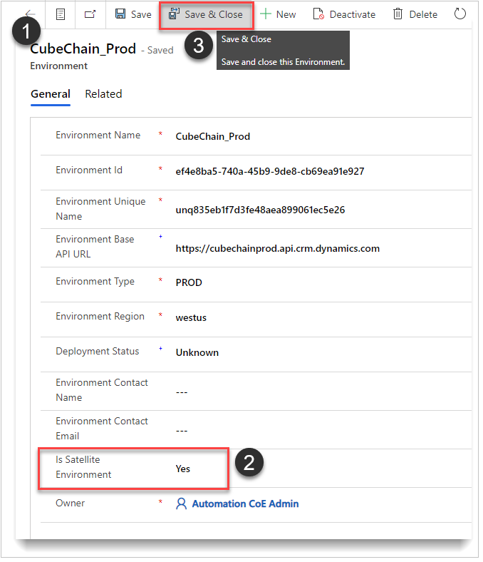

##### Departments

1. On the department tab, select **New**.
1. Create as many departments as your organization needs. Here is a sample of the departments that an organization may need.

- Accounting
- Enterprise Integration
- Finance
- Human Resources
- Information Technology
- Logistics
- Operational Change Management
- Purchasing

##### Process categories

1. On the process categories tab select **New**.
1. Create top level categories that will have subcategories. Here are sample names of subcategories that your organization may need.

- Artificial Intelligence
- Claims
- Invoicing
- Legacy System

##### Process subcategories

Either on the process subcategories tab or directly in a process category, define sub-processes that are related in some way.
<!--todo: this is not clear to me. Where is the sample data?-->
1. Select **New Process Sub Category**.
1. Sample data is below
1. Artificial Intelligence

    - Forms Processing
    - Forms Validation

1. Claims

    - Return
    - Warranty

1. Invoicing

    - Internal
    - External
    - Other

1. Legacy System

    - Complex
    - No API
    - Other

##### App roles

These roles do not give access to anything, they're used as lookups for the fallback record if needed.

1. Create the **Automation CoE Admin** account as the **CoE Owner**.

    | **Field**           | **Value**                 |
    |---------------------|---------------------------|
    | Display Name        | Anything (Auto CoE Owner) |
    | Type                | CoE Owner                 |
    | User Principal Name | The email of the user     |

1. Create **CoE Admins** - At least 1 **CoE Admin** must be initialized to configure the fallback.

    | **Field**           | **Value**                          |
    |---------------------|------------------------------------|
    | Display Name        | Anything (Auto CoE Admin)          |
    | Type                | CoE Admin                          |
    | User Principal Name | The email address for the user     |

##### Base configuration - fallback

This table should only have 1 record defined. This record is used if any of the values that are needed to complete processing is null or not defined.

1. Define on fallback record. Use the following screenshot as a guide for your fallback record.

   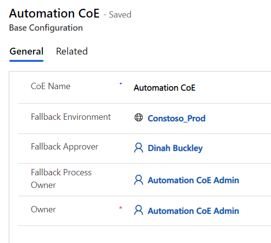

## Steps to configure ROI calculation

Still inside the **Setup** page you can find the ROI calculation configuration. These tables are used to calculate the complexity of each **Automation Project** (scores). Some values are also used for estimated ROI and savings.

### Processing frequency scores

The following table displays a value and score for each record. You must use these values. You can modify the scores.

| **Value** | **Score** |
|-----------|-----------|
| Daily     | 12        |
| Hourly    | 18        |
| Monthly   | 3         |
| Quarterly | 1         |
| Weekly    | 5         |

### Average automation steps scores

The following table contains some examples and it's fully customizable, based on your organization's needs and processes. The table is used to get the score for the average automation steps which the user inputs when they request a new automation project. You can or remove items from this table per your needs.

| **Range**     | **Value From** | **Value To** | **Score** |
|---------------|----------------|--------------|-----------|
| \>= 1, \< 5   | 1              | 5            | 1         |
| \>= 250       | 250            | 999999999    | 10        |
| \>= 5, \< 250 | 5              | 250          | 5         |

### Processing peaks scores

This table has a value and score for each record. Below are values that should be used, scores can be modified.

| **Value** | **Score** |
|-----------|-----------|
| daily     | 15        |
| hourly    | 20        |
| monthly   | 5         |
| quarterly | 2         |
| weekly    | 10        |

## Configuration - console

The automation console app and the project approval automation use these tables.

| **Name**           | **App description**                                           | **AppID / app link**                                        |
|--------------------|---------------------------------------------------------------|-------------------------------------------------------------|
| Automation Project | Create and manage your automation projects                    | [How to get canvas app URL/Id](#how-to-get-canvas-app-urlid)       |
| Automation Center  | Manage and configure all aspects of your automation resources | [How to get model driven app URL/ID)](#how-to-get-model-driven-app-urlid) |

### How to get canvas app URL/ID

Sign into the [maker portal](https://make.powerapps.com/), and then perform the following steps.

1. Select **Apps** tab on the left navigation.
1. Select ... (more commands) on the app.
1. Select **Details**.

   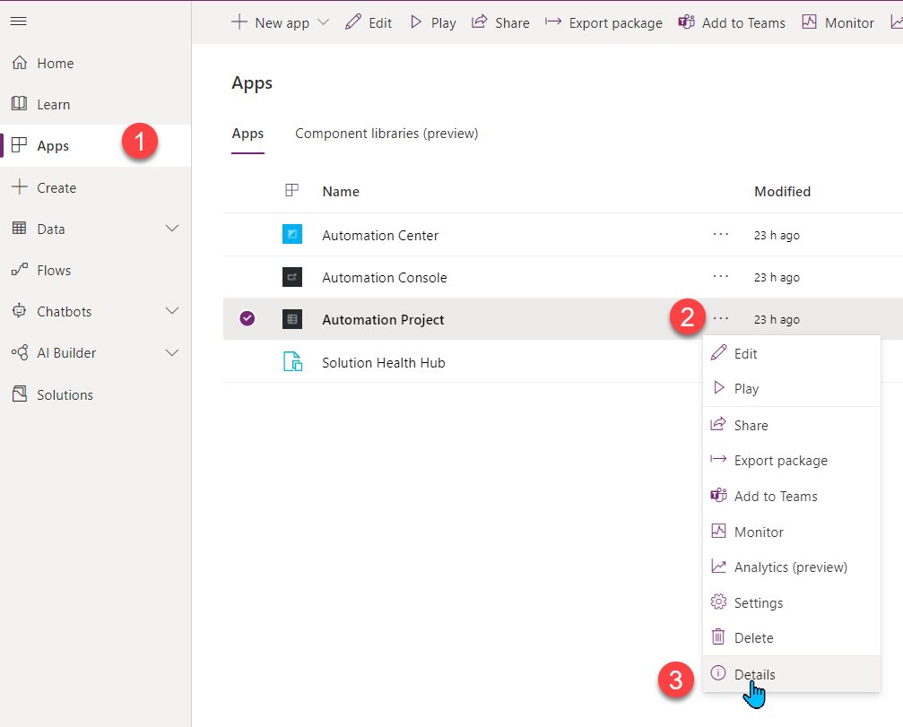

### How to get model driven app URL/ID

Sign into the [maker portal](https://make.powerapps.com/), and then perform the following steps.

1. Select the **Apps** tab on the left navigation.
1. Select ... (more commands) on the app.
1. Select **Details**.

   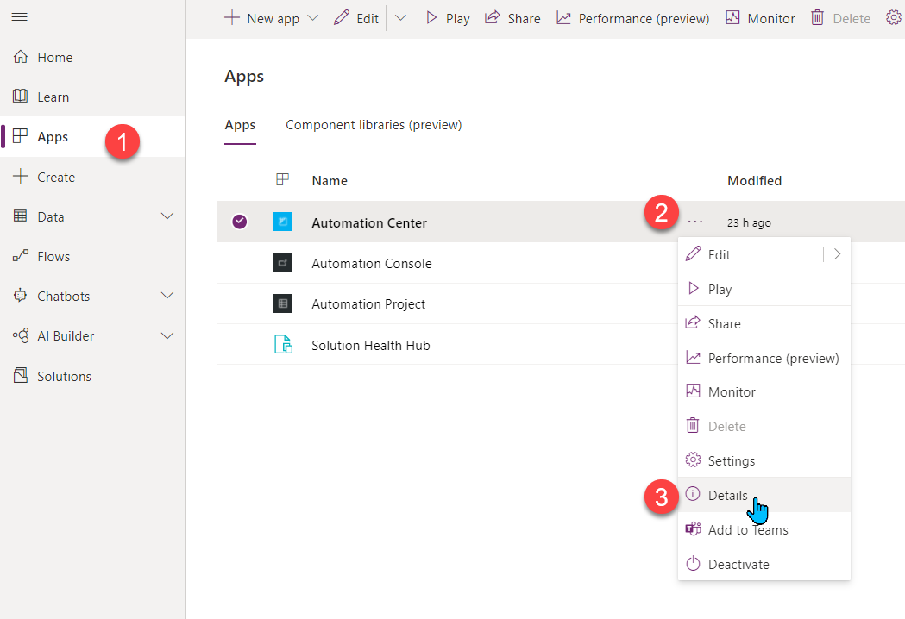
1. Copy the **AppID**.
1. Select the **Web Link**.

1. Select Properties.
1. Copy Unified Interface URL.

<!-- todo: -->

<!-- > [!div class="nextstepaction"]
> [Next step: Core components for Power Automate RPA SAP GUI automation](core-components.md) -->
