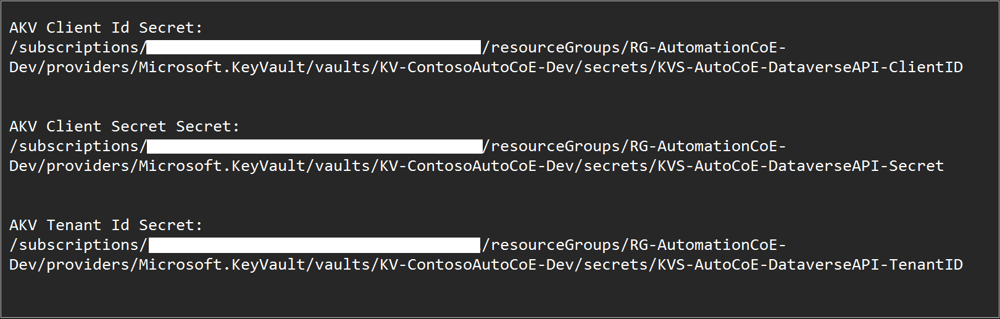

# Configure environment variables

1. To get the information for the environment variables, open a new tab.
2. Go to the satellite environment from the [maker portal](https://make.powerapps.com).
3. Select the **Settings** in the top right nav bar and select **Developer resources**. The information on this panel will be copied to the Key Vault secrets that follow.

Next, we need to get the **URL path** for our **Azure Key Vault secrets**.

The Azure Key Vault secrets are using the environment variable type. These environment variables need to be in the following format.
  
   ```azurecli
   /subscriptions/{Subscription ID}/resourceGroups/{Resource Group Name}/providers/Microsoft.KeyVault/vaults/{Key Vault Name}/secrets/{Secret Name}
   ```

Follow these steps to get the format:

1. Sign in to [Azure portal](https://portal.azure.com/home), and then open your Key Vault with the secrets for your app registration.
1. Select the **Secrets** tab.
1. Copy the **URL**.
1. Paste the URL into notepad.
1. Remove everything from **https://** to **/resource**.

   

1. At the end of the URL, add **/{SecretName}**. Replace **{secretname}** with your **secret name**.

1. Do this for all three Azure Key Vault secrets (Client ID, Client Secret, Tenant ID).

    Refer to the example in the screenshot. These reference strings are needed for three environment variables.

   

   Use this information for the environment variables.

| **Environment variable name**         | **Description**                                                                                                                                                                                                                                                                                 |
|---------------------------------------|-------------------------------------------------------------------------------------------------------------------------------------------------------------------------------------------------------------------------------------------------------------------------------------------------|
| AKV Client ID Secret                  | Azure Key Vault secret for client ID (application ID) from app registration: /subscriptions/{Subscription ID}/resourceGroups/{Resource Group Name}/providers/Microsoft.KeyVault/vaults/{Key Vault Name}/secrets/{Secret Name}                                                                   |
| AKV Client Secret Secret              | Azure Key Vault secret for secret from app Registration                                                                                                                                                                                                                                         |
| AKV Tenant ID Secret                  | Azure Key Vault secret for Tenant ID from app Registration                                                                                                                                                                                                                                      |
| Automation CoE Alert Email Recipient  | The email address where operational reports and alerts should be sent to, for this environment. ([See Flow exception rules framework](../exception-rules-framework.md#flow-exception-rules-framework))                                                                                                                            |
| Automation Project app ID             | Enter the **Automation Project** app Id of the Power Apps that is deployed with the main solution (main environment)                                                                                                                                                                            |
| Desktop Flows Base URL                | Follow the steps in [Desktop flows base url steps](#steps-to-get-the-desktop-flow-base-url)                                                                                                                     |
| Environment ID                        | Use **Session details** to find this value from current environment that you're importing into (satellite)                                                                                                                                                                                     |
| Environment Name                      | Display name of the current environment (satellite)                                                                                                                                                                                                                                             |
| Environment Region                    | Region of the satellite. Can be found in the Power Platform admin center                                                                                                                                                                                                                        |
| Environment Unique Name               | Use **Session details** to find this value from the current environment that you're importing into (**satellite**) Also must add **.crm** to the end of the string. Example: unq08ed139e532b4edc8f38851fd1bb3279.crm. Please note that the extension 'crm', 'crm[x]', and more. is region dependent. [See datacenter regions](/power-platform/admin/new-datacenter-regions)  |
| \*Environment Unique Name of CoE Main | Use **Session details** to find this value **from Main**. Also must add **.crm** to the end of the string. For example: unq08ed139e532b4edc8f38851fd1bb3279.crm. Please note that the extension 'crm', 'crm[x]', and more. is region dependent. [See datacenter regions](/power-platform/admin/new-datacenter-regions)                                                                                                                                                                                                                          |
| Environment URL                       | Open a new tab and then sign in to the [Power Platform admin center](https://aka.ms/ppac).                                                                                            |
| Flow Session Trace Record Owner Id    | This is the UserID (GUID) from the **Users** table inside the satellite environment for the admin account. Select **Tables** under **Data** on the left > **User** > **Data**. Change the view to **"All columns"**. Find the **Auto CoE Admin** account, and then copy the value under **User**. |

## Steps to get the desktop flow base url

1. Select the **My flows** tab.
1. Copy the web address up to '…environments/'.
1. You can also get the **environment ID** from this URL.
1. Select your environment.
1. Select the environment URL.
1. Select **Copy link**.

## Post environment variable setup steps

1. After you've configured all the environment variables, select **Import**.
1. After the importation completes, verify, and then turn on all the flows.
1. Share all apps with the administrators or administrator group of the satellite environment.
