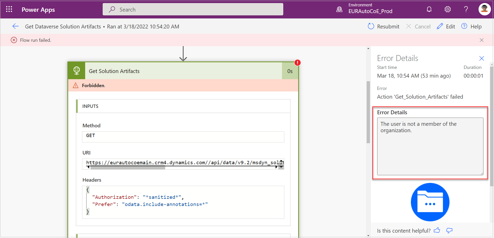

# Frequently asked questions about the automation kit setup guidance

This article provides answers to some of the most common questions about the Automation Kit.

## What are the datacenter region codes?

These values are crucial when configuring a satellite’s environment variables. Each region has a different URL. The following is a list of regions and their URLs.

| Region     |            URL           |
|------------|--------------------------|
| Region     | URL                      |
| NAM        | crm.dynamics.com         |
| DEU        | crm.microsoftdynamics.de |
| SAM        | crm2.dynamics.com        |
| CAN        | crm3.dynamics.com        |
| EUR        | crm4.dynamics.com        |
| FRA        | crm12.dynamics.com       |
| APJ        | crm5.dynamics.com        |
| OCE        | crm6.dynamics.com        |
| JPN        | crm7.dynamics.com        |
| IND        | crm8.dynamics.com        |
| GCC        | crm9.dynamics.com        |
| GCC High   | crm.microsoftdynamics.us |
| GBR        | crm11.dynamics.com       |
| ZAF        | crm14.dynamics.com       |
| UAE        | crm15.dynamics.com       |
| GER        | crm16.dynamics.com       |
| CHE        | crm17.dynamics.com       |
| CHN        | crm.dynamics.cn          |

For more information, go to [Datacenter regions](/power-platform/admin/new-datacenter-regions).

## How can the RPA CLI be used to extend the Automation Kit?

For more information about how to use the RPA CLI, go to [RPA CLI](https://aka.ms/rpacli).

## No organization matches the given dataset: unq0a5fac6XXXXXXXXXXXXX.crm

The issue might be due to a wrongly entered environment variable value for the **Environment Unique Name** of CoE main. If your environment is provisioned in Australia for instance, you need to enter the Australian region suffix to the crm domain. For example, enter **crm6** instead of **crm**. After you fix this, you can turn on all cloud flows.

You can also review [Environment variables aren't editable after you import a solution](../limitations.md#environment-variables-arent-editable-after-you-import-a-solution) and [Environment variables continue to use the old values after a manual change](../limitations.md#environment-variables-continue-to-use-the-old-values-after-a-manual-change) to learn more.

## GetDataverseSolutionArtifacts.Run failed

**Details**  
This error happens inside the Automation Solution Manager app (inside a satellite) when you try to view the  solution artifacts.

**Answer**  
First check out these flows:

- Get Dataverse Bearer Token (Azure KeyVault Env)
- Get Dataverse Solution Artifacts

The error in the flow might be like the following screenshot.

There could be two main causes of this error:  

- The application user isn't created in the satellite environment. [Create an application user inside Dataverse (per satellite environment)](satellite.md#create-an-application-user-inside-dataverse).

- The satellite environment variables aren't configured properly. [Configure automation kit environment variables](environment-variables.md#configure-automation-kit-environment-variables).
