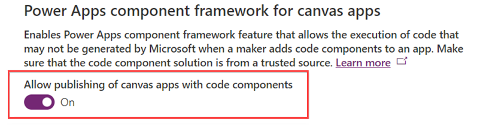

# Prerequisites to install and use the Automation Kit

The following prerequisites are required to install and use the Automation Kit.

- An administrative account, which is called **Automation CoE Admin** or similar.
- The Automation Kit requires access to your Power Platform environments, and some Azure resources, such as Key Vault and app registration. Therefore, the account you set up as the **Automation CoE Admin** needs the following.

## Roles

- Microsoft Power Platform service admin or Dynamics 365 service admin.
- Account must be mail enabled.
- Azure contributor role (for Key Vault and app registration).

## Azure app registration

An Azure app registration is used for an application user for the Dataverse Web API in each of the satellite environments.

## Azure Key Vault

   > [!IMPORTANT]
   > NOTE: Azure Key Vault is only required for Automation Kit Satellite release March 2023 or older. From the April 2023 release Azure Key Vault is no longer required as a prerequisite.

Azure Key Vaults are used to store secrets for the Azure app registration mentioned earlier, depending on your requirements. There might be one Key Vault per satellite environment. Here's an example of how you may name your Key Vaults.

- KV-Contoso-Dev
- KV-Contoso-Test
- KV-Contoso-Prod

>[!NOTE]
>The Automation Kit uses the new [Azure Key Vault secrets (preview)](/powerapps/maker/data-platform/EnvironmentVariables#use-azure-key-vault-secrets-preview).

1. Register the **Microsoft.PowerPlatform** resource provider in your Azure subscription. Follow these steps to verify and configure it: [Azure resource providers and types](/azure/azure-resource-manager/management/resource-providers-and-types).

   Azure Key Vault must have **Get** secret access policy set for the Dataverse service principal.

1. Select **Access policies**
2. Select **Create**.
3. Under **Secret permissions** select **Get** and click **Next**.
4. In the service principal search blank, search for **Dataverse**.
5. Select the Dataverse service principal with the **00000007-0000-0000-c000-000000000000** identity.
6. Click **Next**.
7. Click **Next**.
8. Click **Create**.

## License requirements

All users must have one of the following licenses:

- Microsoft 365 license (E3, E5).
- Power Automate per user with attended RPA license (non-trial).
- Optional Power Automate per user with unattended RPA license (non-trial).
- Power App Pay As You Go, Per User or Per App license (non-trial).
- Power BI Pro license.

## Enable code components

The Automation Kit uses the Power Platform Creator Kit, which was developed to bootstrap and enhance the canvas apps look and feel. The Creator Kit uses Fluent UI references and guidelines. [Read more about Fluent](https://www.microsoft.com/design/fluent/).

The Creator Kit uses a component library and code components. You must enable code components inside all the environments into which the Automation Kit will be installed.

> [!WARNING]
> You'll have to uninstall and potentially lose all data if the Power Apps component framework for canvas apps isn't turned on for the environments where the Automation Kit is installed or upgraded. Enable the component framework before installing or upgrading.

1. Sign in to the Power Platform admin center.
1. Select an environment where you want to enable this feature. This is needed in both the [main](/power-automate/guidance/automation-kit/setup/main) and all [satellite](/power-automate/guidance/automation-kit/setup/satellite) environments.
1. Select **Settings** at the top of the screen.
1. Select **Features** from below **Product**.
1. Turn on **Allow publishing of canvas apps with code components**.
1. Select **Save**.
