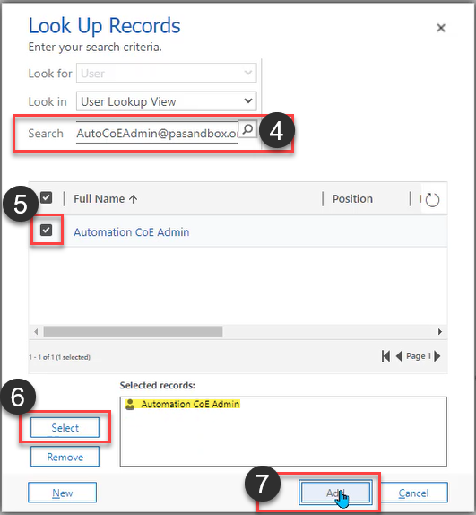

# Set up the Automation Kit security roles and permissions

## Assign security roles

Once the import is complete, assign the following roles, based on responsibility.

For each of the security roles that follow, execute these steps:

1. Sign in to the [Power Platform admin center](https://admin.powerplatform.microsoft.com/).
1. Select your satellite environment.
1. Select **See all** under **Security roles** on the **Access** card.
1. Select the Security role > **Search for and assign the security roles.**

### Flow session exception admin

This is an admin role that provides full CRUD permissions to the flow session exception data captured in the following tables:

- Flow session exception rule configuration
- Flow session exception

### Desktop flow definition admin

The **desktop flow definition admin** role provides full CRUD permissions to the following tables:

- Desktop flow action
- Desktop flow definition
- Desktop flow DLP impact profile

## Assign column security profiles

Inside the solution, there's a column security profile. This profile enables users to see the script field inside the **Desktop Flow Definition** table. This role should only be assigned to CoE Admins due to the sensitive information that may be visible.

The script field is synced and stored inside the Desktop Flow Definition table, by default. If you would like to **not** sync this information, follow the steps in [Disabling Sync of Script field](./optional.md#disable-syncing-of-desktop-flows-script-optional). Otherwise, follow the following steps to assign the security profile:

1. Select the column security profile, **Desktop Flow Script Field Security**.
1. Under **Members**, select **Users**.
1. Select **Add**.
1. Once the popup opens, search for the user to whom you want to assign this profile.
1. Select the checkbox for the user.
1. Select **Select**.

   The user should show in the **Selected records** list.

   

1. Select **Add**.
