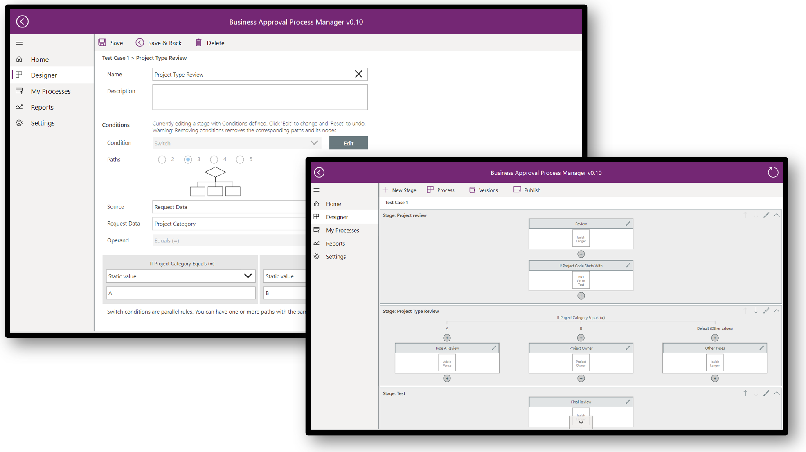

# Overview of the business approvals templates (preview)

[This topic is pre-release documentation and is subject to change.]

Approvals is a key use case that's present across every industry, organization, and department. You can use Power Automate to streamline your business processes by digitalizing the approvals experience.

> [!IMPORTANT]
>
> - This is a preview feature.
> - Preview features aren’t meant for production use and may have restricted functionality. These features are available before an official release so that customers can get early access and provide feedback.
> - This feature is being gradually rolled out across regions and might not be available in your region.

Business approvals templates provide no-code templates that are built on top of Microsoft Power Platform components. Your organization can use these templates to accelerate the speed at which it creates sophisticated approvals workflows that include conditional branching, delegation, administrative overrides, and more. Since these are no-code templates, almost anyone in your organization can use them to meet your approval needs.

Organizations need approvals for a variety of business processes, including expense reporting, time sheet management, business travel requests, procurement orders, sales discounts, etc. With Power Platform, you can meet these approval needs by combining components from [Power Apps](https://make.powerapps.com) and Power Automate. However, as the complexity of your approvals increases, so does your configuration. The business approvals templates are available with a collection of components and tools that are designed to help organizations automate their approvals processes quickly.

These templates cover some of the typical requirements in most organizations, including the following:

- The ability to configure multi-stage approvals
- Delegate others to approve
- View approvals progress and history
- Manage out of office for employees

## Sign up to the preview

We'd like to work closely with customers to learn and improve these templates. If you're interested in joining the preview, start by [completing the business approvals templates preview form](https://aka.ms/business-approvals-templates-preview).
