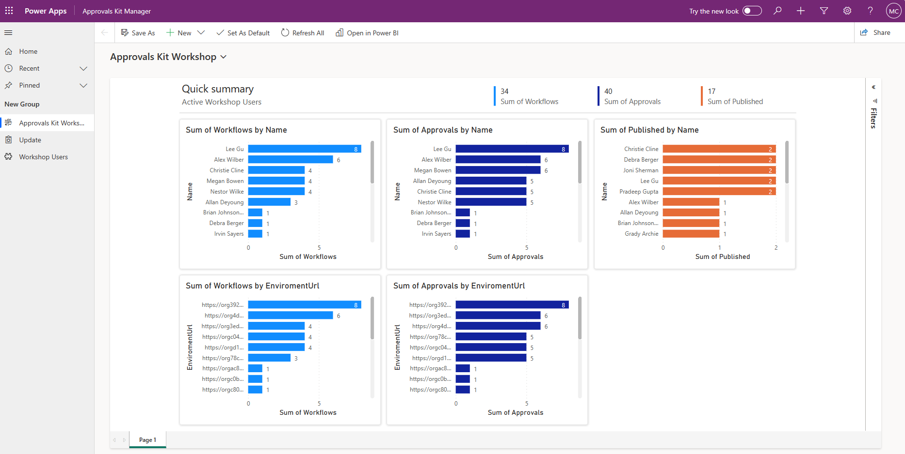
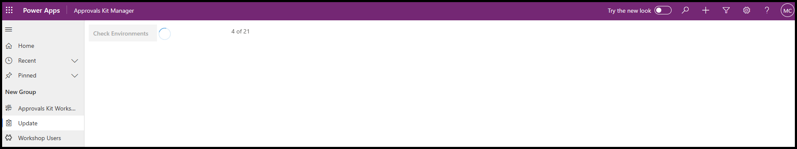
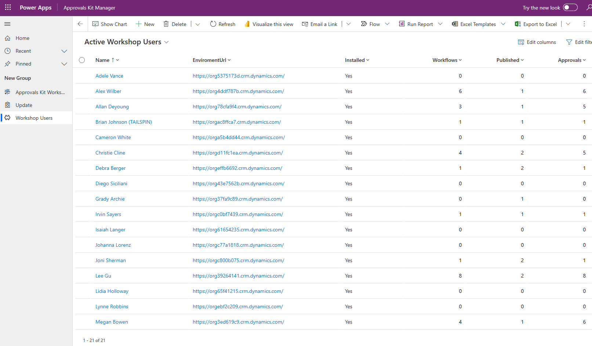

# Monitoring Progress

The Monitoring Progress of learners using the workshop is a critical component of the ensuring their success and aiding them in their learning path. This section provides some suggestions on how to use the **Approval Kit Manager** to support the workshop.

The data within each of the Dataverse learner environments can be aggregated to not only verify that the workshop is ready by monitoring the progress of learners. Additionally, seeded environments that demonstrate the completed stage of the workshop can be used to show the final outcome.

Throughout the workshop, progress of learners can be shown in an engaging way. Completion rates of workshop modules can be monitored during and after the event. The data collected can be used to highlight success and areas that require further follow-up.

The concepts used in monitoring the workshop can be extended to your Center of Excellence and Support team to provide similar views of the Approval data across environments to look at operational health of the deployed business approvals.

## Workshop Dashboard

The Embedded Power BI report included in the **Approval Kit Manager** provides you with a customizable indicator the users inside the workshop and how they're progressing.

.

Interactive dashboards can be a powerful tool to aid learners in a workshop environment to gauge their progress and for the instructor to monitor progress and respond as needed. By providing near real-time data and visualizations, learners can easily see how they're progressing through the workshop and identify areas where they might need to focus more attention. Instructors can also use the data to identify learners who might be struggling and provide targeted support.

Additionally, interactive dashboards can be used to track completion rates and highlight areas where learners are excelling or might need extra support. Overall, interactive dashboards to provide a valuable tool for both learners and you as an instructor to monitor progress and ensure that the workshop is successful.

## Updating Progress

The Updating Progress section is a critical component of the workshop. The **Update** page is designed to enable you to aggregate information from each of the learner environments to update data for the workshop dashboards.

By collecting and analyzing data from each of the learner environments, you can gain valuable insights into how learners are progressing through the workshop. This information can then be used to update the workshop dashboards, providing near real-time data and visualizations that can help learners track their progress and identify areas where they might need extra support.

At key points in the workshop, check progress and use progress to adjust or respond to trends that appear.

## Workshop Users

The workshop users page provides you with information on each of the environments that learners have and progress that each learner is making through the workshop.

