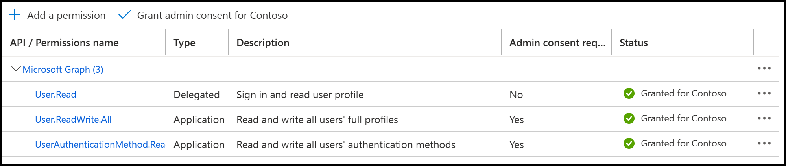

# User Setup

Once complete with the [Tenant Setup](./tenant-setup.md) section of the workshop, the next stage is to get ready to create user account setup. In this section, we cover how to set up users to create Power Platform Developer environments. It's important to ensure that licenses are assigned via a security group to ensure that users have the appropriate access to the Power Platform. Let's dive in and get started!

## Development / Trial Licenses

If you select a tenant that doesn't have access to [Power Apps licenses](https://powerapps.microsoft.com/pricing/) one option for development / test of the Approvals Kit for nonproduction scenarios is the [Power Apps Developer Plan](/power-platform/developer/plan). The learn page has more information on the Power Apps Developer Plan and how to sign up for a Developer Plan.

For learners that don't have access to [Power Automate licenses](https://powerautomate.microsoft.com/pricing/) then you could explore the **Try it for free** option from Power Automate pricing page.

> NOTE: The Associated setup scripts assume that the Power Apps Developer Plan and the Power Automate Free licenses are available in the selected learner tenant.

## Security Group

One way of managing access to power platform resources is via a Security group. You can assign the licenses to the security group so that members inherit the required licenses required to run the workshop.

> NOTE: The Associated setup scripts assume security group is named **Makers**. There are PowerShell scripts available to setup and assign the development and trial licenses required.

### Automated Setup

> NOTE: For instructions on how to download and setup the instructor guide automation scripts follow the [Setup Instructor Guide Scripts](./setup-instructor-scripts.md)

1. Start a PowerShell session

```bash
pwsh
```

1. Import the security PowerShell commands from where you install the Approvals Kit Workshop scripts

```pwsh
. .\src\scripts\security.ps1
```

1. Sign in to Azure as the Administrator of the Entra ID tenant. Use the PowerShell script to call Azure CLI to sign in

```pwsh
Invoke-AzureLogin
```

1. Create Makers security group

```pwsh
Add-SecurityMakersGroup
```

> NOTE: Review the [How are role-assignable groups protected](/entra/identity/role-based-access-control/groups-concept#how-are-role-assignable-groups-protected) for security roles that the logged in Azure Login account will require.

1. Assign Microsoft Developer Plan to the Makers group. More information: [PowerShell and Microsoft Graph examples for group-based licensing in Microsoft Entra ID](/azure/active-directory/enterprise-users/licensing-ps-examples)

```pwsh
Add-SecurityMakersGroupAssignDeveloperPlan
```

> NOTE: Sign up links for developer / trial
> - [Power Apps Developer Plan](https://powerapps.microsoft.com/developerplan/)
> - [Power Automate pricing](https://powerautomate.microsoft.com/pricing/)

## Microsoft Entry ID Applications

The instructor guide assumes that two Microsoft Entra applications are created.

> NOTE: To learn more about [Create a Microsoft Entra application and service principal that can access resources](/entra/identity-platform/howto-create-service-principal-portal) for guidance on  permissions required to register an app.

### Automation Kit Application

The Automation Kit application is used by the Approvals Kit custom connector to provide delegated permissions to access Microsoft Dataverse. The results of this process should be stored in the **CLIENT_ID** and **CLIENT_SECRET** secure variables.

1. Create a new Application following [Register an application with Microsoft Entra ID and create a service principal](/entra/identity-platform/howto-create-service-principal-portal#register-an-application-with-microsoft-entra-id-and-create-a-service-principal)

1. The default URI of type **Web** and value of **https://global.consent.azure-apim.net/redirect**.

> NOTE: This value could change depending on the environment you deploy your custom connector within.

1. Select **Register**

1. In the API Permissions, select **Dataverse** and ensure that Delegated Dynamics (user_impersonation) with granted with administrator consent.

  

1. Select **Add permissions**

1. Select grant admin consent for the application by selecting text similar to **Grant admin consent for Contoso**

1. Create Secret by moving to **Certificates and Secrets** section and select **New client secret**.

1. Add description and select an appropriate expiry date. Select **Add**.

1. Copy the secret value and save it in **CLIENT_SECRET**.

1. Also make a note of Client ID from Overview section to store in **CLIENT_ID**.

### Install Administration Application

The Install Administration application is used by the instructor guide setup scripts to provide user administration. The results of this process should be stored in the **ADMIN_APP_ID** and **ADMIN_APP_SECRET** secure variables.

1. Create a new Application named **Approvals Kit Instructor Admin** following [Register an application with Microsoft Entra ID and create a service principal](/entra/identity-platform/howto-create-service-principal-portal#register-an-application-with-microsoft-entra-id-and-create-a-service-principal)

1. Select **Register**

1. Select **Microsoft.Graph**

1. Ensure that API permissions are of type **application** for **User.ReadWrite.Add** and **UserAuthenticationMethod.ReadWrite.All**

1. Select grant admin consent for the application by selecting text similar to **Grant admin consent for Contoso**

  

1. Create Secret by moving to **Certificates and Secrets** section and select **New client secret**.

1. Add description and select an appropriate expiry date. Select **Add**.

1. Copy the secret value and save it in **ADMIN_APP_SECRET**.

1. Also make a note of Client ID from Overview section to store in **ADMIN_APP_ID**.

## Setting up secure install variables

Run the following inside PowerShell:

1. Change to the workshop folder for the approvals kit

```pwsh
cd ~/powercat-business-approvals-kit/Workshop
```

1. Create and move to new folder named secure

```pwsh
mkdir secure
cd secure
```

1. Create a secure store location to hold values

```pwsh
SecureStore create secrets.json --keyfile secret.key
```

1. Store the values for your setup

```pwsh
SecureStore set DEMO_PASSWORD "SomePassword" --keyfile secret.key
SecureStore set CLIENT_ID "Azure Client id" --keyfile secret.key
SecureStore set CLIENT_SECRET "Azure Client secret" --keyfile secret.key
SecureStore set ADMIN_APP_ID "Azure Admin Client id" --keyfile secret.key
SecureStore set ADMIN_APP_SECRET "Azure Admin Client secret value" --keyfile secret.key
```

## Creating Users

You can optionally create users via the automated scripts for demonstration tenants.

1. Ensure that you have the scripts imported

```pwsh
. .\src\scripts\users.ps1
```

1. Setup a user with the value that is securely stored in the value **DEMO_PASSWORD**

```pwsh
Reset-User "first.last@contoso.OnMicrosoft.com"
```

  > NOTE: Either delegated scope **User.ReadWrite.All** or **Directory.AccessAsUser.All** is required to reset a user's password. In addition to the correct scope, the signed-in user would need sufficient privileges to reset another user's password.

1. (Optional) To setup a group of users, assuming they have the same password the following PowerShell could be used

```pwsh
"LidiaH","LynneR" | Foreach-Object { 
    $upn = "$($_)@contoso.OnMicrosoft.com"
    Write-Host "-------------------------------------------------------------------------"
    Write-Host $upn
    Write-Host "-------------------------------------------------------------------------"
    Reset-User $upn
}
```

## Install Creator Kit

1. Sign in to [Power Platform Admin Center](https://aka.ms/ppac) an environment administrator

1. Install [Creator Kit](https://appsource.microsoft.com/product/dynamics-365/microsoftpowercatarch.creatorkit1) from app source

1. Select an environment to install the Creator Kit

1. Review and Agree to the Terms and conditions and privacy policy

1. Select **Install**

## Summary

Continue with [Environment Setup](./environment-setup.md) one you gave ensured following is in place

- Users should be created in the Microsoft Entra ID tenant

- They should have licenses for the workshop assigned directly or inherited via a security group membership

- Microsoft Entra ID Application is created that is used for the custom connector and to assist with automated setup.

- Setup variables are configured in SecureStore

- The Creator Kit installed into one environment
