# Add conditionals and stages

The prior [Trigger approval module](./trigger-approval.md) provided tasks and steps required to create a Contoso Coffee machine request and begin the self approval of the machine request. In this module you will add additional input information into the Business approval process so that the workflow includes a Manager approval stage when the value of the Machine request is above $400.

## Task 1 - Open the Business Approval Process

1. Open the Business Approval Management application as described in the last module.

1. Switch to the Approvals Designer in the bottom of the left navigation.

  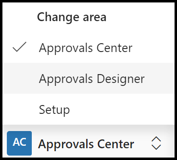

1. Select the **Machine Requests** business approval to edit

  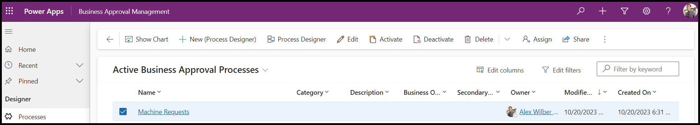

## Task 2 - Add new business approval data

1. With the Business Approval process open select **Process Designer** from the command bar.

  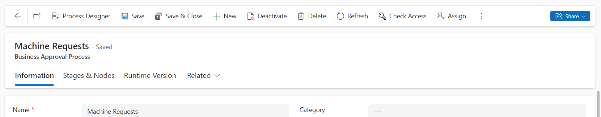

1. In the Process Designer select the **Variables** button to add new business approval data

  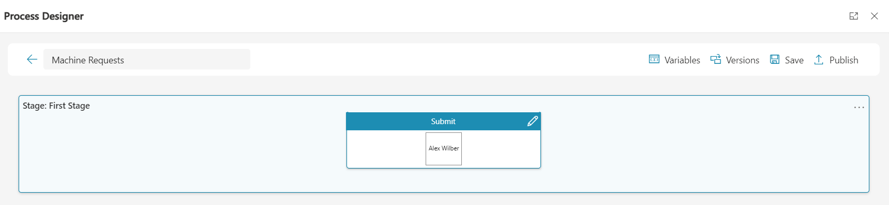

1. Select the **+ Add** button to add Field Name of **Name** of Data Type **Text** and Field Name **Price** of Data Type **Number**.

> NOTE: The [Define Application Data](../../configuring-preset-approvals.md?#define-application-data) of the Configuring preset approvals guide provides more information on each of the Data Types.

  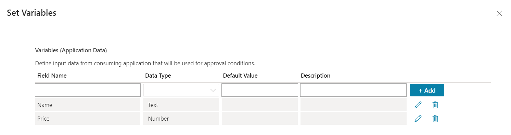

1. Select the **X** on the same horizontal lin as Set Variables heading to close the variables.

## Task 3 - Add a new conditional stage

1. In the Process Designer select the **+** icon to add a new stage.

1. using Create Stage dialog enter the following information

   |Field|Value|
   |-----|-----|
   |Name |Manager Approval|
   |Condition|Select **If/Else**|
   |Source|Select **Request Data**|
   |Request Data|Select **Price**|
   |Operand|Select **Greater Than**|
   |If Price Greater Than (>)|Enter value of 400|

  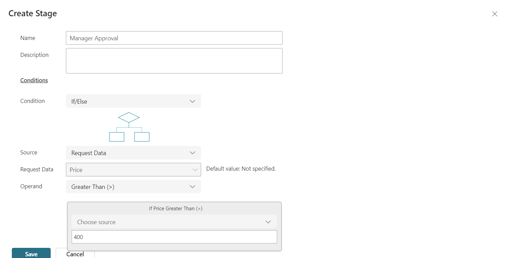

1. Select **Save** to save the new stage.

1. Select **Save** in the Process Designer to update the workflow with two stages.

  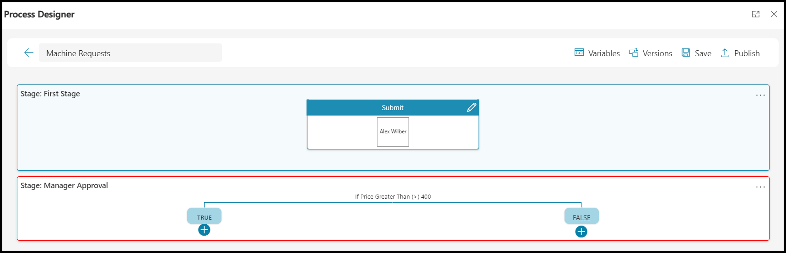

1. Select the **+** under the **TRUE** node.

1. In the Create Node dialog enter the following information:

> NOTE: The [Define the first node](../../configuring-preset-approvals.md?#define-the-first-node) provides more information on allowable node values.

   |Field|Value|
   |-----|-----|
   |Name|Above $400 Approval|
   |Approver|Select your user account from the selection list|
   |Add|Select the **Add** button to add your user account as the the manager approver|

   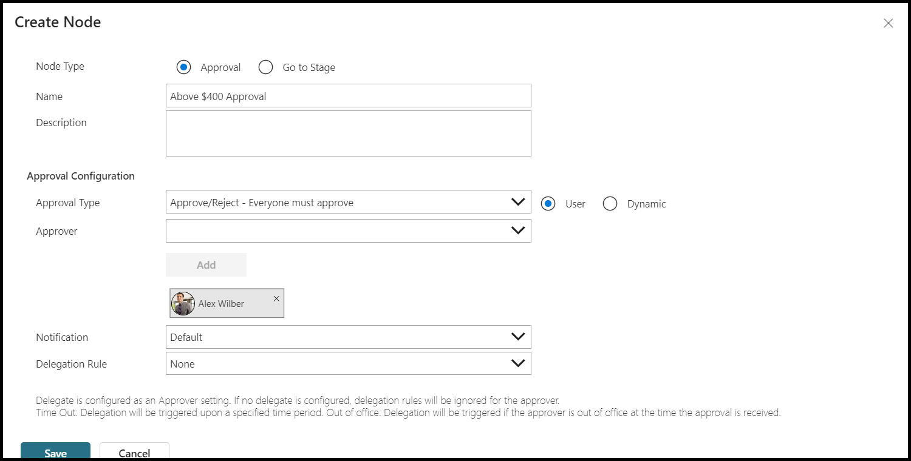

1. Select **Save** to save the new node.

   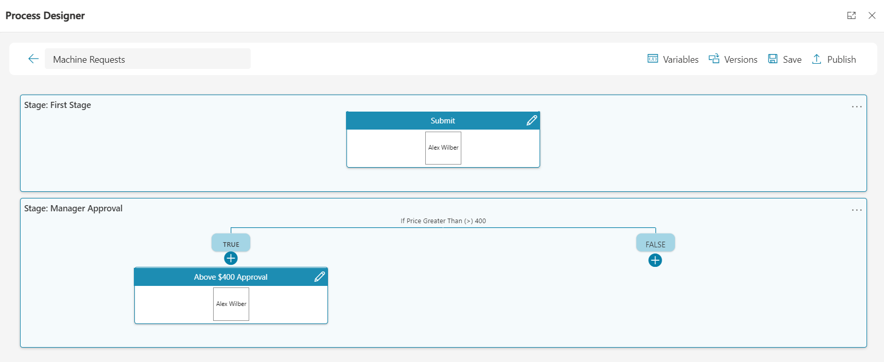

1. Select **Publish**.

   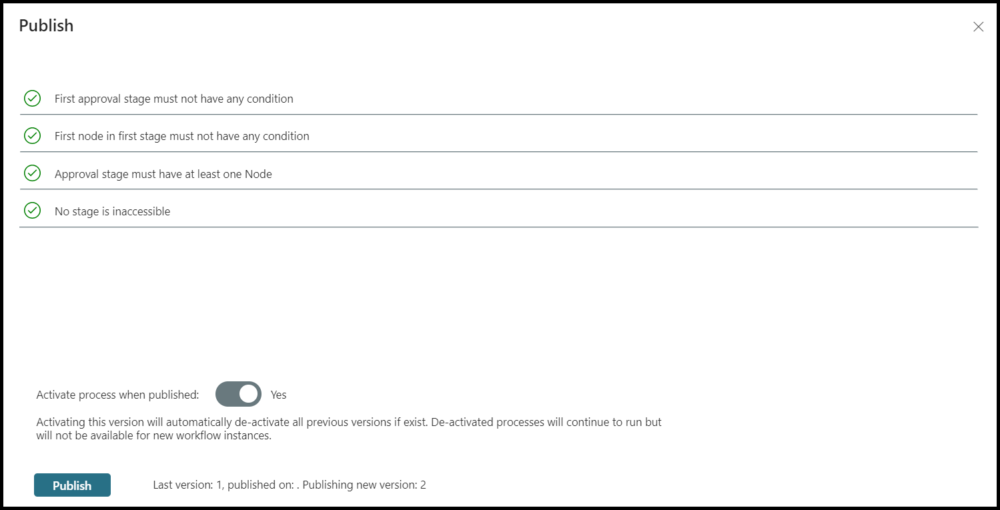

1. Confirm that validation checks pass and select **Publish** to confirm publish.

1. Wait for the publish to complete. You can select the **Refresh** button to update the publish status.

   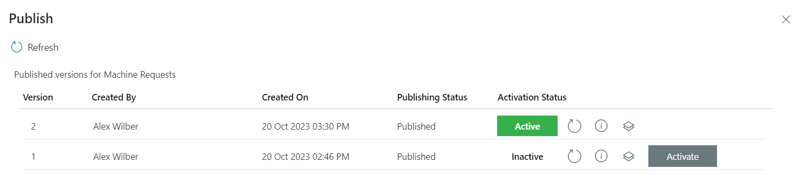

1. Select the **X** icon on the same horizontal line as the Publish heading to close the publish dialog.

1. You can now select *X** to close the process designer

## Task 4 - Edit the Machine request cloud flow

1. Select **Solutions** in the Power Apps or Power Automate Portal

1. Ensure that the you have selected the environment where you are performing this workshop

1. Open the **Contoso Coffee Approvals** solution

1. Select the **Machine request** Cloud Flow.

1. Select **Edit** from the command bar

## Task 5 - Update the business approval process

1. Open the **Start business approval process** card.

1. Enter the following information into the card

   |Field|Value|
   |-----|-----|
   |Workflow Process|Machine Requests (v2)|
   |Name|Select **Machine Name** from Dynamic content|
   |Price|Select **Price** from Dynamic content|
   |Show Advanced options|Select the **Show Advanced options**|
   |Additional Information|Enter **Premium machine requested**|

    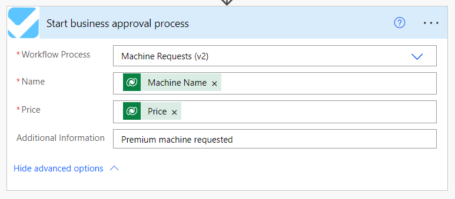

1. Select **Save** to update the Cloud Flow with the new workflow version and request data variables.

## Task 6 - Test multi-stage approval with a new Machine Request

1. Open the **Machine Ordering App**

1. Select two machines of value greater than $400. For example the **Smart Brew 300**.

1. Select **Compare 2 items**.

1. Select **Submit machine request**.

1. Select **OK** to close the confirmation.

## Task 7 - Approve first Stage

1. Open the [Power Automate Portal](https://make.powerautomate.com) you had open earlier.

1. Ensure that the you have selected the environment where you are performing this workshop.

1. Select **Approvals** from the left navigation.

> NOTE: The approval can tak up to a minute to be sent and you may need to refresh the page to view the generated request.

1. Select the new **Machine Requests Approval - Submit** Approval received and select **Approve**.

1. Select **Confirm**.

1. Select **Done** to close the approval response.

## Task 8 - Approve manager approval

1. Refresh the **Approvals** tab

1. Select the new **Machine Requests Approval - Above $400 Approval** received and select **Approve**.

  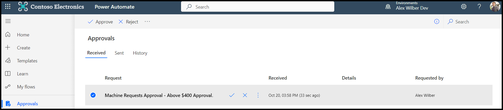

1. Select **Confirm** to confirm the manager approval.

1. Select **Done** to close the approval response.

## Task 9 - View approved multi-stage approval

1. Open the **Business Approval Management** application

1. Select **Approvals Center** from the left navigation.

1. Select **Approvals Instances**

   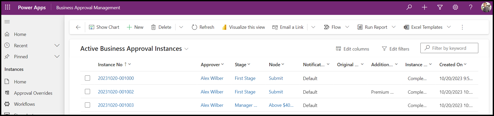

## Summary

In this module you published new version of the business approval workflow. The first step was to add new request data variables for name and price. The price variable was used in a new Manager approval stage where the price was above $400 to request and additional approval. The module then edited the **Machine request** cloud flow to use the new v2 workflow that includes the name and price variables. The **Machine Name** and **Price** where mapped as request data so that they could be used to supply data required by the workflow.

> [!div class="nextstepaction"]
> [Next step: Approvals delegation and out of office](./approval-delegation-out-of-office.md)