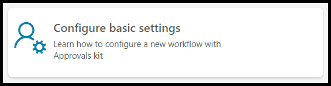

# Approvals delegation and out of office

One key element of the Approvals kit is the ability to specify delegate approvers in the event that you are out of the office or on holiday. This ensures that the approval process can continue smoothly even if the primary approver is unavailable. In the "Configure basic settings" section of the Business Approval Management application, you can easily set these delegate approver values.

This workshop module will provide step-by-step instructions for defining delegated approvers and handling out of office approvers. You will learn how to configure the basic settings of the Business Approval Management application to set delegate approvers, as well as how to handle out of office approvers using the Approvals kit. By the end of this module, you should have a good understanding of how to manage delegate approvers and out of office settings using the Power Platform Approvals Kit.

## Delegation

One key element of the Approvals kit is the ability to specify delegate approvers in the event that you are out of the office or on holiday. This ensures that the approval process can continue smoothly even if the primary approver is unavailable.

Using the step-by-step instructions, you will define a delegated approver and that can be used when handling out of office approvals.

### Task 1 - Open the basic settings configuration

1. Open the **Business Approval Management** application in the workshop environment assigned to you.

1. From the **Home** page select the **Configure basic settings** panel

   

1. Review the settings screen to get familiar with the information that you can provide

   

## Task 2 - Define approval delegate and set out of office

1. In the **Approval Delegate** field search for another user who can act as an approver or enter the auto-approver test user that yor instructor has configured in Power Platform for workshop users.

1. Select the **Out of Office** so that is displays Enabled

> NOTE: For this workshop we will use Out of office. Defining your work profile and public holidays are other scenarios where your delegated approvers will also be used to route the approval request to the correct approver.

1. Select **Save**

   

## Task 3 - Create a new Machine Request

1. Sign in to [Power Apps](https://make.powerapps.com)

1. Select the assigned Approvals Kit environment for this workshop content

1. Select **Apps** and select the **Machine Ordering App**

  

1. If prompted select Allow for the Office 365 users connector.

  

1. Select a few machines **below $400** and click **Compare**.

  

1. Select one of the machines  and select **Submit**

1. Select **OK** to close the submitted Machine Request

## Task 4 - Check Approvals

1. Open the [Power Automate Portal](https://make.powerautomate.com)

1. Select the assigned Approvals Kit environment for this workshop content.

1. From the left navigation select **Approvals**.

1. Wait for a new minutes and refresh and verify that you have not been sent an approval.

## Summary

This workshop module covered the basic out of office scenario for the Approvals kit. It provided step-by-step instructions for defining and testing delegated approvers when your are out of office.

The workshop demonstrated how to configure the basic settings of the Business Approval Management application to set delegate approvers, as well as how to handle out of office approvers using the Approvals kit. You could extend workshop to testing your work define work profile or public holidays as examples of when delegation can be used.
