# Creating First Approval Kit workflow

## Task 1 - Create a Contoso Coffee Machine Request

By completing the App In a Day module 2 or having the Contoso Coffee Application imported into your environment you will have the ability create a machine request. Lets review the the request process before you proceed with creating the Business Approval for this process.

> NOTE: If you do not have the Contoso Coffee Machine Ordering app follow the [Import Contoso Coffee](./import-contoso-coffee.md) guide to get started.

1. Select **Apps** and select the **Machine Ordering App**

  > [!div class="mx-imgBorder"]
  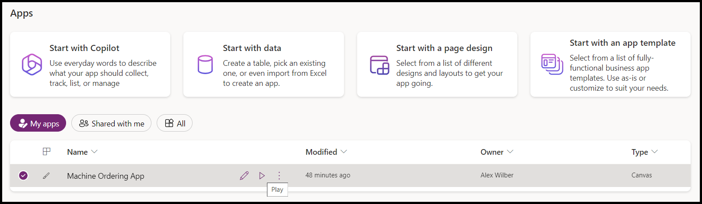

1. If prompted select Allow for the Office 365 users connector.

  > [!div class="mx-imgBorder"]
  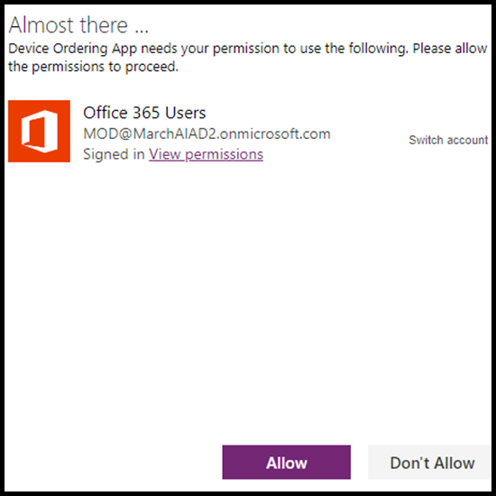

1. Select a few machines and click **Compare**.

  > [!div class="mx-imgBorder"]
  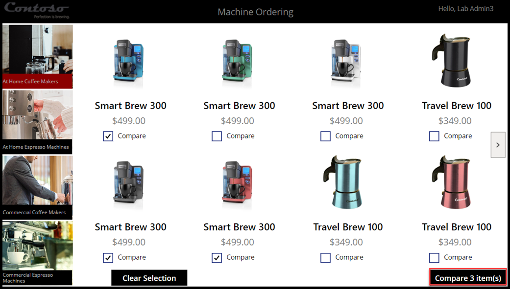

1. Select one of the machines and select **Submit**

  > [!div class="mx-imgBorder"]
  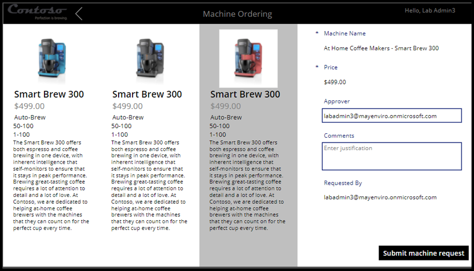

1. Select OK to close the submitted Machine Request

  > [!div class="mx-imgBorder"]
  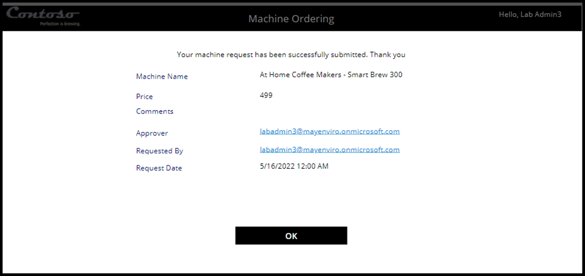

1. Close the application.

1. select **Tables**, search for **Machine Order** and select it.

  > [!div class="mx-imgBorder"]
  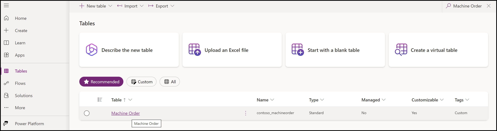

1. Select the Data tab and make sure you have at least one record in the table.

## Task 2 - Create Approvals Kit Workflow

Now that you have verified that Contoso Coffee machine request can be successfully created lets create a simple one stage and one node approval process that you can self approve.

> NOTE: If you do not have the Approvals Kit installed in your environment the [Approvals Kit Setup Guide](../../setup.md) or the [Instructor Guide](../instructor-guide/overview.md) could help your Center of Excellence team or Trainer provide an environment so that you can follow this workshop module

1. Select **Apps**, select the … button of the **Business Approval Management** and select **Play**.

1. If prompted select your account and enter your account password.

1. Select **Continue** to close the welcome screen if it appears

1. Select **Configure a Workflow** from the Home navigation item

  > [!div class="mx-imgBorder"]
  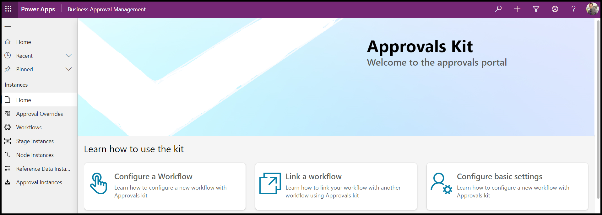

1. Enter the name of your workflow. For example "My First Approval"

  > [!div class="mx-imgBorder"]
  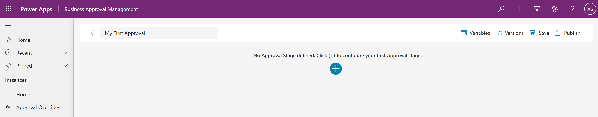

1. Select the + button to create the first approval stage.

1. Enter a name for the stage and then select **Save**

  > [!div class="mx-imgBorder"]
  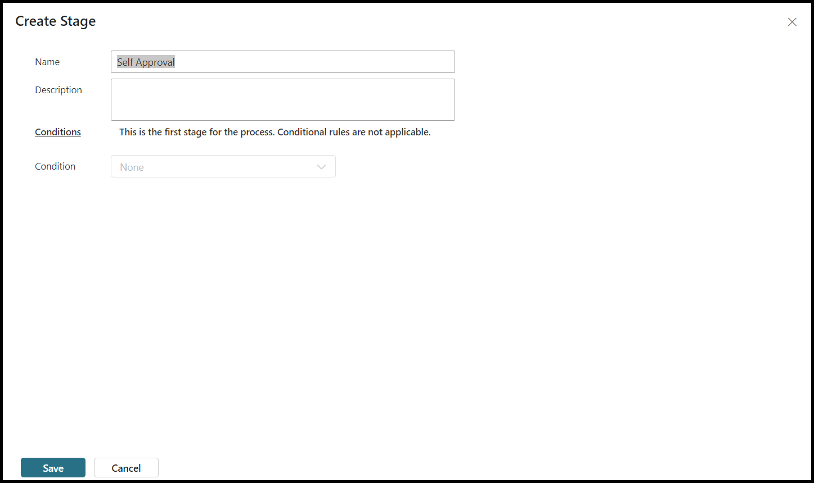

1. Wait for the the stage to be created. Select the gray + button to create a node for the created stage

  > [!div class="mx-imgBorder"]
  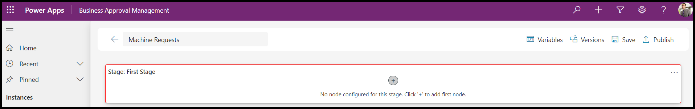

1. Create a first node with name and select your user account from the Approver list

  > [!div class="mx-imgBorder"]
  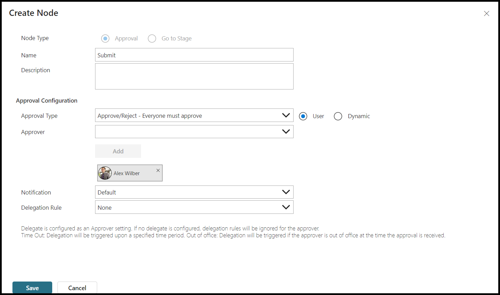

1. Select **Save** to save the first node

1. Wait for the node to be created

  > [!div class="mx-imgBorder"]
  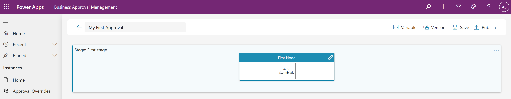

1. Select the Save button to save you workflow

  > [!div class="mx-imgBorder"]
  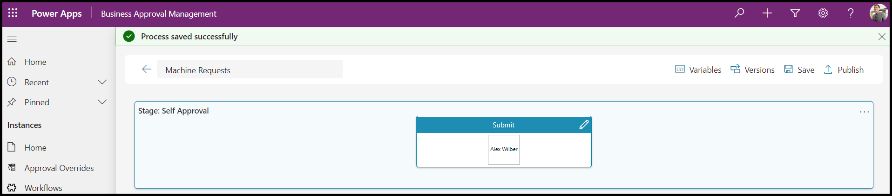

## Task 3 - Publish Approval Workflow

Having created the definition of you work flow the next step is to publish the workflow so that you can trigger a approval when a Machine request is created.

1. Select **Publish**.

1. Verify that the workflow can be published and select **Publish**.

  > [!div class="mx-imgBorder"]
 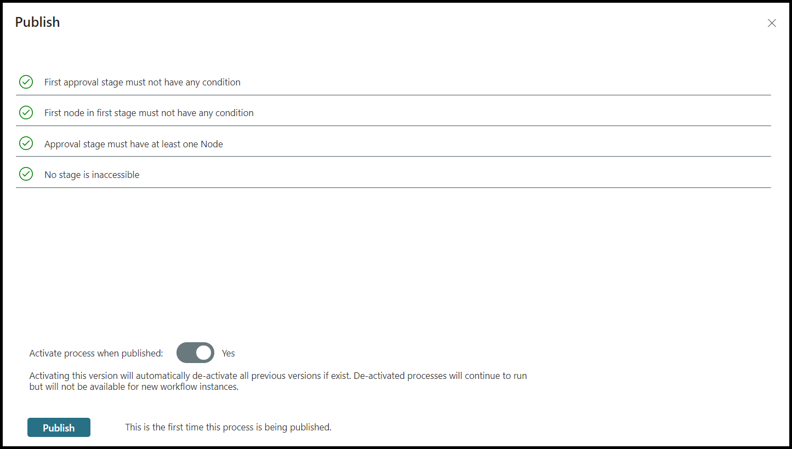.

1. Wait for the workflow to be published. You can use the **Refresh** to update the publish status.

  > [!div class="mx-imgBorder"]
 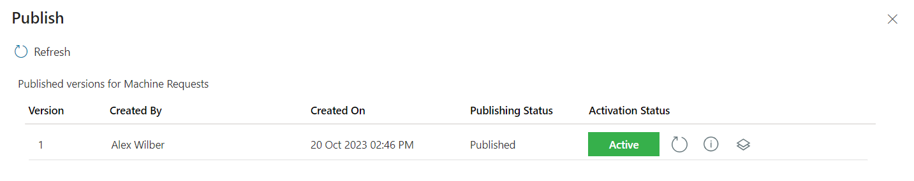.

## Summary

In this module you stepped through the process of creating a Contoso Coffee Machine request, defined a simple Approval workflow and published the first version of this workflow.

The publish task created an active version of you work flow. As you change and adapt a workflow you can publish new versions to react to changing business rules or revert back to an earlier version.

The next [Trigger Approval](./trigger-approval.md) module will build on these two elements to use a Power Automate Cloud flow to begin a approval workflow every time a Machine request is submitted.
