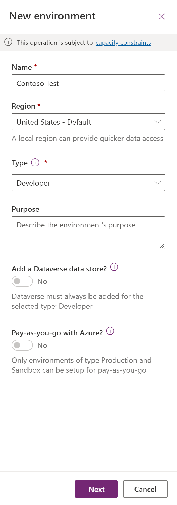

# Import Contoso coffee solution

Follow the steps, if you didn't complete already imported or have an environment with the Contoso Coffee solution available to you.

## Task 1: Create a new environment

1. Open a new browser tab, navigate to [Power Platform admin portal](https://aka.ms/ppac) select Environments and select New Environment.

1. Provide an Environment Name, select **Developer** for Type, select Region and select Next.

  > [!div class="mx-imgBorder"]
  

1. Select Language, URL, and Currency. Select No for Deploy sample apps and data and then select Save.

1. Wait for the environment to be created.

## Task 2: Import the solution

In this task, you import the completed second module solution from the App in a day workshop:

1. Navigate to [Power Apps maker portal](https://make.powerapps.com/)

1. Make sure you are in the **Contoso** Test Environment you created.

1. Select **Solutions** and select **Import**.

1. Select Browse.

1. Select the **ContosoCoffee_1_0_0_2.zip** Contso Coffee solution zip file located in **Completed Lab Solution for students** and **Module 2** folder and select Open.

> NOTE: The English language version Contoso Coffee Module 2 solution can be located in the [AppinaDay Trainer Package.zip](https://aka.ms/appinadayTrainer) or [Other Languages](https://aka.ms/AIADLocalTrainer)

1. Select Next.

1. Select Import.

1. Wait for the solution import to complete.

1. Once the import is complete, Select **Publish All Customizations** and wait for the publishing to complete.

1. Select **Apps**, select the … button of the **Machine Ordering App** and select **Play**.

1. When the application opens select **Allow** for the Office 365 Users connection.

1. Select a few machines and select **Compare**.

1. Select one of the machines and select **Submit**.

1. Review the machine request select **OK** to close the request.

1. Close the application.

1. Select **Tables**, search for **Machine Order** and select on it.

1. Select the Data tab and make sure you have at least one record in the table.

## Summary

In this module, you stepped through the process of manually importing the Contoso Coffee Power Platform solution into an environment.

## Troubleshooting

This module assumed that you have the ability to create a new Developer environment is one hasn't been assigned to you. Organizations can [Control environment creation](https://learn.microsoft.com/power-platform/admin/control-environment-creation). If you're unable to create a new environment you need to request a development environment.

To import the Contoso Coffee solution, you need a role of [Environment Maker](https://learn.microsoft.com/power-platform/admin/database-security#environments-with-a-dataverse-database) assigned in the environment.

To use the Contoso Coffee solution the following connectors must be enabled in the [Data Loss Prevention Policy](https://learn.microsoft.com/power-platform/admin/prevent-data-loss) applied to your environment.

|Connector| Description |
|---------|-------------|
|[Microsoft Dataverse](https://learn.microsoft.com/connectors/commondataserviceforapps/)| Load and save Machine requests |
|[Office 365 Users](https://learn.microsoft.com/connectors/office365users/) | Used to   perform various actions such as get your user profile |
