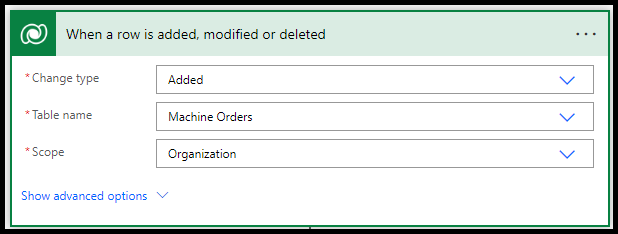
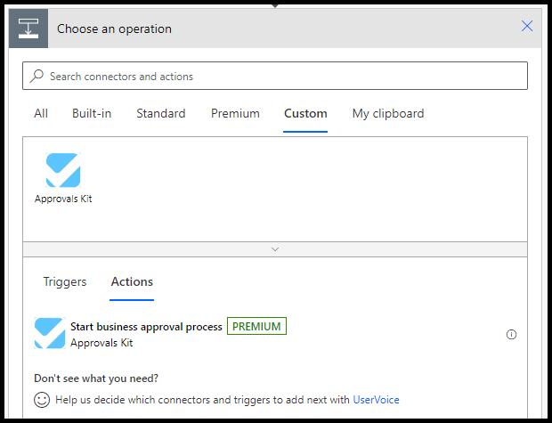
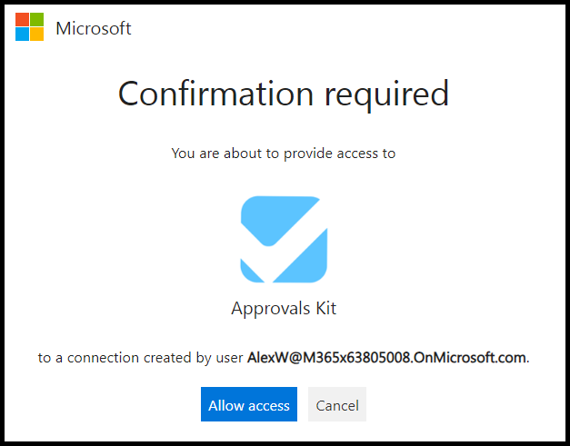
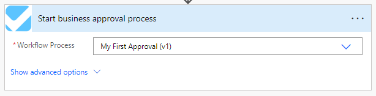
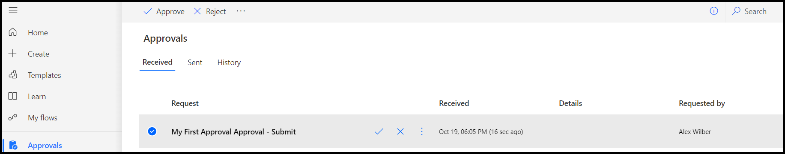
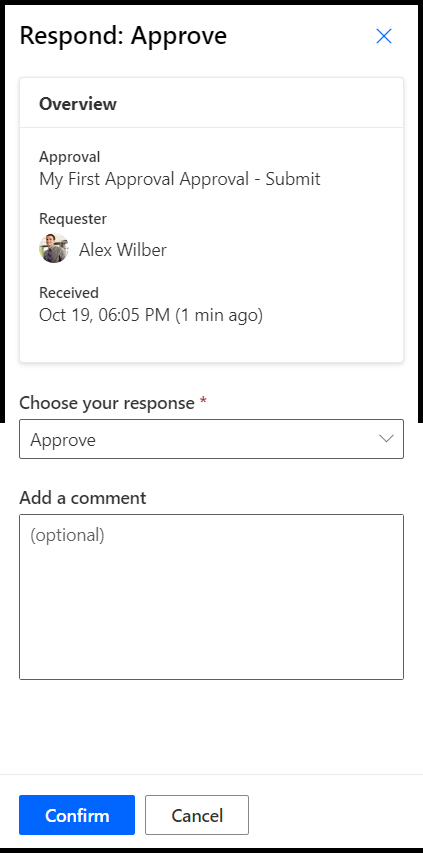
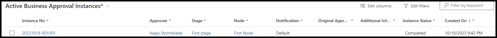
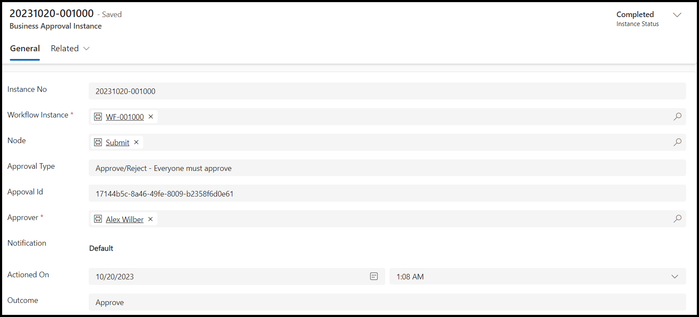

# Triggering a defined Approval

The prior [First approval module](./first-approval.md) provided tasks and steps required to create a Contoso Coffee machine request and a simple Approval workflow that when triggered will send an Approval to you for approval. This module will extend this functionality by using a Power Automate Cloud flow to begin a business approval process when a Machine Request is created in Dataverse.

> NOTE: If you are not familiar with what Approvals are in Power Platform the [Get started with approvals](/power-automate/get-started-approvals) provides some examples of what can be achieved with the Standard Power Platform Approvals Connector. The Approvals Kit extends Approvals scenarios with additional features discussed below.

## Give me an example

As a example in the Contoso Coffee scenario we will start with a simple self-approval, based data getting added to Dataverse. In the later modules we will extend this workflow where a second manager approval is created when the value of the machine request is greater than $400. This combined scenario could be built using multiple Power Automate Cloud Flows and the Approvals Kit. By using the Approvals Kit you can model the same process and focus on the business approvals process rather then combining multiple components together to achieve the same goal.

## Tell me more

Given the goal of this workshop is designed to incrementally build you knowledge of the Approvals Kit the first modules are intentionally simple, to get you started and it provides very similar to the functionality provided by the out of the box Approvals connector. In fact the Approvals kt also builds on the out of the box Approvals connector enhancing it with Power Platform solution that is made up of a set of Power Automate Cloud flows and Dataverse tables.

To explore what this provides you is the Approvals Kit gives a no code way of defining [Muti stage approvals and conditions](./add-conditional-stages.md) like we will cover in the next module. From a data point of view by storing data Approval workflow sin Dataverse, it enables you to rapidly make changes without the need to update or deploy a power platform solution. This also allows for variations for just one Approval, which can be done on a case by case basis rather than changing the approval process for all Approvals. Additionally, using Dataverse gives the ability to use the Auditing features of Dataverse to record Approvals process.

In later modules of this workshop we will also demonstrate feature like handling for Delegated approvals and out of office support make it easy for you to build complicated Approvals process easily without needing to build these features using Power Platform solutions yourself.

> NOTE: If you want to dive deeper you can read the [Approvals Kit Comparison](../../approvals-kit-comparison.md) for more information.

## Task 1 - Creating a solution

The first task is to create a Power Platform solution to create a container to you to group your related Platform resources together.

> NOTE: If solutions are a new concept for you, the [Solution Overview](/power-apps/maker/data-platform/solutions-overview) and [Solution Concepts](/power-platform/alm/solution-concepts-alm) provides some further reading.

1. Sign in to [Power Apps](https://make.powerapps.com)

1. Select the assigned Approvals Kit environment for this workshop content

1. Select Solutions from the left navigation. If the item isn’t in the left navigation pane, select **… More** and then select Solutions.

1. Select **New Solution**

1. Enter a Solution display name of **Contoso Coffee Approvals**.

1. Select publisher **Contoso**.

> The Power Apps create solution guidance includes information on the [Solution Publisher](/power-apps/maker/data-platform/create-solution#solution-publisher). On how to select or create a solution publisher.

1. Select **Create**.

1. Wait for your solution to be created.

## Task 2 - Creating Cloud Flow

In your created solution perform these steps:

1. Select **New** > **Automation** > **Cloud flow** > **Automated**

> For more guidance on create a Cloud flow with solutions you can reference [Create a cloud flow in a solution](/create-flow-solution).

1. Enter Flow name of **Machine request**

1. Search for trigger by entering **Dataverse** to choose your trigger

1. Select trigger **When a row is added, modified or deleted (Microsoft Dataverse)**

1. Select **Create**.

1. Select change type of **Added**.

1. Select Table name of **Machine Orders**.

1. Select the scope of the change. For example **Organization** read more on [Scope](/dataverse/create-update-delete-trigger#scope)

> NOTE: For more information on Dataverse trigger parameters you can reference [Trigger flows when a row is added, modified, or deleted](/dataverse/create-update-delete-trigger)

  > [!div class="mx-imgBorder"]
  

1. Select **New Step**.

1. Select **Custom** tab.

1. Select **Start business approval process** action.

  > [!div class="mx-imgBorder"]
  

1. Select **Sign in** if prompted and select your account.

1. If prompted select **Allow access** to confirm creation of Approvals Kit connection.

  

1. Select the **Machine Requests (v1)** workflow process that you published in the [First Approval](./first-approval.md) module.

  > [!div class="mx-imgBorder"]
  

1. Select **Save**.

1. Wait for the Cloud flow to be saved.

## Task 3 - Creating a new Machine Request

Now that a cloud flow trigger has been defined for the **Machine Order** table peform these steps to create a new Machine request that should trigger an Approval workflow.

1. Select **Apps** and select the **Machine Ordering App**

  > [!div class="mx-imgBorder"]
  

1. If prompted select Allow for the Office 365 users connector.

  > [!div class="mx-imgBorder"]
  

1. Select a few machines and click **Compare**.

  > [!div class="mx-imgBorder"]
 

1. Select one of the machines and select **Submit**

  > [!div class="mx-imgBorder"]
 

1. Select OK to close the submitted Machine Request

  > [!div class="mx-imgBorder"]
  

1. Close the application.

## Task 4 - Approve the request

After submitting the Machine request the cloud flow should be triggered and begin your defined business approval process. Use these steps to approve the request in the Power Automate web portal.

> NOTE: This workshop guide performs in the Approval inside the Power Automate Portal. If the user is configured with an Office 365 license the the approval will also be available via Outlook or in [Microsoft Teams](/teams/native-approvals-in-teams).

1. Open the [Power Automate Portal](https://make.powerautomate.com)

1. Select the assigned Approvals Kit environment for this workshop content.

1. From the left navigation select **Approvals**.

1. Wait for the approval to be sent.

1. Select the received approval.

1. Select **Approve**.

  > [!div class="mx-imgBorder"]
 

1. Select **Confirm** to approve the approval.

  > [!div class="mx-imgBorder"]
  

1. Select **Done** to close the Approval once confirmed.

## Task 5 - View the Completed Approval

In this task use the Business Approval Management application of the Approvals Kit to view the updated status of the approved request.

1. Select **Solutions** from the left navigation of the Power Automate web portal

1. Select **Business Approval Kit** from the list of solution

1. Select **Apps** from the Objects navigation item

1. Select **Business Approval Management** from the list of apps.

1. Select the **...** next to the application name and select **Play**.
  
1. Select **Approval Instances** from the left navigation.

1. Select the completed approval.

  > [!div class="mx-imgBorder"]
  .

1. Review the details and outcome of the Approval

  > [!div class="mx-imgBorder"]
  .

## Summary

In this module we combined the Contoso Coffee Machine Request solution with the business approval created in the [First approval](./first-approval.md) module. A Power Automate Cloud flow was created combing a Dataverse trigger for the Machine Order table and the Approvals kit connector to begin a selected business approval process.

The **Business Approval Manager** application was used to view the results of the completed Business Approval. If there was an error in the process or the stage was not completed the Instance status would be **Running** or **Error**.
